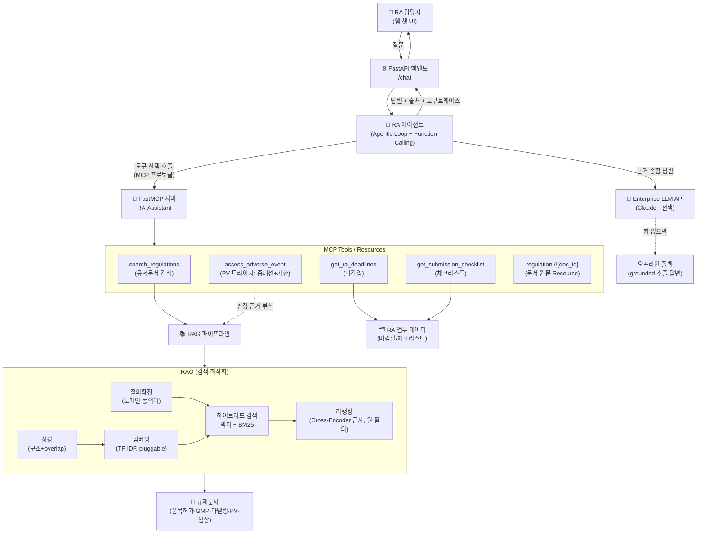

# 🧬 RA-Assistant — 제약 규제업무(RA)를 위한 RAG + MCP Agentic 어시스턴트

> 제약회사 **RA(Regulatory Affairs·인허가/규제업무)** 담당자가 실제로 쓸 법한
> 사내 규제문서 검색·업무 자동화 AI 어시스턴트의 **작동하는 최소 데모(MVP)**.
>
> **아키텍처가 GC녹십자 `Hey.GC 2.0`(Agentic AI + MCP)와 1:1로 대응**하도록 설계했다.
> 공고 필수 스택(RAG 최적화 · Agentic Workflow · Function Calling · MCP/FastMCP · FastAPI)을 한 프로젝트로 증명한다.

---

## 1. 문제 정의 (왜 RA인가)

RA 담당자는 **규제문서의 바다**에서 일한다.
- "이 변경은 변경허가야 변경신고야?", "중대 이상사례는 며칠 안에 보고?", "품목허가 심사 며칠 걸려?"
  — 답은 식약처 고시·가이드라인·SOP 어딘가에 있지만 **찾는 데 시간이 걸리고**, 틀리면 **규제 리스크**가 된다.
- 여러 제품의 **제출 기한·보고 마감**이 흩어져 있어 **놓치면 곧 컴플라이언스 사고**다.

→ 그래서 필요한 것: **① 규제문서를 근거와 함께 즉시 검색(RAG)** + **② 마감/체크리스트 같은 업무 도구를 에이전트가 자율 호출(Agent+MCP)**.
이것이 GC가 `Hey.GC 2.0`으로 사내에 하려는 바로 그 일이다.

## 2. 무엇을 하는가 (기능)

| 사용자 질문 예 | 에이전트 동작 | 사용 기술 |
|---|---|---|
| "신약 품목허가 심사 며칠 걸려?" | 규제문서 검색 → 근거+출처와 함께 답변 | **RAG** (하이브리드 + 리랭킹 + 질의확장) |
| "환자가 복용 후 아나필락시스로 입원했어요. 언제까지 보고?" | **PV 트리아지** 도구 호출 → 중대성 판정+보고기한 계산(+근거 규정) | **MCP Tool** (assess_adverse_event, 규칙 기반) |
| "이번 주 마감 임박한 규제 업무는?" | 마감일 도구 호출 → D-day 순 정리 | **MCP Tool** (get_ra_deadlines) |
| "변경허가 준비 체크리스트 줘" | 체크리스트 도구 호출 | **MCP Tool** (get_submission_checklist) |
| (복합) "GMP 변경인데 뭘 준비하고 언제까지?" | 검색+체크리스트+마감일 **여러 도구 조합** | **Agentic Workflow** |

모든 답변에 **근거 출처(문서·섹션)** 를 표시해 규제 산업에 필수적인 **추적성**을 확보하고,
케이스 서술 속 **환자 개인정보(주민번호·연락처·이름)는 에이전트 입구에서 마스킹**되어
외부 LLM API·로그 어디에도 흘러들지 않는다.

### 데모 화면


> 규제문서 검색(근거+출처 표시)과 마감일 조회를 각각 다른 MCP 도구가 처리한다. 하단에 "호출한 MCP 도구" 트레이스가 표시된다.

## 3. 아키텍처



**핵심 설계 포인트:** 모델(에이전트)과 도구(RA 시스템)가 **MCP 규격으로 분리**되어 있다.
→ 한 번 만든 MCP 도구를 Claude Desktop·Cursor·사내 에이전트 어디서든 재사용할 수 있다(= `Hey.GC 2.0`의 확장성 원리).

## 4. 기술 스택 ↔ 채용공고 매핑

| 공고 요구 | 이 프로젝트에서 | 위치 |
|---|---|---|
| **RAG 최적화** | 구조 청킹+overlap, 하이브리드(벡터+BM25), **리랭킹**, **질의확장(도메인 동의어)**, RAGAS식 평가 | `src/rag/`, `eval/` |
| **PV 도메인 도구** | 이상사례 **트리아지**(중대성 판정+보고기한 계산, 규칙 기반+근거 부착) | `src/pv/triage.py` |
| **개인정보 보호** | **PII 비식별화**(에이전트 입구 마스킹, 외부 API·로그 비유출) | `src/pv/redactor.py` |
| **MCP / FastMCP** | FastMCP로 RA 도구 서버 구현(Tools+Resource), 인메모리/stdio | `src/mcp_server/server.py` |
| **Agentic Workflow / Function Calling** | 에이전트 tool-use 루프, MCP 도구 자율 호출 | `src/agent/agent.py` |
| **FastAPI (백엔드)** | `/chat`·`/health` API 서빙, Pydantic 스키마 | `src/api/main.py` |
| **Enterprise LLM API** | Anthropic Claude 연동(있으면) + 오프라인 폴백 | `src/agent/agent.py`, `src/config.py` |
| **프론트엔드** | 단일 페이지 챗 UI(출처·도구트레이스 표시) | `web/index.html` |
| **ML/DL 이론** | TF-IDF/BM25/코사인/리랭킹을 순수 파이썬으로 직접 구현 | `src/rag/embedder.py`, `retriever.py` |
| **임베딩 교체성** | `EmbeddingProvider` 1인터페이스 · TF-IDF/해싱/**Voyage(실 API)** 3구현 | `src/rag/embedder.py` |
| **신뢰성(환각 억제)** | groundedness·**abstention**(근거 없으면 회피) + 출처·버전 추적 | `src/agent/agent.py`, `eval/faithfulness.py` |
| **버전 인지 검색** | 폐지본 자동 제외 · `as_of`·`include_superseded`(개정 이력) | `src/rag/retriever.py` |
| **관측성** | 스텝별 지연·성패 트레이스(span) + 구조화 로그 + 도구 에러 흡수 | `src/observability.py` |
| **테스트/CI** | pytest 46케이스 + GitHub Actions(테스트·평가 회귀) | `tests/`, `.github/workflows/ci.yml` |

## 5. 실행 방법

### 방법 A — 원커맨드 (권장)
```bash
cd project
./run.sh          # venv 생성 + 의존성 설치 + 서버 실행
# → 브라우저에서 http://127.0.0.1:8000 접속
```

### 방법 B — 수동
```bash
cd project
python3 -m venv .venv && .venv/bin/pip install -r requirements.txt
.venv/bin/python -m uvicorn src.api.main:app --port 8000
```

### LLM 모드 켜기 (선택)
```bash
export ANTHROPIC_API_KEY=sk-ant-...   # 없으면 자동으로 오프라인 모드
```
> **API 키가 없어도 데모는 항상 동작한다.** 키가 없으면 검색 근거를 발췌한 grounded 답변으로,
> 키가 있으면 에이전트가 실제 Claude로 도구를 조합해 자연어로 답한다.

### 기타
```bash
pip install -r requirements-dev.txt         # 테스트 의존성(pytest)
pytest                                       # 전체 테스트 46케이스
.venv/bin/python -m eval.evaluate           # RAG 검색 품질 평가(+임베더 비교)
.venv/bin/python -m eval.faithfulness       # 답변 신뢰성(groundedness·abstention) 평가
.venv/bin/python -m src.mcp_server.server   # MCP 서버 단독 실행(stdio)
```
> CI: 매 푸시마다 GitHub Actions가 `pytest` + 두 평가를 실행해 회귀를 막는다(`.github/workflows/ci.yml`).

## 6. RAG 검색 품질 평가 (RAG 최적화의 근거)

`eval/` 의 **30개 QA셋**(어휘가 겹치는 **하드네거티브** 13문항 포함)으로 검색기 성능을 측정한다.
코퍼스도 **13종**으로 늘려(의료기기·화장품·DMF·GMP실태조사 등 유사문서를 일부러 섞음) 최적화 효과가
수치로 드러나게 했다. 리랭킹 최종 1건(rerank_n=1) 기준:

| 지표 | ① 벡터만 | ② 하이브리드 | ③ +리랭킹 | ④ +질의확장 |
|---|---|---|---|---|
| Hit@1 | 0.867 | 0.833 | 0.867 | **0.900** |
| MRR | 0.867 | 0.833 | 0.867 | **0.900** |
| **ContextRecall** | 0.767 | 0.833 | **0.867** | 0.833 |
| **HardNegHit@1** | 0.769 | 0.769 | **0.846** | **0.846** |
| mean_ms(지연) | ~0.4 | ~0.6 | ~0.8 | ~0.8 |

- **HardNegHit@1**(어휘가 겹치는 오답 유사문서가 섞인 문항의 정확도)이 **리랭킹에서 개선**된다
  → 벡터 단독은 어휘 유사도에 끌려 오답을 고르지만, 리랭킹이 정답을 1순위로 되돌린다. **이게 RAG 최적화의 핵심 근거.**
- **④ 질의확장**(도메인 동의어: "부작용"→"이상사례", "설명서"→"첨부문서")이 어휘 불일치를 메워
  **Hit@1 0.867→0.900**. 확장은 1단계 회수에만 적용하고 리랭킹은 원 질의로 재점수해 정밀도 희석을 막는다.
  ContextRecall 소폭 하락(0.867→0.833)은 정답 '문서'는 맞히나 rerank_n=1에서 섹션이 달라진 1문항 — 정직한 트레이드오프.
- **지연 트레이드오프**: 리랭킹·확장은 정밀도/회수를 얻는 대신 지연이 는다.
- 하이브리드가 일부 쉬운 질의에서 Hit@1을 살짝 떨어뜨리는 것은 **정직한 수치**다. 작은 코퍼스라 벡터만으로
  이미 포화되기 때문이며, 리랭킹이 전체 Hit@1을 회복시키고 하드네거티브에서 이득을 낸다. (설계 근거는 [`docs/면접노트.md`](docs/면접노트.md) 3~4장, 질의확장은 11장)

### 6.1 답변 신뢰성 평가 (환각 억제 — 규제 도메인 킬러 포인트)

검색이 정답을 회수했는지와 별개로, **최종 답변이 근거 안에서만 말했는지 / 근거 없으면 지어내지 않는지**를
`eval/faithfulness.py` 로 따로 측정한다.

| 지표 | 값 | 의미 |
|---|---|---|
| AnswerGroundedness | **0.933** | 범위내 답변이 검색 근거로 뒷받침되는 비율 |
| CitationRate | **0.933** | 답변에 출처가 부착된 비율 |
| **AbstentionAccuracy** | **1.000** | 범위밖 질문에 환각 대신 '근거 없음'으로 답한 비율 |
| OverAbstain | 0.033 | 범위내인데 과도 회피(낮을수록 좋음) |

→ 두 신호(근거 관련도 + 질의 커버리지)가 **둘 다** 약할 때만 회피하는 AND 조건으로,
과도한 회피 없이 환각을 억제한다.

### 6.2 PV 업무 심화 — 이상사례 트리아지 & 개인정보 보호

PV(약물감시) 담당자의 첫 업무인 **케이스 트리아지**를 MCP 도구로 구현했다.

- **`assess_adverse_event`**: 케이스 서술 → 중대성(Serious) 판정 → 보고 경로/기한 계산
  (사망·생명위협 = 지체 없이, 그 외 중대 = 인지일+15일, 비중대 = PSUR) → **근거 규정(REG-005) 부착**.
- **왜 규칙 기반인가**: 보고기한 계산은 컴플라이언스라 LLM의 확률적 추론에 맡기지 않는다.
  LLM은 도구 선택·설명을, 규정이 정한 계산은 **결정론적(감사 가능한) 도구**가 맡는다.
  모호하면 보수 적용(예상 여부 불명 → 15일 트래킹) + "최종 확정은 PV 담당자" caveat 강제.
- **PII 비식별화**: 케이스 속 환자 개인정보(주민번호·연락처·이름 등)를 **에이전트 입구에서 마스킹**.
  외부 LLM API·검색·로그·트레이스 어디에도 원문이 남지 않고, 응답에는 유형·건수만 표시된다.

## 7. 프로젝트 구조

```
project/
├── run.sh                     # 원커맨드 실행
├── requirements.txt · requirements-dev.txt · .env.example · pytest.ini
├── data/
│   ├── regulations/           # 규제문서 13종(핵심 6 + 하드네거티브 6 + 폐지 구판 1)
│   └── ra_tasks.json          # 마감일·체크리스트 업무 데이터
├── src/
│   ├── config.py              # 실행 모드·RAG 하이퍼파라미터(alpha·rerank_weight·embedder·질의확장)
│   ├── observability.py       # 📈 트레이스(span)·구조화 로그
│   ├── rag/                   # 📚 RAG: loader→chunker→embedder→vectorstore→retriever(+synonyms)→pipeline
│   ├── pv/                    # 💊 PV 도메인: triage(AE 트리아지)·redactor(PII 비식별화)
│   ├── mcp_server/server.py   # 🔌 FastMCP 서버(RA/PV 도구, 버전 인지 검색)
│   ├── agent/agent.py         # 🤖 에이전트(tool-use 루프 + 에러흡수 + abstention + 멀티턴 + 입구 PII 마스킹)
│   └── api/main.py            # ⚙️ FastAPI(trace·latency·grounded·redactions 노출)
├── web/index.html             # 💬 챗 UI(지연·근거상태·버전·PII 마스킹 배지, 멀티턴)
├── eval/                      # 📊 검색 평가(evaluate) + 신뢰성 평가(faithfulness) + QA셋
├── tests/                     # ✅ pytest 46케이스(retriever·버전·임베더·에이전트·MCP·PV)
└── .github/workflows/ci.yml   # 🔁 CI(테스트+평가 회귀)
```

📎 함께 보기: [`docs/면접노트.md`](docs/면접노트.md)(**설계 근거 + 예상질문 대응**) · [`docs/프로젝트_소개서.md`](docs/프로젝트_소개서.md)(필요성·페르소나·사용법·구조, 이미지 포함) · [`docs/ARCHITECTURE.md`](docs/ARCHITECTURE.md)(설계 결정 노트) · [`docs/포트폴리오_자소서3_소재.md`](docs/포트폴리오_자소서3_소재.md)

---

## 8. FDE 관점에서 이 데모가 증명하는 것

- **현업 밀착:** 실존하는 RA/PV 담당자의 반복업무(규정 검색·**이상사례 트리아지**·기한 관리·**개정 이력 추적**)를 정확히 겨냥했다.
- **End-to-end:** 데이터→RAG→MCP→에이전트→API→UI→**평가→CI**까지 혼자 전 구간을 만들었다.
- **엔터프라이즈 감각:** 출처·**버전** 추적, 근거 기반(**abstention으로 환각 억제**), **PII 비식별화(외부 API 경계 보호)**,
  컴플라이언스 계산의 **결정론적 도구 분리**(LLM에 기한 계산을 맡기지 않음), **관측성(트레이스)**,
  도구 실패 흡수, 키 없이도 돌아가는 graceful degradation, 도구/모델의 MCP 분리 —
  제약 규제 산업이 요구하는 신뢰성·확장성을 반영했다.
- **검증 가능:** 모든 주장을 `pytest`(46케이스)와 `eval`(검색·신뢰성)로 **재현**할 수 있다.

> ℹ️ 규제 수치(처리기한 등)는 **데모용 샘플**로, 실제 최신 법령과 다를 수 있다. 이 프로젝트의 목적은 규제 자문이 아니라 **아키텍처·엔지니어링 역량 증명**이다.
