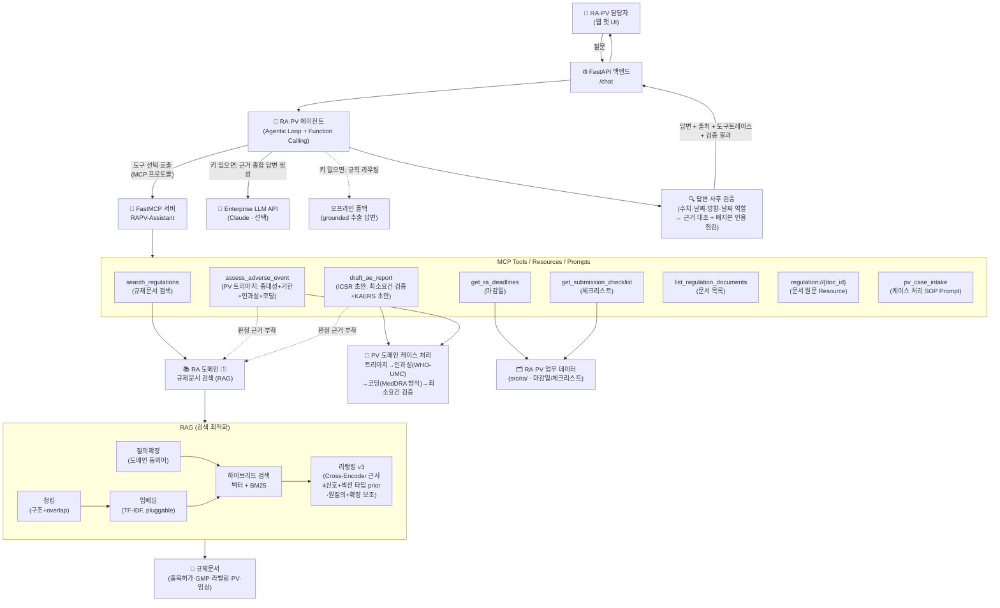

# 🧬 RAPV-Assistant — 제약 규제업무(RA·PV)를 위한 RAG + MCP Agentic 어시스턴트

> 제약회사 **RA(인허가/규제업무)·PV(약물감시)** 담당자를 위한 규제문서 검색·업무 자동화
> AI 어시스턴트의 **작동하는 최소 데모(MVP)**.
> **GC녹십자가 공개한 `Hey.GC 2.0` 방향성(Agentic AI + MCP 사내 시스템 통합)과 같은 구조 원리**로 설계 —
> 공고 필수 스택(RAG 최적화 · Agentic Workflow · Function Calling · MCP/FastMCP · FastAPI)을 한 프로젝트로 증명한다.

## 1. 문제 정의 (왜 RA·PV인가)

RA·PV 담당자는 규제문서의 바다에서 일한다 — "이 변경은 허가야 신고야?", "중대 이상사례는 며칠 안에 보고?"의
답은 고시·SOP 어딘가에 있지만 찾는 데 시간이 걸리고 틀리면 규제 리스크다. 제출 기한을 놓치면 컴플라이언스
사고이고, 허가 후에는 **이상사례 접수→중대성 판정→보고기한 계산→당국 보고**(PV)가 기다린다.
→ **① 규제문서를 근거와 함께 즉시 검색(RAG) + ② 마감·체크리스트·이상사례 처리 도구를 에이전트가 자율 호출(Agent+MCP)**.

## 2. 무엇을 하는가

| 사용자 질문 예 | 동작 | 기술 |
|---|---|---|
| "신약 품목허가 심사 며칠 걸려?" | 규제문서 검색 → 근거+출처 답변 | **RAG** (하이브리드+리랭킹+질의확장) |
| "복용 후 아나필락시스로 입원했어요. 언제까지 보고?" | 중대성 판정+기한 계산+인과성(WHO-UMC) 제안+코딩 | **MCP Tool** (assess_adverse_event) |
| "이 케이스 KAERS 보고서 초안 만들어줘" | 최소보고요건(ICH E2D) 검증+초안+보완 질문 | **MCP Tool** (draft_ae_report) |
| "이번 주 마감 임박한 규제 업무는?" | 마감일 D-day 정리 | **MCP Tool** (get_ra_deadlines) |
| (복합) "GMP 변경인데 뭘 준비하고 언제까지?" | 검색+체크리스트+마감일 조합 | **Agentic Workflow** |

모든 답변에 **출처(문서·섹션·버전)** 부착, 환자 **PII는 입구에서 마스킹**(외부 API·로그 비유출),
나가는 답변은 **사후 검증 게이트**(수치·날짜·방향·역할 ↔ 근거 대조)를 전수 통과, 기동 전에는
**preflight**가 데이터·설정·안전장치를 검사해 실패 시 기동을 차단한다.


## 3. 아키텍처



**핵심 설계 포인트:** 모델(에이전트)과 도구(RA·PV 업무 시스템)가 **MCP 규격으로 분리** —
한 번 만든 도구를 Claude Desktop·Cursor·사내 에이전트 어디서든 재사용한다(`Hey.GC 2.0`과 같은 확장성 원리).
상세 해설·설계 결정·점검 기록은 **[아키텍처 정본](description/아키텍처.md)** 참고.

## 4. 기술 스택 ↔ 채용공고 매핑

| 공고 요구 | 이 프로젝트에서 | 위치 |
|---|---|---|
| **RAG 최적화** | 구조 청킹, 하이브리드(벡터+BM25), 4신호 리랭킹+섹션 prior, 질의확장, 스윕/ablation 재현 | `src/rag/`, `eval/` |
| **제약/바이오 산업 이해** | RA·PV 도메인 도구 — RA: 검색·마감·체크리스트 / PV: 트리아지→인과성→코딩(3계층)→ICSR 초안 + 라벨 22케이스 평가 | `src/ra/`, `src/pv/`, `eval/pv_eval.py` |
| **개인정보 보호** | PII 비식별화 2겹(에이전트 입구+도구 계층) — 한글 직결·조사 표기까지 룩어라운드 경계 | `src/pv/redactor.py` |
| **MCP / FastMCP** | Tools 6 + Resource + Prompt(3대 primitive), 인메모리/stdio | `src/mcp_server/server.py` |
| **Agentic / Function Calling** | tool-use 루프, 도구 에러 자가복구, 오프라인 규칙 라우터 폴백 | `src/agent/agent.py` |
| **FastAPI · 프론트엔드** | `/chat`·`/health` + 단일 페이지 챗 UI(출처·트레이스·검증 배지) | `src/api/`, `web/` |
| **신뢰성(환각 억제)** | groundedness·abstention(AND 문턱)·출처/버전 추적·`as_of` 시점 조회 | `src/agent/`, `src/rag/retriever.py` |
| **답변 사후 검증** | 전 응답 통과 런타임 게이트 + 게이트 자체의 메타모픽 평가(pytest 가드로 CI 강제) | `src/verify/`, `eval/verify_eval.py` |
| **배포 전 점검(FDE Day-0)** | 설정·코퍼스·업무데이터·스모크+안전장치 자가 테스트 — 실패 시 기동 차단 | `src/preflight.py` |
| **운영 계기판** | 검증 경고율(`warn_rate_checked`)·감사 로그를 `/health` 노출 | `src/observability.py` |
| **실데이터 인제스트** | PDF→코퍼스 변환 경로(헤딩 휴리스틱+frontmatter, 상용 파서 교체 자리) | `scripts/ingest_pdf.py` |
| **테스트/CI** | pytest 273케이스(불변식/fuzz 포함) + Actions(preflight+평가 4종 회귀) | `tests/`, 루트 `.github/workflows/ci.yml` |

## 5. 실행 방법

```bash
cd project
./run.sh          # venv + 의존성 + 배포 전 점검(preflight) + 서버 → http://127.0.0.1:8000
export ANTHROPIC_API_KEY=sk-ant-...   # (선택) LLM 모드 — 없어도 오프라인 grounded 답변으로 항상 동작
```

품질 확인: `.venv/bin/python -m src.preflight`(배포 전 점검) · `-m pytest`(273케이스) ·
`-m eval.evaluate / sweep / faithfulness / pv_eval / verify_eval`(평가 5종, 95% CI 병기).
CI는 매 푸시마다 preflight+테스트+평가 4종을 실행한다. MCP 단독 실행·Claude Desktop 연결은
[사용자 가이드](description/가이드.md) 참고.

## 6. 핵심 수치 (전부 스크립트 1회 실행으로 재현)

> ⚠️ **읽기 규율:** 검색 32문항은 오류 분석 루프에 쓴 **개발셋**이라 그 위의 1.000은 일반화가
> 아니라 개발셋 포화다. 일반화의 근사는 **홀드아웃**(튜닝 미사용 6문항, `eval/holdout_dataset.json`)
> 수치로 따로 본다. 최초 측정은 0.833이었는데, 유일 실패의 실체는 검색기 결함이 아니라 **복수
> 정답 문항의 라벨 모호성**이었다(REG-011 §3 도 동등 정답) — v9 에서 `accept_doc_ids` 로 정답
> 집합만 교정했고 **검색기 튜닝은 하지 않았다**(홀드아웃 규율 유지). 교정 후 1.000 도 n=6·CI
> 하한 0.610 이라 **일반화 보장이 아니다** — '이 표본에서 실패 관측 0'으로만 읽는다.

| 영역 | 지표 | 값 |
|---|---|---|
| 검색(개발셋 32) | Hit@1 (벡터만 → 전체 파이프라인) | 0.875 → **1.000** [0.893, 1.000] |
| 검색(개발셋 32) | HardNegHit@1 / ContextRecall | 0.786 → **1.000** / 0.781 → **0.969** |
| **검색(홀드아웃 6)** | **Hit@1 — 일반화 근사** | **1.000** [0.610, 1.000] (v9 라벨 교정 — 교정 전 0.833, 유일 실패는 복수 정답 라벨 모호성) |
| 신뢰성(32+8) | Groundedness / AbstentionAcc / OverAbstain | **1.000** / **1.000** (n=8) / **0.000** |
| PV(라벨 22) | 중대성·기한·인과성·보고요건 정확도 | 모두 **1.000** (규칙 회귀는 CI가 잡음) |
| PV(라벨 22) | 코딩 P / R (확정) · R (확정∪후보) | **1.000** / 0.792 · **0.958** — 갭 = 사전 롱테일(확장 지점 크기) |
| 검증 게이트 | 변조 탐지 9축 / 오탐 감시 4축 | 모두 **1.000** (n=4~40, 표본 하한은 pytest 가드가 CI 강제) |
| 운영 실측 | E2EPassRate (오프라인 실응답 전수) | **1.000** [0.912, 1.000] (n=40) |

- 수치의 상세(모드 4종 비교표·오류 분석 루프 0.867→1.000·검증기 축별 표)는 각 평가 스크립트 출력과
  [면접노트](docs/면접노트.md)에 있다. 소표본 1.000에는 항상 Wilson 95% CI를 병기한다 — '완벽'이 아니라
  '이 표본에서 실패 관측 0'이며, 구간이 겹치면 개선이 아니라 구분 불가로 읽는다.
- **답변 사후 검증 게이트**(6줄 요약): 평가는 표본을 지키지만 LLM 답변은 매번 새로 생성되므로,
  **모든 응답**이 수치·단위(근무일≠일)·날짜(한국어·부분 표기 정규화)·방향 한정어(이내↔이후)·
  날짜 역할(인지일↔마감일)을 '검색 근거 ∪ 결정론적 도구 출력 − 입력 에코'와 대조하는 게이트를
  통과한다. 실패는 차단이 아니라 경고 부착(사람의 최종 확정을 빠르게), 케이스 서술 유래 지지는
  `from_case` 라벨로 구분한다. 게이트 자체도 메타모픽 변조(9축)로 측정하고 preflight가 기동 전에
  전 축 자가 테스트를 강제한다 — 상세 설계는 [아키텍처 정본](description/아키텍처.md) 2-7장·7장.
- **PV 워크플로**: 트리아지(중대성=기준 대조는 결정론, 서술→기준 매핑은 과탐 보수+사람 확정) →
  인과성(WHO-UMC 6범주의 5범주 근사, '제안'+되물을 질문) → 코딩(확정/후보/미코딩 3계층, 자동 확정
  무관용) → ICSR 초안(ICH E2D 4요소 검증). 기한 계산은 역일(calendar day) 기준이며 LLM이 아니라
  규칙 도구가 한다 — 상세는 [아키텍처 정본 2-6장](description/아키텍처.md)·[면접노트](docs/면접노트.md) 9~15장.

## 7. 구조와 문서

프로젝트 구조·파일별 안내는 **[파일구조.md](description/파일구조.md)**(읽기 지도),
아키텍처는 **[정본 문서](description/아키텍처.md)** 한 곳에서 관리한다(루트 `architecture.md`·
`docs/ARCHITECTURE.md`는 리다이렉트 스텁). CI 워크플로는 저장소 루트 `.github/workflows/ci.yml`
(GitHub Actions는 루트만 인식, `working-directory: project`로 실행).

📎 함께 보기: [`description/아키텍처.md`](description/아키텍처.md)(**아키텍처 정본**) ·
[`docs/면접노트.md`](docs/면접노트.md)(설계 근거+예상질문) ·
[`docs/프로젝트_소개서.md`](docs/프로젝트_소개서.md)(비개발자용 소개) ·
[`description/가이드.md`](description/가이드.md)(사용자 가이드)

> ℹ️ 규제문서·수치(처리기한 등)는 **데모용 가상 샘플**로(각 문서 frontmatter에 disclaimer 명시),
> 실제 법령과 다를 수 있다. 이 프로젝트의 목적은 규제 자문이 아니라 **아키텍처·엔지니어링 역량 증명**이다.
