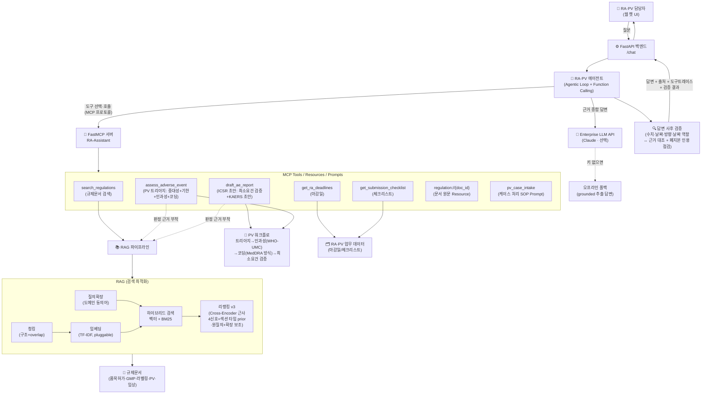

# 🧬 RA-Assistant — 제약 규제업무(RA·PV)를 위한 RAG + MCP Agentic 어시스턴트

> 제약회사 **RA(Regulatory Affairs·인허가/규제업무)·PV(Pharmacovigilance·약물감시)** 담당자가 실제로 쓸 법한
> 사내 규제문서 검색·업무 자동화 AI 어시스턴트의 **작동하는 최소 데모(MVP)**.
>
> **아키텍처가 GC녹십자 `Hey.GC 2.0`(Agentic AI + MCP)와 1:1로 대응**하도록 설계했다.
> 공고 필수 스택(RAG 최적화 · Agentic Workflow · Function Calling · MCP/FastMCP · FastAPI)을 한 프로젝트로 증명한다.

---

## 1. 문제 정의 (왜 RA·PV인가)

RA·PV 담당자는 **규제문서의 바다**에서 일한다.
- "이 변경은 변경허가야 변경신고야?", "중대 이상사례는 며칠 안에 보고?", "품목허가 심사 며칠 걸려?"
  — 답은 식약처 고시·가이드라인·SOP 어딘가에 있지만 **찾는 데 시간이 걸리고**, 틀리면 **규제 리스크**가 된다.
- 여러 제품의 **제출 기한·보고 마감**이 흩어져 있어 **놓치면 곧 컴플라이언스 사고**다.
- 허가가 끝이 아니다. 시판 후에는 **이상사례(부작용) 접수 → 중대성 판정 → 보고기한 계산 → 당국 보고**가
  기다린다. 이 시판 후 안전관리가 **PV(Pharmacovigilance·약물감시)** — RA와 한 몸처럼 맞물려 도는
  규제 컴플라이언스 업무다. 이 데모는 RA의 문서·기한 업무에 더해 **PV 케이스 처리 워크플로까지**를 범위로 잡았다(6.2절).

→ 그래서 필요한 것: **① 규제문서를 근거와 함께 즉시 검색(RAG)** + **② 마감/체크리스트·이상사례 처리 같은 업무 도구를 에이전트가 자율 호출(Agent+MCP)**.
이것이 GC가 `Hey.GC 2.0`으로 사내에 하려는 바로 그 일이다.

## 2. 무엇을 하는가 (기능)

| 사용자 질문 예 | 에이전트 동작 | 사용 기술 |
|---|---|---|
| "신약 품목허가 심사 며칠 걸려?" | 규제문서 검색 → 근거+출처와 함께 답변 | **RAG** (하이브리드 + 리랭킹 + 질의확장) |
| "환자가 복용 후 아나필락시스로 입원했어요. 언제까지 보고?" | **PV 트리아지** 도구 호출 → 중대성 판정+보고기한 계산+인과성(WHO-UMC) 제안+용어 코딩(+근거 규정) | **MCP Tool** (assess_adverse_event, 규칙 기반) |
| "이 케이스 KAERS 보고서 초안 만들어줘" | **ICSR 초안** 도구 호출 → 최소보고요건(ICH E2D 4요소) 검증+초안 조립+보완 질문 | **MCP Tool** (draft_ae_report, 규칙 기반) |
| "이번 주 마감 임박한 규제 업무는?" | 마감일 도구 호출 → D-day 순 정리 | **MCP Tool** (get_ra_deadlines) |
| "변경허가 준비 체크리스트 줘" | 체크리스트 도구 호출 | **MCP Tool** (get_submission_checklist) |
| (복합) "GMP 변경인데 뭘 준비하고 언제까지?" | 검색+체크리스트+마감일 **여러 도구 조합** | **Agentic Workflow** |

모든 답변에 **근거 출처(문서·섹션)** 를 표시해 규제 산업에 필수적인 **추적성**을 확보하고,
케이스 서술 속 **환자 개인정보(주민번호·연락처·이름)는 에이전트 입구에서 마스킹**되어
외부 LLM API·로그 어디에도 흘러들지 않는다. 나가는 방향도 지킨다 — **모든 답변은
사후 검증 게이트를 통과**해 답변 속 수치·날짜·**방향 한정어("이내"↔"이후")·날짜
역할(인지일↔마감일)**이 근거/도구 결과와 대조되고(6.4절), 폐지된 규정을 인용하면 경고가 붙는다.
시간축의 양 끝도 지킨다 — 서버 기동 전에는 **배포 전 점검(preflight)**이 데이터·설정·검증
게이트 자체를 검사해 실패 시 기동을 차단하고, 운영 중에는 **게이트 경고율이 `/health`
계기판으로 집계**된다(6.6절).

### 데모 화면


> 규제문서 검색(근거+출처 표시)과 마감일 조회를 각각 다른 MCP 도구가 처리한다. 하단에 "호출한 MCP 도구" 트레이스가 표시된다.

## 3. 아키텍처



**핵심 설계 포인트:** 모델(에이전트)과 도구(RA·PV 업무 시스템)가 **MCP 규격으로 분리**되어 있다.
→ 한 번 만든 MCP 도구를 Claude Desktop·Cursor·사내 에이전트 어디서든 재사용할 수 있다(= `Hey.GC 2.0`의 확장성 원리).

## 4. 기술 스택 ↔ 채용공고 매핑

| 공고 요구 | 이 프로젝트에서 | 위치 |
|---|---|---|
| **RAG 최적화** | 구조 청킹+overlap, 하이브리드(벡터+BM25), **4신호 리랭킹 + 섹션 타입 prior(질의 의도 게이트)**, **질의확장(도메인 동의어)**, RAGAS식 평가 + **하이퍼파라미터 스윕/ablation 재현 스크립트** | `src/rag/`, `eval/` |
| **제약/바이오 산업 이해**(우대) | **RA·PV 도메인 도구**로 증명 — RA: 규제문서 검색·마감일·제출 체크리스트 / PV: 이상사례 **트리아지 → 인과성(WHO-UMC) 제안 → 용어 코딩(확정/후보/미코딩 3계층, MedDRA 방식) → ICSR 보고서 초안(최소보고요건 검증)** 전 워크플로(규칙 기반+근거 부착) + **라벨 22케이스 수치 평가** | `src/pv/`, `src/mcp_server/server.py`, `eval/pv_eval.py` |
| **개인정보 보호** | **PII 비식별화**(에이전트 입구+MCP 도구 계층 2겹 마스킹, 외부 API·로그 비유출 — 경계는 `\b`가 아닌 **숫자 룩어라운드**: "…는 010-…로"·"…입니다" 같은 한글 직결 표기까지 커버) | `src/pv/redactor.py` |
| **MCP / FastMCP** | FastMCP로 RA·PV 도구 서버 구현(**Tools+Resources+Prompts 3대 primitive**), 인메모리/stdio | `src/mcp_server/server.py` |
| **Agentic Workflow / Function Calling** | 에이전트 tool-use 루프, MCP 도구 자율 호출 | `src/agent/agent.py` |
| **FastAPI (백엔드)** | `/chat`·`/health` API 서빙, Pydantic 스키마 | `src/api/main.py` |
| **Enterprise LLM API** | Anthropic Claude 연동(있으면) + 오프라인 폴백 | `src/agent/agent.py`, `src/config.py` |
| **프론트엔드** | 단일 페이지 챗 UI(출처·도구트레이스 표시) | `web/index.html` |
| **ML/DL 이론** | TF-IDF/BM25/코사인/리랭킹을 순수 파이썬으로 직접 구현 | `src/rag/embedder.py`, `retriever.py` |
| **임베딩 교체성** | `EmbeddingProvider` 1인터페이스 · TF-IDF/해싱/**Voyage(실 API)** 3구현 | `src/rag/embedder.py` |
| **신뢰성(환각 억제)** | groundedness·**abstention**(근거 없으면 회피) + 출처·버전 추적 | `src/agent/agent.py`, `eval/faithfulness.py` |
| **답변 사후 검증** | 모든 응답이 통과하는 **런타임 검증 게이트**(수치·날짜(**한국어 표기·부분 표기("7월 25일")·연도 표기("2025년") 정규화** 포함)·**단위(근무일≠일)·고유어 수사(보름=15일)·방향 한정어(이내↔이후 — 기간·날짜·고유어 표기 모두)·날짜 역할(인지일↔마감일 스왑)** ↔ 근거 대조(입력 에코·에러 계약 응답은 신뢰 소스에서 제외), **2계층 신뢰 소스**(케이스 서술 유래 지지는 `from_case` 라벨), 폐지본 인용 감지(**문서 단위 허용** — 이력 검색이 실제 반환한 문서만 면제), 질문 전제 에코 구분(직전 턴 창)) + **검증기 자체의 메타모픽 평가**(변조 탐지 7축·오탐 감시 4축, 95% CI — 탐지율·표본 수는 **pytest 가드가 CI 실패로 강제**) | `src/verify/`, `eval/verify_eval.py`, `tests/test_verify_eval.py` |
| **배포 전 점검(FDE Day-0)** | `python -m src.preflight` — 설정 불변식·코퍼스/**폐지 체인** 무결성(실존·현행 종점·**시행일 단조성**)·업무데이터 스키마·스모크(canary — RAG·PV·**시점 조회**)+**안전장치 자가 테스트**(검증 게이트 — **전 경고 축**에 심은 오류가 기대 축에 걸리는가·PII 마스킹). 실패 시 기동 차단(run.sh·CI 연동) | `src/preflight.py` |
| **운영 계기판(경고율)** | 검증 게이트 통과/경고를 축별 집계해 `/health` 노출 + 응답 단위 **감사 로그** — alert fatigue 의 조기 신호를 상시 측정. **warn_rate_checked** 병기(회피·무클레임 응답의 분모 혼합 착시 제거) | `src/observability.py`, `src/api/main.py` |
| **통계적 정직성** | 소표본 지표에 **Wilson 95% 신뢰구간** 병기(1.000 ≠ 완벽) | `eval/stats.py` |
| **버전 인지 검색** | 폐지본 자동 제외 · `as_of` **시점 조회('그 시점의 현행' 반환 — 당시 시행 중이던 폐지본 포함, 결함 시행일은 fail-closed)** · `include_superseded`(개정 이력, 오프라인 라우터도 명시 구문으로 지원) | `src/rag/retriever.py` |
| **관측성** | 스텝별 지연·성패 트레이스(span) + 구조화 로그 + 도구 에러 흡수 | `src/observability.py` |
| **테스트/CI** | pytest 202케이스(**불변식/fuzz 테스트** 포함) + GitHub Actions(**preflight**+테스트·검색/신뢰성/PV/검증기 평가 회귀) | `tests/`, 저장소 루트 `.github/workflows/ci.yml` |

## 5. 실행 방법

### 방법 A — 원커맨드 (권장)
```bash
cd project
./run.sh          # venv 생성 + 의존성 설치 + 서버 실행
# → 브라우저에서 http://127.0.0.1:8000 접속
```

### 방법 B — 수동
```bash
cd project
python3 -m venv .venv && .venv/bin/pip install -r requirements.txt
.venv/bin/python -m src.preflight   # 권장 — 수동 실행은 preflight 게이트를 자동으로 지나지 않는다(run.sh·CI만 게이트 뒤에 있음)
.venv/bin/python -m uvicorn src.api.main:app --port 8000
```

### LLM 모드 켜기 (선택)
```bash
export ANTHROPIC_API_KEY=sk-ant-...   # 없으면 자동으로 오프라인 모드
```
> **API 키가 없어도 데모는 항상 동작한다.** 키가 없으면 검색 근거를 발췌한 grounded 답변으로,
> 키가 있으면 에이전트가 실제 Claude로 도구를 조합해 자연어로 답한다.

### 기타
```bash
pip install -r requirements-dev.txt         # 테스트 의존성(pytest)
.venv/bin/python -m src.preflight           # 배포 전 점검(설정·코퍼스·업무데이터·스모크+안전장치 자가 테스트(검증 게이트·PII 마스킹))
pytest                                       # 전체 테스트 202케이스(불변식/fuzz 포함)
.venv/bin/python -m eval.evaluate           # RAG 검색 품질 평가(+임베더 비교, 95% CI)
.venv/bin/python -m eval.sweep              # 하이퍼파라미터 스윕·ablation (튜닝 근거 재현)
.venv/bin/python -m eval.faithfulness       # 답변 신뢰성(groundedness·abstention) 평가
.venv/bin/python -m eval.pv_eval            # PV 워크플로 평가(트리아지·인과성·코딩·보고요건)
.venv/bin/python -m eval.verify_eval        # 답변 사후 검증기 평가(메타모픽: 변조 탐지·오탐)
.venv/bin/python -m src.mcp_server.server   # MCP 서버 단독 실행(stdio)
```
> CI: 매 푸시마다 GitHub Actions가 **preflight** + `pytest` + 네 평가(검색·신뢰성·PV·검증기)를 실행해 회귀를 막는다(`.github/workflows/ci.yml`).
> `run.sh`도 서버 기동 전에 preflight 를 통과해야 한다 — 데이터·설정 결함은 부팅이 아니라 **운영 중 오답**으로 나타나기 때문에 기동 전에 차단한다.

## 6. RAG 검색 품질 평가 (RAG 최적화의 근거)

`eval/` 의 **32개 QA셋**(어휘가 겹치는 **하드네거티브** 14문항 + 신호 게이트 검증 2문항 포함)으로
검색기 성능을 측정한다. 코퍼스도 **13종**으로 늘려(의료기기·화장품·DMF·GMP실태조사 등 유사문서를
일부러 섞음) 최적화 효과가 수치로 드러나게 했다. 리랭킹 최종 1건(rerank_n=1) 기준:

| 지표 | ① 벡터만 | ② 하이브리드 | ③ +리랭킹(v3) | ④ +질의확장 |
|---|---|---|---|---|
| Hit@1 | 0.875 | 0.844 | 0.938 | **1.000** |
| MRR | 0.875 | 0.844 | 0.938 | **1.000** |
| **ContextRecall** | 0.781 | 0.844 | 0.906 | **0.969** |
| **HardNegHit@1** | 0.786 | 0.786 | 0.929 | **1.000** |
| mean_ms(지연) | ~0.4 | ~0.7 | ~0.9 | ~0.9 |

- **HardNegHit@1**(어휘가 겹치는 오답 유사문서가 섞인 문항의 정확도)이 **리랭킹+확장에서 개선**된다
  → 벡터 단독은 어휘 유사도에 끌려 오답을 고르지만, 리랭킹이 정답을 1순위로 되돌린다. **이게 RAG 최적화의 핵심 근거.**
- **④ 질의확장**(도메인 동의어: "부작용"→"이상사례", "심각"→"중대한", "섞이"→"교차오염")이 어휘 불일치를 메워
  Hit@1을 끌어올린다. 확장은 1단계 회수에 전 가중으로, 리랭킹에는 **절반 가중의 보조 신호**로만 반영해
  정밀도 희석 없이 완전 어휘 불일치 질의를 구제한다(ablation: 1차 prior 를 끄면 보조 신호 유무가 Hit@1 0.969 vs 0.906).
- **오류 분석 루프의 결과다**: 0.867(30문항 초기)→0.900(구어 동의어 보강)→0.967(리랭커 필드 분리)
  →**1.000(리랭커 v3: 섹션 타입 prior)**. 마지막 잔여 실패였던 화장품 규정 속 **"의약품 표시기재와의 차이"
  대조 섹션**은 어휘 재가중으로는 어떤 조합으로도 안 뒤집혔고, 문서 **구조** 신호(대조 섹션 페널티 +
  서두 섹션 감쇠, **질의가 '차이/정의'를 물으면 게이트로 해제**)로 풀었다. 게이트 검증 문항
  2건(대조 섹션이 정답인 질문 1 + 서두 섹션이 정답인 질문 1)을 QA셋에 추가해 게이트가 섹션
  삭제가 아님을 같은 표에서 증명한다. 과정은 `eval/sweep.py` 로 재현된다.
- 남은 정직한 갭은 ContextRecall 1건: "계속 제출해야 하나?"라는 질의와 "정기 보고(PSUR)" 조항 사이의
  **의미 간극**은 어휘 신호로 못 메운다 — 밀집 임베딩/실제 Cross-Encoder가 밥값을 하는 지점.
- 하이브리드가 일부 쉬운 질의에서 Hit@1을 살짝 떨어뜨리는 것은 **정직한 수치**다. 작은 코퍼스라 벡터만으로
  이미 포화되기 때문이며, 리랭킹이 전체 Hit@1을 회복시키고 하드네거티브에서 이득을 낸다. (설계 근거는 [`docs/면접노트.md`](docs/면접노트.md) 3~4장, 질의확장은 11장, 섹션 prior는 20장)

### 6.1 답변 신뢰성 평가 (환각 억제 — 규제 도메인 킬러 포인트)

검색이 정답을 회수했는지와 별개로, **최종 답변이 근거 안에서만 말했는지 / 근거 없으면 지어내지 않는지**를
`eval/faithfulness.py` 로 따로 측정한다.

| 지표 | 값 | 의미 |
|---|---|---|
| AnswerGroundedness | **1.000** | 범위내 답변이 검색 근거로 뒷받침되는 비율 |
| CitationRate | **0.969** | 답변에 출처가 부착된 비율(나머지 1건은 문서검색이 아닌 마감일 도구로 답한 문항) |
| **AbstentionAccuracy** | **1.000** | 범위밖 질문에 환각 대신 '근거 없음'으로 답한 비율 |
| **OverAbstain** | **0.000** | 범위내인데 과도 회피(낮을수록 좋음) |

→ 두 신호(근거 관련도 + 질의 커버리지)가 **둘 다** 약할 때만 회피하는 AND 조건으로,
과도한 회피 없이 환각을 억제한다. 커버리지는 **확장 질의 기준**으로 계산한다 —
검색이 동의어 확장으로 정답을 찾는데 회피 판정만 원 질의로 보면 '정답을 찾고도
모른다고 답하는' 자기모순(과회피)이 생기기 때문. 문턱값은 범위내/범위밖 점수 분포를
실측해 마진 중앙으로 보정했다(`src/agent/agent.py` 주석에 근거 수치). 리랭커 v3(섹션
타입 prior) 도입 후에도 재보정 절차를 반복 수행 — 경계 분포가 불변이어서 문턱은 유지됐다.

### 6.2 PV 업무 심화 — 케이스 접수부터 보고서 초안까지의 전체 워크플로

PV(약물감시) 담당자의 케이스 처리 흐름 **접수 → 트리아지 → 인과성 평가 → 용어 코딩 → 보고서 초안**을
MCP 도구 2종(`assess_adverse_event`, `draft_ae_report`)으로 구현했다. 전 단계가 규칙 기반(결정론)이다.

- **트리아지** (`src/pv/triage.py`): 중대성(Serious) 판정 → 보고 경로/기한 계산
  (사망·생명위협 = 지체 없이, 그 외 중대 = 인지일+15일, 비중대 = PSUR) → **근거 규정(REG-005) 부착**.
- **인과성 평가** (`src/pv/causality.py`): WHO-UMC 척도(Certain~Unassessable)를 규칙 기반 **'제안'**으로.
  케이스 서술에서 판단 요소 4신호(시간관계·dechallenge·rechallenge·대체원인)를 감지해 등급을 제안하되,
  정보가 없는 요소는 충족으로 치지 않고(보수 적용) **보고자에게 되물을 follow-up 질문**을 함께 생성한다.
  중대성은 '닫힌 목록 대조'라 규칙으로 확정하지만, 인과성은 '종합 판단'이라 제안+질문으로 확신 수준을 낮췄다.
- **용어 표준화 코딩** (`src/pv/coding.py`): 구어 서술("숨쉬기 힘듦")을 표준 용어(PT: 호흡곤란/Dyspnoea + SOC)로
  코딩하는 **3계층 구조** — ① 검수된 소사전 매칭은 **확정**(집계 대상), ② LLT(Lowest Level Term) 스타일
  참조 매칭은 **후보**(needs_confirmation, 사람 승인 후 1계층으로 승격 — 사전 성장의 운영 루프),
  ③ 어느 사전에도 없는 구체적 증상 서술은 **미코딩 감지**(PT 없이 존재만 표시). 실무에선 사전만
  MedDRA 본체로 교체. 같은 PT는 dedupe해 집계 왜곡을 막는다.
- **ICSR 보고서 초안** (`src/pv/report.py`): 초안 생성 전에 **최소보고요건(ICH E2D 4요소: 환자·보고자·
  의심약·이상사례)**을 검증한다. 미충족이면 `reportable=False` + 보완 항목 + follow-up 질문을 반환하고,
  충족이면 트리아지+인과성+코딩을 종합한 KAERS 제출용 마크다운 초안을 조립한다. ④요소는 '구체적
  증상 서술의 **존재**'로 판정한다(코딩 성공 여부가 아님 — 후보/미코딩 감지도 충족 신호). 막연한
  서술("몸이 좋지 않다")은 specificity 미달로 여전히 미충족 — 코딩 사전의 빈틈이 '보고 불가' 오판으로
  연쇄되는 것만 끊고 보수성은 유지한다.
- **왜 규칙 기반인가**: 보고기한 계산·요건 판정은 컴플라이언스라 LLM의 확률적 추론에 맡기지 않는다.
  LLM은 도구 선택·설명을, 규정이 정한 계산은 **결정론적(감사 가능한) 도구**가 맡는다.
  모호하면 보수 적용(예상 여부 불명 → 15일 트래킹) + "최종 확정은 PV 담당자" caveat 강제.
- **PII 비식별화**: 케이스 속 환자 개인정보(주민번호·연락처·이름 등)를 **에이전트 입구에서 마스킹**.
  외부 LLM API·검색·로그·트레이스 어디에도 원문이 남지 않고, 응답에는 유형·건수만 표시된다.
  마스킹은 값을 지우되 존재 신호(`[이름]님` 등)는 남겨, **최소보고요건의 '식별 가능한 환자' 판정과 양립**한다.

### 6.3 PV 워크플로 수치 평가 — 규칙 기반이라도 "측정 없이 신뢰 없음"

라벨링한 **22케이스**(`eval/pv_dataset.json`)로 트리아지→인과성→코딩→보고요건 전 단계를
`eval/pv_eval.py` 로 측정한다. 라벨은 도메인 정답이며, 1계층 사전이 못 잡는 **롱테일 구어
(저혈당·울렁거림·난청)** 와 2계층조차 못 잡는 **심층 롱테일(저릿저릿)** 을 일부러 포함해
확정·후보 재현율이 모두 정직하게 1.0 미만이 되게 설계했다.

| 지표 | 값 | 의미 |
|---|---|---|
| SeriousnessAcc | **1.000** | 중대성 판정 — 닫힌 목록 대조라 1.0이 정상, 깨지면 규칙 회귀(CI가 잡음) |
| DeadlineAcc | **1.000** | 보고기한 일수+**날짜 연산**(인지일+15일) — 컴플라이언스 그 자체 |
| CausalityAcc | **1.000** | WHO-UMC 제안 등급(Certain~Unassessable) 일치율 |
| Coding P / R / F1 | **1.000** / 0.792 / 0.884 | **1계층 확정 코딩** — 정밀도 1.0 무관용(오탐=집계 오염) · 재현율 갭 = 검수된 사전의 롱테일 |
| CandidateRecall | **0.958** (후보 정밀도 1.000) | 확정∪**후보(2계층 LLT)** 재현율 — 놓친 정답이 '사람 확정 큐'에 올라오는 비율 |
| AEDetectionRecall | **1.000** | 이상사례 '존재'를 어느 계층으로든 감지 — 보고요건 ④ 판정의 상한 |
| ReportableAcc | **1.000** | 최소보고요건 판정 — ④를 '서술의 존재'로 판정해 코딩 실패의 연쇄 오판을 차단 |
| MissingCountAcc | **1.000** | 빠진 요소 '개수'까지 정확해야 follow-up 질문이 유효 |

→ 확정 재현율(0.792)과 후보 재현율(0.958)의 **갭이 각각 '검수 대기 큐'와 'MedDRA 본체 교체'
확장 지점의 크기**다. 후보는 절대 자동 확정하지 않고(오탐=집계 오염), 실패 방향은
**조용한 오탐이 아니라 시끄러운 보완 요청**(컴플라이언스 도구의 올바른 실패)을 유지한다.

### 6.4 답변 사후 검증 — 평가는 '표본'을 지키고, 게이트는 '전수'를 지킨다

6.1의 신뢰성 평가는 **오프라인 표본 측정**이다. 운영에서 LLM 모드의 답변은 매 요청마다
새로 생성되는데, 그 답변 속 "15일"이 "30일"로 바뀌는 생성 오류를 평가셋은 막아주지 못한다.
그래서 **모든 응답이 통과하는 런타임 검증 게이트**(`src/verify/`)를 따로 뒀다:

- **수치·날짜 대조**: 답변에서 숫자+단위(15일·6개월·**120 근무일**…), **고유어 수량 표현**
  (보름·이틀·한 달 — 값이 같은 표기 변형만 동치 처리), 날짜(YYYY-MM-DD)를 추출해
  **신뢰 소스** 안에 실제로 존재하는지 확인한다. 단위는 엄격하다 — '근무일'과 '일'은
  다른 단위이고("120 근무일"→"120일" 환산은 달력 기한이 달라지는 오류), '주' 환산
  ("15일"→"약 2주")도 근거에 없는 값으로 취급한다. 지원된 클레임에는 **근거 위치
  스니펫(evidence)**을 붙여 사람의 최종 대조를 빠르게 한다.
- **방향 한정어 대조**: 수치가 근거에 있어도 **한정어 방향이 뒤집히면**("15일 이내"→
  "15일 이후") 별도 경고. 방향 한정어는 닫힌 어휘 집합(이내·이하·미만·까지/이상·이후·초과)
  이라 기계 검증이 가능하다 — 수치 대조만으로는 통과하는 가장 교묘한 왜곡을 잡는 축.
  근거에 한정어 없이 값만 있으면 판단 근거가 없으므로 플래그하지 않는다(보수적 — 오탐 방지).
- **날짜 역할 대조**: 도구 출력에 날짜가 여러 개면(인지일·마감일) 답변이 두 날짜의
  **역할을 맞바꿔도**("보고 기한은 \<인지일\>입니다") 각 날짜가 신뢰 소스에 실존하므로
  존재 대조는 **정의상 통과**한다. 결정론적 도구는 날짜를 역할 키(deadline_date·
  awareness_date)로 라벨링해 출력하므로, 답변에서 역할 키워드(기한/마감·인지일)에
  **직접 붙은** 날짜를 그 역할의 라벨과 대조한다 — 방향 한정어와 같은 원리(닫힌
  키워드·라벨 기반)로 기계 검증 가능 경계를 한 뼘 더 넓힌 축. 신뢰 소스에 역할
  라벨이 없으면(검색 근거만 있는 경우) 판단하지 않는다(보수적).
- **신뢰 소스 = 검색 근거 ∪ 결정론적 도구 출력 − 질문 에코**: 도구가 '계산해 낸' 마감일은
  근거 원문에 없으므로 도구 출력을 신뢰 소스에 포함하고(안 하면 오탐), 반대로 도구 출력에
  에코된 **사용자 질의는 제외**한다 — 포함하면 사용자가 틀린 수치를 전제로 물었을 때 모델이
  맞장구쳐도 통과하는 구멍이 생긴다. 미확인 수치가 질문에 있던 값이면 `question_origin`
  으로 라벨을 구분해, 경고가 '환각'이 아니라 '전제 확인 필요'를 가리키게 한다
  (정정 답변 "30일이 아니라 15일"의 오탐 완화 — 신뢰하지도, 조용히 넘기지도 않는다).
- **폐지본 인용 감지**: 이력 조회를 명시하지 않았는데 출처에 superseded 문서가 섞이면 경고.
- **실패 방향**: 차단이 아니라 **경고 부착**(본문·API `verification` 필드·UI 배지) —
  검증기 자신도 오탐 가능성이 있고, 원칙은 '사람의 최종 확정을 빠르게'이지 자동 차단이 아니다.

검증기 자체도 측정한다(`eval/verify_eval.py` — "그 검증기는 누가 검증하나"). 정상 답변에
**결정론적 변조**를 가해 오류 케이스를 합성하는 메타모픽 방식이다(Wilson 95% CI 병기):

| 지표 | 값 | 의미 |
|---|---|---|
| CleanPassRate | **1.000** [0.893, 1.000] (n=32) | 정상(근거 발췌) 답변 통과율 — 오탐 감시(오탐↑ = alert fatigue = 계층 사망) |
| ParaphrasePassRate | **1.000** (n=2) | 동치 고유어 표기(15일→보름) 통과율 — 새 사전이 오탐을 만들지 않는지의 반대 방향 감시 |
| DateCleanPassRate | **1.000** (n=8) | 도구가 계산한 마감일을 그대로 인용한 답변의 통과율 |
| **PartialDatePassRate** | **1.000** (n=8) | 마감일을 연도 없는 **"M월 D일"로 재서술**한 옳은 답변의 통과율 — v4까지는 '25일' 성분이 기간으로 오추출되어 오탐이 붙던 표기(오탐 제거도 검증 강화) |
| SwapDetection | **1.000** [0.839, 1.000] (n=20) | **교차문서 수치 치환**(의료기기 80 근무일↔의약품 120 근무일 같은 '그럴듯한 혼동') 탐지율 |
| OffsetDetection | **1.000** [0.857, 1.000] (n=23) | 오프셋 변조(15일→22일) 탐지율 |
| **DirectionDetection** | **1.000** [0.806, 1.000] (n=16) | **방향 뒤집기**(이내→이후) 탐지율 — v1은 측정 자체가 없던 사각지대 |
| **NativeSwapDetection** | **1.000** (n=4) | **고유어 치환**(15일→열흘) 탐지율 — v1에서는 추출되지 않아 **조용히 통과**하던 형태 |
| **DateShiftDetection** | **1.000** (n=8) | 도구 계산 마감일 시프트(+3일) 탐지율 — 날짜 축의 첫 측정 |
| **DateRoleSwapDetection** | **1.000** (n=5) | **인지일↔마감일 역할 스왑** 탐지율 — 두 날짜가 모두 근거에 실존해 존재 대조를 '정의상' 통과하던 v2까지의 사각지대 |
| **PartialDateDetection** | **1.000** (n=8) | **연도 없는 부분 날짜 시프트**("7월 25일"→"7월 28일") 탐지율 — v4까지는 부분 날짜 클레임이 아예 추출되지 않아 측정 자체가 없던 축(v5 추가) |
| 폐지본 인용 감지 | ✓ (이력 모드 허용 ✓) | 버전 검증 축 |
| E2EPassRate | **1.000** [0.912, 1.000] (n=40) | 오프라인 에이전트 **실응답 전수**가 게이트를 통과 — 포매터가 근거 밖 수치를 만들면 깨진다 |

→ 해석의 규율 — **'핀'과 '실측'을 구분해 읽는다.** 탐지율 7축은 '근거에 없는 값·방향·역할'로
합성했으므로 1.0이 정상이며, **깨지는 순간이 곧 검증기 회귀**(클레임 추출·대조 로직)다 —
회귀 고정 핀. CleanPassRate 도 절반은 구성적이다(발췌 답변은 신뢰 소스의 부분 문자열이라
통과하도록 만들어져 있다) — 이 지표가 잡는 것은 답변/근거 추출의 **비대칭 회귀**다.
구성이 개입하지 않는 진짜 실측은 **E2EPassRate** 하나이며, 그래서 표에서 따로 읽는다.
탐지 표본도 v1(swap 7 + offset 10) → v2(5축 71건) → v3(6축 76건) → **v5(7축 84건 — 부분 날짜 축 추가)**로 늘었다 — v2는 '근무일'
단위 인식과 신규 3축, v3는 존재 대조가 원리상 못 잡는 **역할 스왑**의 가시화다.

→ 핀의 **강제**: 평가 스크립트 자체는 측정·출력 후 exit 0이라, CI에 스크립트만 두면
'핀이라 부르지만 아무것도 고정하지 않는' 상태가 된다(알람 없는 계기판). 그래서
`tests/test_verify_eval.py` 가 탐지율·오탐률과 함께 **표본 수 하한**을 pytest 로 강제한다
— 치환 하네스가 조용히 수축하면(치환 실패는 표본에서 제외) 표본이 줄어든 채 1.0이
유지되는데, 분자만 보는 지표는 분모의 수축을 못 보기 때문이다.

### 6.5 통계적 정직성 — 1.000이라는 숫자에 신뢰구간 달기

이 데모의 평가셋은 32문항·22케이스로 작다. 그래서 모든 평가 스크립트가 핵심 비율 지표에
**Wilson 95% 신뢰구간**을 병기한다(`eval/stats.py`): Hit@1 1.000의 실제 의미는
**[0.893, 1.000]** — '완벽'이 아니라 '이 표본에서 실패 관측 0'이다. 개선을 주장할 때의
규율: 두 구간이 크게 겹치면 '개선'이 아니라 '구분 불가'로 읽는다.

### 6.6 게이트의 앞과 뒤 — 배포 전 점검(preflight)과 운영 계기판

FDE가 시스템을 고객사에 배치할 때 가장 먼저 깨지는 것은 코드가 아니라 **데이터와 설정**이다.
그리고 그런 결함은 부팅이 아니라 **운영 중에 오답으로** 나타난다 — 규제 도메인에서 가장
나쁜 실패 방향. 그래서 검증 게이트의 시간축 양 끝에 장치를 하나씩 더 뒀다:

- **배포 전(preflight, `src/preflight.py`)**: 서버 기동 전에 결정론적 점검 4그룹을 강제한다 —
  ① **설정 불변식**(overlap < chunk_size, rerank_top_n ≤ retrieve_top_k … 각 값이 유효해도
  조합이 모순이면 조용히 품질이 깨진다), ② **코퍼스 무결성**(frontmatter 필수 필드,
  doc_id 유일성, **폐지 체인** — superseded 문서는 실존하는 현행 문서를 가리켜야 한다:
  status 누락 구판은 버전 필터를 그대로 통과해 현행 답변에 섞인다), ③ **업무 데이터
  스키마**(마감일 날짜 형식 등), ④ **스모크(canary)** — 대표 질의가 정답 문서를 1위로
  회수하는가, 대표 케이스가 인지일+15일로 트리아지되는가, 그리고 **검증 게이트 자가
  테스트**(런타임 게이트의 **모든 경고 축** — 존재·방향(기간/날짜)·역할·버전·전제 라벨 —
  에 심은 오류가 '기대한 그 축에' 걸리는가 + 정상 케이스 오탐 없음 — 안전장치가 고장난
  채 배포되는 것은 없는 것보다 나쁘고, 자가 테스트를 일부 축에만 하는 것은 나머지 축을
  검사 없이 배포하는 것이다). 실패 시 **exit 1로 기동 차단**(run.sh·CI 연동) — 운영 중
  '경고 부착'과 달리 배포 시점은 아직 사용자가 없으므로 시끄럽게 멈추는 비용이 0이다.
- **운영 중(계기판, `src/observability.py` GateStats)**: 검증 게이트의 통과/경고를 축별로
  집계해 `/health`에 노출하고(경고율 `warn_rate` + **클레임이 있던 응답만의
  `warn_rate_checked`** — 회피·무클레임 응답이 분모에 섞이면 트래픽 믹스 변화가 품질
  변화처럼 보이는 착시가 생긴다), 응답 단위 **감사 로그**(판정 요약 JSON,
  PII 없음)를 남긴다. 검증 계층의 운영 리스크는 오탐 그 자체보다 **경고율의 추이**다 —
  경고가 잦아지면 담당자가 경고를 무시하기 시작하고(alert fatigue) 그 순간 계층 전체가
  죽는데, 이 신호를 볼 수단이 없으면 죽는 순간을 모른 채 지나간다. 배치 다음 날 아침
  FDE가 확인하는 계기판이다.

## 7. 프로젝트 구조

```
project/
├── run.sh                     # 원커맨드 실행
├── requirements.txt · requirements-dev.txt · .env.example · pytest.ini
├── data/
│   ├── regulations/           # 규제문서 13종(핵심 6 + 하드네거티브 6 + 폐지 구판 1)
│   └── ra_tasks.json          # 마감일·체크리스트 업무 데이터
├── src/
│   ├── config.py              # 실행 모드·RAG 하이퍼파라미터(alpha·rerank_weight·embedder·질의확장)
│   ├── preflight.py           # 🛫 배포 전 점검(설정·코퍼스/폐지 체인·업무데이터·스모크+안전장치 자가 테스트(검증 게이트·PII 마스킹) — 실패 시 기동 차단)
│   ├── observability.py       # 📈 트레이스(span)·구조화 로그 + 검증 게이트 계기판(경고율·감사 로그)
│   ├── rag/                   # 📚 RAG: loader→chunker→embedder→vectorstore→retriever(+synonyms)→pipeline
│   ├── pv/                    # 💊 PV 워크플로: redactor(PII)→triage→causality(WHO-UMC)→coding(MedDRA 방식)→report(ICSR 초안)
│   ├── verify/                # 🔍 답변 사후 검증(수치·날짜·단위·고유어·방향 한정어·날짜 역할 ↔ 근거 대조 + 폐지본 인용 감지)
│   ├── mcp_server/server.py   # 🔌 FastMCP 서버(Tools 6종+Resource+Prompt, 버전 인지 검색)
│   ├── agent/agent.py         # 🤖 에이전트(tool-use 루프 + 에러흡수 + abstention + 멀티턴 + 입구 PII 마스킹 + 사후 검증 게이트)
│   └── api/main.py            # ⚙️ FastAPI(trace·latency·grounded·redactions·verification·경고율 계기판 노출)
├── web/index.html             # 💬 챗 UI(지연·근거상태·버전·PII 마스킹·수치 검증 배지, 멀티턴)
├── eval/                      # 📊 검색(evaluate)·스윕(sweep)·신뢰성(faithfulness)·PV(pv_eval)·검증기(verify_eval) 평가 + stats(신뢰구간) + 데이터셋
└── tests/                     # ✅ pytest 202케이스(retriever·버전·임베더·에이전트·MCP·PV·검증기·preflight·불변식/fuzz 회귀)

../.github/workflows/ci.yml    # 🔁 CI(preflight+테스트+평가 회귀) — project/ 밖, 저장소 루트에 있다
                               #    (GitHub Actions 는 저장소 루트의 워크플로만 인식 · working-directory: project 로 실행)
```

📎 함께 보기: [`docs/면접노트.md`](docs/면접노트.md)(**설계 근거 + 예상질문 대응**) · [`docs/프로젝트_소개서.md`](docs/프로젝트_소개서.md)(필요성·페르소나·사용법·구조, 이미지 포함) · [`docs/ARCHITECTURE.md`](docs/ARCHITECTURE.md)(설계 결정 노트) · [`docs/포트폴리오_자소서3_소재.md`](docs/포트폴리오_자소서3_소재.md)

---

## 8. FDE 관점에서 이 데모가 증명하는 것

- **현업 밀착:** 실존하는 RA·PV 담당자의 반복업무(규정 검색·**이상사례 트리아지→인과성→코딩→보고서 초안**·기한 관리·**개정 이력 추적**)를 정확히 겨냥했다.
- **End-to-end:** 데이터→RAG→MCP→에이전트→API→UI→**평가→CI**까지 혼자 전 구간을 만들었다.
- **엔터프라이즈 감각:** 출처·**버전** 추적, 근거 기반(**abstention으로 환각 억제**), **PII 비식별화(외부 API 경계 보호)**,
  **답변 사후 검증 게이트(수치·날짜·단위·방향 한정어·날짜 역할 대조 + 폐지본 인용 감지 — 나가는 방향의 경계)**,
  컴플라이언스 계산의 **결정론적 도구 분리**(LLM에 기한 계산을 맡기지 않음), **관측성(트레이스)**,
  도구 실패 흡수, 키 없이도 돌아가는 graceful degradation, 도구/모델의 MCP 분리 —
  제약 규제 산업이 요구하는 신뢰성·확장성을 반영했다.
- **배치 운영 감각(FDE의 시간축):** 배포 전에는 **preflight 게이트**(데이터·설정·스모크·
  안전장치 자가 테스트(검증 게이트·PII 마스킹) — 실패 시 기동 차단)가, 배치 후에는 **경고율 계기판**(`/health`)과
  응답 단위 **감사 로그**가 지킨다 — "부팅은 되는데 운영 중에 오답"이라는 최악의 실패
  방향과 "경고가 무시되기 시작하는 순간(alert fatigue)"을 둘 다 보이게 만들었다.
- **검증 가능:** 모든 주장을 `pytest`(202케이스 — **불변식/fuzz 테스트** 포함)와 `eval` 5종
  (검색·스윕/ablation·신뢰성·PV·**검증기 메타 평가**)으로 **재현**할 수 있다.
  하이퍼파라미터도 감이 아니라 `eval/sweep.py` 의 스윕·ablation 수치로 정했고,
  소표본 지표에는 **95% 신뢰구간**을 병기해 1.000을 과장하지 않는다.

> ℹ️ 규제 수치(처리기한 등)는 **데모용 샘플**로, 실제 최신 법령과 다를 수 있다. 이 프로젝트의 목적은 규제 자문이 아니라 **아키텍처·엔지니어링 역량 증명**이다.
