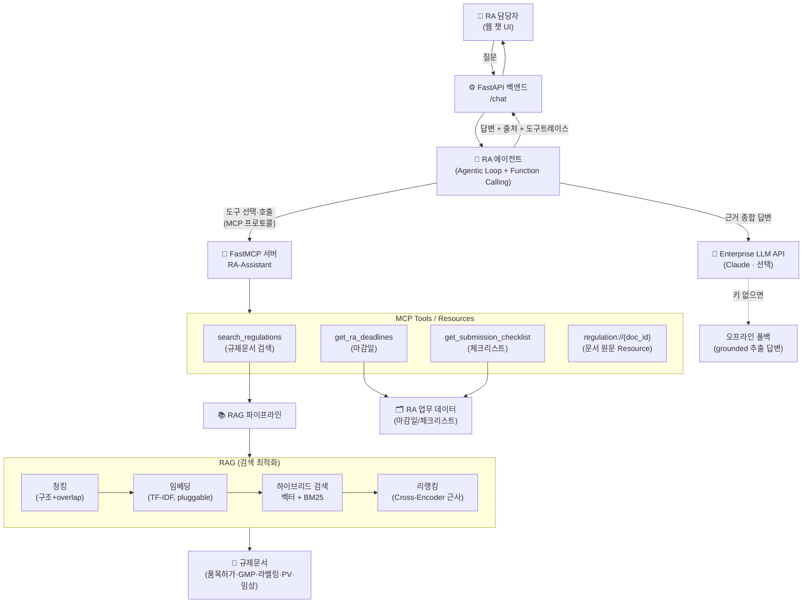

# 🧬 RA-Assistant — 제약 규제업무(RA)를 위한 RAG + MCP Agentic 어시스턴트

> 제약회사 **RA(Regulatory Affairs·인허가/규제업무)** 담당자가 실제로 쓸 법한
> 사내 규제문서 검색·업무 자동화 AI 어시스턴트의 **작동하는 최소 데모(MVP)**.
>
> **아키텍처가 GC녹십자 `Hey.GC 2.0`(Agentic AI + MCP)와 1:1로 대응**하도록 설계했다.
> 공고 필수 스택(RAG 최적화 · Agentic Workflow · Function Calling · MCP/FastMCP · FastAPI)을 한 프로젝트로 증명한다.

---

## 1. 문제 정의 (왜 RA인가)

RA 담당자는 **규제문서의 바다**에서 일한다.
- "이 변경은 변경허가야 변경신고야?", "중대 이상사례는 며칠 안에 보고?", "품목허가 심사 며칠 걸려?"
  — 답은 식약처 고시·가이드라인·SOP 어딘가에 있지만 **찾는 데 시간이 걸리고**, 틀리면 **규제 리스크**가 된다.
- 여러 제품의 **제출 기한·보고 마감**이 흩어져 있어 **놓치면 곧 컴플라이언스 사고**다.

→ 그래서 필요한 것: **① 규제문서를 근거와 함께 즉시 검색(RAG)** + **② 마감/체크리스트 같은 업무 도구를 에이전트가 자율 호출(Agent+MCP)**.
이것이 GC가 `Hey.GC 2.0`으로 사내에 하려는 바로 그 일이다.

## 2. 무엇을 하는가 (기능)

| 사용자 질문 예 | 에이전트 동작 | 사용 기술 |
|---|---|---|
| "신약 품목허가 심사 며칠 걸려?" | 규제문서 검색 → 근거+출처와 함께 답변 | **RAG** (하이브리드 검색 + 리랭킹) |
| "이번 주 마감 임박한 규제 업무는?" | 마감일 도구 호출 → D-day 순 정리 | **MCP Tool** (get_ra_deadlines) |
| "변경허가 준비 체크리스트 줘" | 체크리스트 도구 호출 | **MCP Tool** (get_submission_checklist) |
| (복합) "GMP 변경인데 뭘 준비하고 언제까지?" | 검색+체크리스트+마감일 **여러 도구 조합** | **Agentic Workflow** |

모든 답변에 **근거 출처(문서·섹션)** 를 표시해 규제 산업에 필수적인 **추적성**을 확보한다.

### 데모 화면


> 규제문서 검색(근거+출처 표시)과 마감일 조회를 각각 다른 MCP 도구가 처리한다. 하단에 "호출한 MCP 도구" 트레이스가 표시된다.

## 3. 아키텍처



**핵심 설계 포인트:** 모델(에이전트)과 도구(RA 시스템)가 **MCP 규격으로 분리**되어 있다.
→ 한 번 만든 MCP 도구를 Claude Desktop·Cursor·사내 에이전트 어디서든 재사용할 수 있다(= `Hey.GC 2.0`의 확장성 원리).

## 4. 기술 스택 ↔ 채용공고 매핑

| 공고 요구 | 이 프로젝트에서 | 위치 |
|---|---|---|
| **RAG 최적화** | 구조 청킹+overlap, 하이브리드(벡터+BM25), **리랭킹**, RAGAS식 평가 | `src/rag/`, `eval/` |
| **MCP / FastMCP** | FastMCP로 RA 도구 서버 구현(Tools+Resource), 인메모리/stdio | `src/mcp_server/server.py` |
| **Agentic Workflow / Function Calling** | 에이전트 tool-use 루프, MCP 도구 자율 호출 | `src/agent/agent.py` |
| **FastAPI (백엔드)** | `/chat`·`/health` API 서빙, Pydantic 스키마 | `src/api/main.py` |
| **Enterprise LLM API** | Anthropic Claude 연동(있으면) + 오프라인 폴백 | `src/agent/agent.py`, `src/config.py` |
| **프론트엔드** | 단일 페이지 챗 UI(출처·도구트레이스 표시) | `web/index.html` |
| **ML/DL 이론** | TF-IDF/BM25/코사인/리랭킹을 순수 파이썬으로 직접 구현 | `src/rag/embedder.py`, `retriever.py` |

## 5. 실행 방법

### 방법 A — 원커맨드 (권장)
```bash
cd project
./run.sh          # venv 생성 + 의존성 설치 + 서버 실행
# → 브라우저에서 http://127.0.0.1:8000 접속
```

### 방법 B — 수동
```bash
cd project
python3 -m venv .venv && .venv/bin/pip install -r requirements.txt
.venv/bin/python -m uvicorn src.api.main:app --port 8000
```

### LLM 모드 켜기 (선택)
```bash
export ANTHROPIC_API_KEY=sk-ant-...   # 없으면 자동으로 오프라인 모드
```
> **API 키가 없어도 데모는 항상 동작한다.** 키가 없으면 검색 근거를 발췌한 grounded 답변으로,
> 키가 있으면 에이전트가 실제 Claude로 도구를 조합해 자연어로 답한다.

### 기타
```bash
.venv/bin/python -m tests.test_rag          # 스모크 테스트
.venv/bin/python -m eval.evaluate           # RAG 검색 품질 평가
.venv/bin/python -m src.mcp_server.server   # MCP 서버 단독 실행(stdio)
```

## 6. RAG 검색 품질 평가 (RAG 최적화의 근거)

`eval/` 의 16개 QA셋으로 검색기 성능을 측정한다. 리랭킹 최종 1건(rerank_n=1) 기준:

| 지표 | ① 벡터만 | ② 하이브리드 | ③ +리랭킹 |
|---|---|---|---|
| Hit@1 | 0.875 | 0.875 | 0.875 |
| MRR | 0.875 | 0.875 | 0.875 |
| **ContextRecall** | 0.688 | **0.75** | **0.75** |

- **ContextRecall**(정답 근거의 핵심어가 회수된 context에 있는 비율)이
  벡터 단독 대비 **하이브리드에서 개선**된다 → 키워드+의미 결합의 효과.
- 지표·방법론은 `eval/evaluate.py` 참조. (작은 코퍼스라 상한이 빨리 포화 — 규모가 커질수록 하이브리드·리랭킹 효과가 커진다.)

## 7. 프로젝트 구조

```
project/
├── run.sh                     # 원커맨드 실행
├── requirements.txt · .env.example
├── data/
│   ├── regulations/           # 샘플 규제문서 6종(품목허가/변경/GMP/라벨링/PV/임상)
│   └── ra_tasks.json          # 마감일·체크리스트 업무 데이터
├── src/
│   ├── config.py              # 실행 모드·RAG 하이퍼파라미터
│   ├── rag/                   # 📚 RAG: loader→chunker→embedder→vectorstore→retriever→pipeline
│   ├── mcp_server/server.py   # 🔌 FastMCP 서버(RA 도구)
│   ├── agent/agent.py         # 🤖 에이전트(tool-use 루프 + 오프라인 폴백)
│   └── api/main.py            # ⚙️ FastAPI
├── web/index.html             # 💬 챗 UI
├── eval/                      # 📊 RAG 평가(QA셋 + 지표)
└── tests/test_rag.py         # ✅ 스모크 테스트
```

📎 함께 보기: [`docs/프로젝트_소개서.md`](docs/프로젝트_소개서.md)(필요성·페르소나·사용법·구조, 이미지 포함) · [`docs/ARCHITECTURE.md`](docs/ARCHITECTURE.md)(설계 결정 노트) · [`docs/포트폴리오_자소서3_소재.md`](docs/포트폴리오_자소서3_소재.md)

---

## 8. FDE 관점에서 이 데모가 증명하는 것

- **현업 밀착:** 실존하는 RA 담당자의 반복업무(규정 검색·기한 관리)를 정확히 겨냥했다.
- **End-to-end:** 데이터→RAG→MCP→에이전트→API→UI→평가까지 혼자 전 구간을 만들었다.
- **엔터프라이즈 감각:** 출처 추적, 근거 기반(환각 억제), 키 없이도 돌아가는 graceful degradation,
  도구/모델의 MCP 분리 — 제약 규제 산업이 요구하는 신뢰성·확장성을 반영했다.

> ℹ️ 규제 수치(처리기한 등)는 **데모용 샘플**로, 실제 최신 법령과 다를 수 있다. 이 프로젝트의 목적은 규제 자문이 아니라 **아키텍처·엔지니어링 역량 증명**이다.
