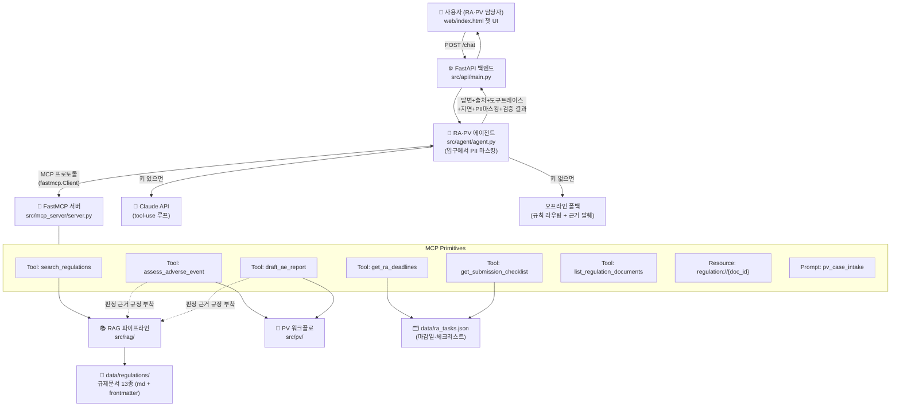
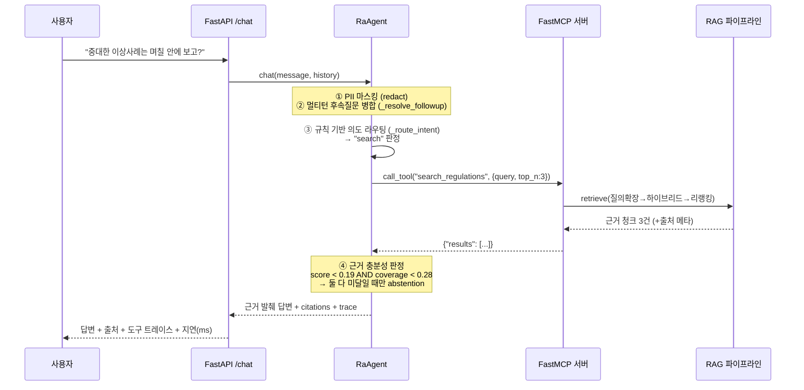
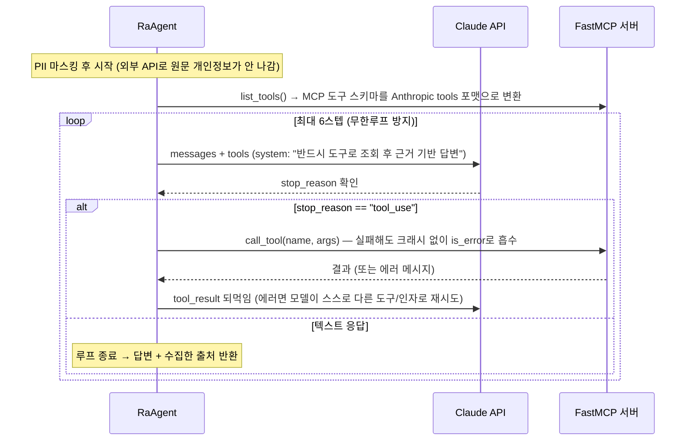
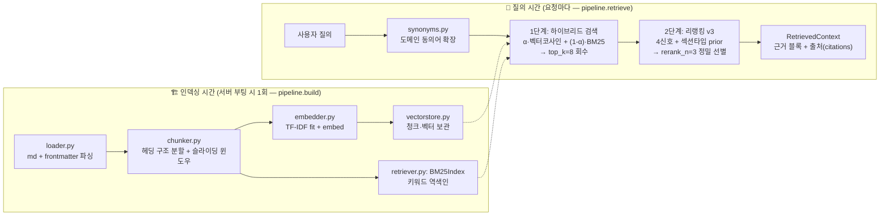
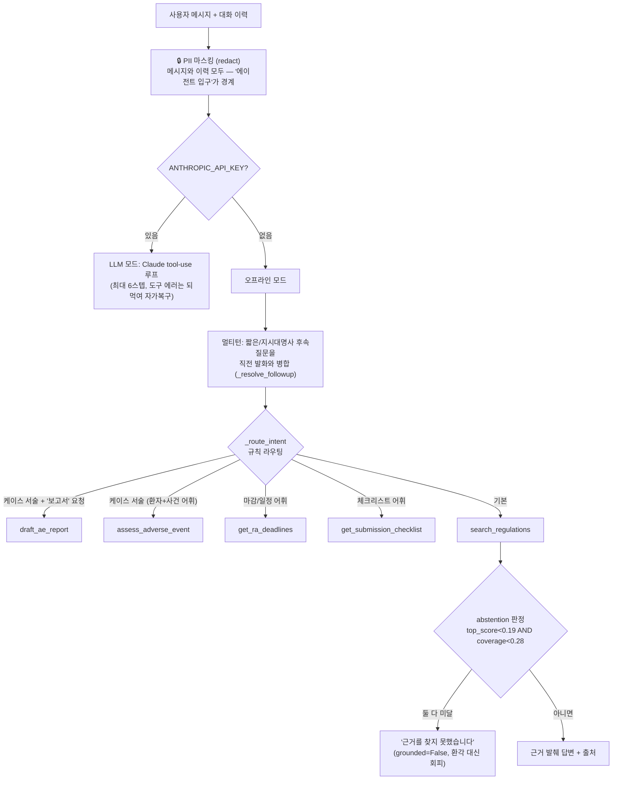
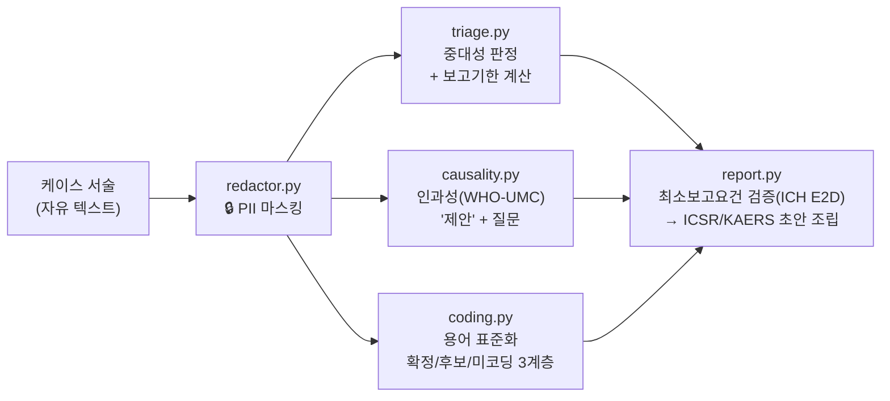

# RAPV-Assistant 아키텍처 완전 해설

> 이 문서는 **내가 직접 이 데모의 구조·원리·구성요소를 남에게 설명할 수 있게** 하기 위한 학습용 정리다.
> "무엇이 있는가"뿐 아니라 **"왜 그렇게 만들었는가"**를 함께 적는다.
> (경력기술서·자소서에 쓴 수치와 주장이 코드의 어디에서 나오는지도 표시한다.)

---

## 0. 한 문장 요약

**"규제문서를 근거·출처와 함께 검색하는 RAG"와 "업무 도구(마감·트리아지·보고서 초안)를 자율 호출하는 에이전트"를 MCP 규격으로 연결한, 제약 RA·PV 담당자용 어시스턴트.**

- 사용자는 웹 챗 UI에서 질문한다 → FastAPI가 받아 에이전트에 넘긴다.
- 에이전트는 질문 의도에 따라 **MCP 도구 6종** 중 필요한 것을 골라 호출한다.
- 규정 질문이면 RAG 검색 도구가, 케이스 서술이면 PV 도구가, 일정 질문이면 마감 도구가 답의 재료를 만든다.
- 모든 답변에 **근거 출처(문서·섹션·버전)**가 붙고, 근거가 없으면 **지어내지 않고 회피(abstention)**한다.
- LLM API 키가 없어도 전 기능이 동작한다(오프라인 폴백).

---

## 1. 전체 아키텍처 그림



**구조의 핵심 한 가지만 꼽으면**: 모델(에이전트)과 도구(RA·PV 업무 시스템)가 **MCP 규격으로 분리**되어 있다는 점이다. 에이전트는 도구의 내부 구현을 모르고, 도구의 이름·설명(docstring)·입력 스키마만 보고 호출한다. 그래서 같은 MCP 서버를 Claude Desktop이나 Cursor 같은 다른 MCP 클라이언트에 그대로 연결할 수 있다(stdio 실행 지원: `python -m src.mcp_server.server`).

---

## 2. 요청이 흐르는 길 (엔드투엔드)

### 2-1. 오프라인 모드 (API 키 없음 — 데모 기본값)



### 2-2. LLM 모드 (ANTHROPIC_API_KEY 있음 — 진짜 Agentic)



두 모드는 **동일한 MCP 도구, 동일한 인터페이스(`chat()`)**를 쓴다. 차이는 "누가 도구를 고르는가"뿐이다 — LLM 모드는 Claude가 tool-use로 스스로 고르고(Function Calling), 오프라인 모드는 규칙 라우터가 고른다. 이 대칭 덕분에 키가 없어도 데모가 항상 동작한다(graceful degradation).

---

## 3. 코드 지도 — 무엇이 어디에 있는가

```
project/
├── data/
│   ├── regulations/            # 규제문서 13종 (핵심 6 + 하드네거티브 유사문서 6 + 폐지 구판 1)
│   └── ra_tasks.json           # 마감일·체크리스트 샘플 데이터
├── src/
│   ├── config.py               # 실행 모드 + RAG 하이퍼파라미터 (환경변수로 제어)
│   ├── preflight.py            # 🛫 배포 전 점검 게이트 (설정·코퍼스·업무데이터·스모크 — 실패 시 기동 차단)
│   ├── observability.py        # 트레이스(span)·구조화 로그 + 검증 경고율 계기판(GateStats)·감사 로그
│   ├── rag/                    # 📚 검색: loader → chunker → embedder → vectorstore
│   │                           #          → synonyms(질의확장) → retriever(하이브리드+리랭킹) → pipeline
│   ├── pv/                     # 💊 PV: redactor(PII) → triage → causality → coding → report
│   ├── mcp_server/server.py    # 🔌 FastMCP 서버 (Tools 6 + Resource 1 + Prompt 1)
│   ├── agent/agent.py          # 🤖 에이전트 (LLM tool-use 루프 / 오프라인 라우터, abstention)
│   └── api/main.py             # ⚙️ FastAPI (/chat, /health, /api/deadlines, /)
├── web/index.html              # 💬 단일 페이지 챗 UI
├── eval/                       # 📊 평가 5종: evaluate(검색) · sweep(스윕/ablation) · faithfulness(신뢰성) · pv_eval(PV) · verify_eval(검증기) + stats(신뢰구간)
└── tests/                      # ✅ pytest 195케이스(불변식/fuzz 포함)
```

| 계층 | 파일 | 역할 한 줄 |
|---|---|---|
| 데이터 | `data/regulations/*.md` | YAML frontmatter(doc_id·version·effective_date·status)를 단 마크다운 규제문서 |
| RAG | `src/rag/*` | 문서 → 청크 → 벡터/BM25 인덱스 → 하이브리드 검색 → 리랭킹 → 근거+출처 |
| PV | `src/pv/*` | 케이스 서술 → 마스킹 → 중대성/기한 → 인과성 제안 → 용어 코딩 → ICSR 초안 |
| MCP | `src/mcp_server/server.py` | 위 기능들을 MCP Tools/Resources/Prompts로 표준화해 노출 |
| 에이전트 | `src/agent/agent.py` | 질문 의도 → 도구 선택·호출 → 근거 종합 답변 (환각 억제 포함) |
| API/UI | `src/api/main.py`, `web/index.html` | 서빙 + 출처·트레이스·지연·마스킹 배지 표시 |
| 품질 | `eval/*`, `tests/*` | 검색·신뢰성·PV 전 구간 수치 평가 + 회귀 테스트 |

---

## 4. RAG 파이프라인 심화 (`src/rag/`) — RA 도메인의 검색 축

규제문서 검색은 RA 담당자 업무의 중심 도구다. RA 도메인의 나머지 축(마감일·제출
체크리스트)은 조회 로직이 단순해 6장의 MCP 도구(`get_ra_deadlines`·`get_submission_checklist`,
`data/ra_tasks.json`)로 끝나고, 이 장은 검색 파이프라인을 깊이 다룬다.

### 4-1. 두 개의 시간축: 인덱싱(부팅 1회) vs 질의(요청마다)



### 4-2. 단계별 원리와 "왜"

**① 로더 (`loader.py`)** — 마크다운 상단의 YAML frontmatter를 파싱해 `doc_id`, `title`, `version`, `effective_date`, `status(active|superseded)` 같은 메타데이터와 본문을 분리한다. 실무의 PDF/HWP 파서 자리를 대신하는 데모용 입구다. **버전 메타를 여기서 실어두는 것**이 뒤의 '버전 인지 검색'의 출발점이다.

**② 청커 (`chunker.py`)** — RAG 품질을 좌우하는 첫 단계. 두 겹으로 자른다.
- **구조 분할**: 마크다운 헤딩(`##`)을 경계로 섹션 단위로 먼저 나눈다 → 문맥(주제)이 청크 안에서 끊기지 않는다.
- **슬라이딩 윈도우**: 긴 섹션은 `CHUNK_SIZE=500자`로 자르되 `OVERLAP=80자`씩 겹친다 → 경계에 걸린 문장이 유실되지 않는다.
- 각 청크 본문 앞에 `[문서제목 > 섹션제목]`을 덧붙인다 — Anthropic의 **Contextual Retrieval** 아이디어의 경량판으로, 청크 단독으로도 "어느 문서의 어느 맥락인지" 검색 신호에 반영된다.
- 청크는 `doc_id`, `section`, `version`, `effective_date`, `status`를 함께 들고 다닌다 → **출처 표시와 버전 필터**가 청크 레벨에서 가능해진다.

**③ 임베더 (`embedder.py`)** — 텍스트를 벡터로. 핵심 설계는 **교체 가능(pluggable)** 구조다.
- `EmbeddingProvider`라는 Protocol(인터페이스: `fit`/`embed`) 하나에 세 구현을 꽂았다:
  - `TfidfEmbedder`(기본): 코퍼스로 IDF를 학습해 희소 벡터 생성. 외부 의존성·API 키 0으로 데모가 항상 돈다.
  - `HashingEmbedder`: 사전 없이 토큰을 고정 버킷으로 해싱(feature hashing, signed hash로 충돌 상쇄). OOV에 강한 실전 기법의 시연.
  - `VoyageEmbedder`: 실제 상용 임베딩 API(REST) 호출 — "확장 지점"이 가설이 아니라 동작 코드로 존재함을 보여준다.
- 벡터는 `{term: weight}` 희소 dict + 코사인 유사도. numpy 없이 순수 파이썬.
- **왜 TF-IDF가 기본인가**: 데모의 제1원칙이 "키 없이 항상 실행"이기 때문. 밀집 임베딩의 의미 이해력은 포기하는 대신, 그 갭을 질의확장·리랭킹으로 메우는 것이 이 프로젝트의 최적화 스토리다.

**④ 토크나이저 (`textutil.py`)** — 한국어는 조사·띄어쓰기 변형이 많아 단어 매칭이 약하다. 그래서 (단어/영숫자 토큰) + (한글 문자 bi-gram)을 함께 만든다 — '감기약'과 '감기'가 bi-gram('감기')으로 이어진다. 형태소 분석기 없이 만든 경량 근사.

**⑤ 벡터스토어 (`vectorstore.py`)** — 청크와 임베딩을 리스트로 보관하고 코사인 top-k를 제공하는 인메모리 구현. 실무의 Vector DB(pgvector/Qdrant) 자리의 경량 대체물. 코퍼스가 작아(13문서 → 72청크) 전수 비교로 충분하다.

**⑥ 질의확장 (`synonyms.py`)** — 검색 실패의 최빈 원인인 **어휘 불일치(vocabulary mismatch)**를 겨냥한다. 사용자는 "부작용"이라 묻는데 문서는 "이상사례"라 쓴다 — TF-IDF/BM25는 이 간극을 스스로 못 메운다.
- 사전 방향은 **'구어 → 문서 정식 용어' 단방향**만. 양방향·연쇄 확장은 주제 표류(노이즈)를 만든다.
- 확장은 **원 질의에 덧붙이기(append)** — 원 질의 신호는 보존된다.
- 사전 항목은 감이 아니라 **eval 오류 분석에서 발굴**했다(예: "부작용이 심각하게…" 질의가 규정 용어 '중대한 이상사례'와 전혀 안 겹쳐 실패 → "심각"→"중대한" 추가). 역효과가 난 항목은 뺐다("dmf"→확장이 정의 섹션으로 주제 표류를 유발해 제외).

**⑦ 하이브리드 검색 (`retriever.py` 1단계)** — 서로 다른 강점의 두 검색을 결합한다.
- **벡터(TF-IDF 코사인)**: 문서 전체 어휘 분포의 유사성 — 넓은 의미 유사.
- **BM25(Okapi)**: 질의 용어의 정확 매칭 + 문서 길이 보정 + IDF — 고유명사·코드에 강함.
- 각 점수를 min-max 정규화한 뒤 `α·벡터 + (1-α)·BM25`(α=0.5)로 결합해 top_k=8을 회수한다. **정규화를 '버전 필터 통과 후보군 안에서' 수행**하는 디테일이 있다 — 전체 기준으로 정규화하면 필터로 빠진 문서가 스케일을 왜곡한다.

**⑧ 리랭킹 v3 (`retriever.py` 2단계)** — "많이 회수(recall)"한 8건을 "정밀하게 재정렬(precision)"해 상위 3건만 남긴다. 실무의 Cross-Encoder 리랭커 자리를 오프라인 신호로 근사한 것.

리랭커 점수 = 4신호 가중합 + 섹션 타입 prior:

| 신호 | 가중치 | 무엇을 보는가 |
|---|---|---|
| coverage | 0.55 | 청크 본문이 질의 토큰을 얼마나 덮는가 (토큰별 idf^0.5 가중) |
| phrase | 0.20 | 질의 원문이 본문에 통째로 등장하는가 (정확 구문) |
| section | 0.15 | 질의 토큰이 **섹션 제목**에 있는가 — 같은 문서 안에서 정답 '섹션'을 고르는 신호 |
| title | 0.10 | **문서 제목**이 질의로 설명되는 비율 — 하드네거티브 문서를 거르는 반증 신호 (BM25F처럼 필드 분리) |

여기에 **섹션 타입 prior(v3)** — 어휘가 아니라 **문서 구조**를 읽는 신호:
- **대조 섹션 페널티(−0.3)**: "의약품 표시기재**와의 차이**" 같은 대조 섹션은 상대 도메인의 어휘를 통째로 인용해서 coverage로는 정답 문서를 이겨버린다(하드네거티브 최빈 실패 형태). 섹션 '제목'의 대조 구문(`~와의 차이/구분/비교`)을 감지해 감점하되, **질의 자체가 비교를 물으면("차이가 뭐야?") 게이트로 페널티를 끈다** — 대조 섹션이 정답인 질문을 죽이지 않는다.
- **서두 섹션 감쇠(−0.055)**: "목적/개요/총칙" 섹션은 문서의 모든 주제 어휘를 요약해 담아 coverage가 과대평가된다(운영 질문의 답은 대개 본문 조항에 있다). 질의가 정의/취지를 물으면 게이트로 해제.
- 마지막으로 **1차 하이브리드 점수를 prior로 블렌딩**한다(`0.9·리랭커 + 0.1·1차점수`). 순수 재정렬은 쉬운 질의를 오히려 떨어뜨리기 때문 — 실무 Cross-Encoder도 first-stage 점수와 결합해 안정화한다.
- 질의확장으로 추가된 토큰은 리랭킹에서 **절반 가중의 보조 신호(aux)**로만 쓴다. 회수(확장 전 가중)와 정밀(원 질의 중심)의 역할 분리 — 완전 어휘 불일치 질의에서 리랭커가 판별력을 잃는 것을 막는 안전망이다(ablation: 1차 prior를 끄면 aux 유무가 Hit@1 0.969 vs 0.906).

**⑨ 버전 인지 검색** — 규제 산업 필수 요건. `status=superseded`(폐지 구판)는 기본 제외하고, `as_of=YYYY-MM-DD`를 주면 **그 시점에 시행 중이던 버전**을 반환한다 — 시행 전 문서는 제외하되, **당시 현행이던 폐지본은 [시행일, 후속본 시행일) 구간 판정으로 포함**한다. 폐지 필터를 as_of 에 그대로 겹치면 개정된 규정(=시점 조회가 필요한 규정)의 과거 시점 조회가 신·구판 모두 걸러져 0건이 되는 조합 결함이 있었고, 이를 '당시 현행' 의미론으로 수정했다(시행일 해석 불가 문서는 fail-closed 제외, 폐지 체인의 시행일 단조성은 preflight 가 검사, 시점 조회 자체는 canary 로 고정). `include_superseded=True`로 개정 이력 조회도 가능하며, 형식이 틀린 as_of 는 조용히 무시하지 않고 명시적 에러(`error`+`expected`)로 답한다. 코퍼스에 **폐지 구판 문서(REG-013 계열)를 일부러 포함**해 이 필터가 실제로 작동함을 평가로 증명한다.

### 4-3. 수치로 보는 최적화 스토리 (경력기술서 수치의 출처)

`eval/qa_dataset.json` 32문항(어휘가 겹치는 하드네거티브 14문항 포함), rerank_n=1 기준:

| 지표 | ① 벡터만 | ② 하이브리드 | ③ +리랭킹 v3 | ④ +질의확장 |
|---|---|---|---|---|
| Hit@1 | 0.875 | 0.844 | 0.938 | **1.000** |
| ContextRecall | 0.781 | 0.844 | 0.906 | **0.969** |
| HardNegHit@1 | 0.786 | 0.786 | 0.929 | **1.000** |

읽는 법(면접에서 그대로 설명할 수 있어야 함):
- **하이브리드가 Hit@1을 살짝 떨어뜨리는 것은 정직한 수치**다. 작은 코퍼스에서는 벡터만으로 쉬운 질의가 이미 포화라, BM25 결합이 일부를 흔든다. 대신 ContextRecall(정답 재료 회수)이 오르고, 리랭킹이 Hit@1을 회복+초과시킨다.
- **하드네거티브에서의 개선이 최적화의 핵심 근거**다. 벡터 단독은 어휘 유사도에 끌려 유사 오답 문서를 고르지만, 리랭커(특히 title 반증 신호 + 섹션 타입 prior)가 정답을 1순위로 되돌린다.
- 개선은 **오류 분석 루프**의 결과다: 0.867(초기 30문항) → 0.900(구어 동의어 보강) → 0.967(리랭커 필드 분리) → 1.000(섹션 타입 prior). 마지막 잔여 실패는 어휘 재가중으로는 어떤 조합으로도 안 뒤집혔고, '구조' 신호로 풀었다.
- 하이퍼파라미터(α=0.5, rerank_weight=0.9, idf_power=0.5, 페널티 0.3/0.055)는 감이 아니라 `eval/sweep.py`의 스윕·ablation으로 정했고 재현 가능하다.
- **남은 정직한 갭**: ContextRecall 1건 — "계속 제출해야 하나?"와 "정기 보고(PSUR)" 조항 사이의 의미 간극은 어휘 신호로 못 메운다. 밀집 임베딩/실제 Cross-Encoder가 필요한 지점 = 다음 확장 지점.

---

## 5. 에이전트 계층 (`src/agent/agent.py`)

### 5-1. 구조



### 5-2. 핵심 설계 포인트

**Function Calling / Agentic Loop (LLM 모드)** — `list_tools()`로 받은 MCP 도구 스키마를 Anthropic tools 포맷으로 변환해 Claude에 준다. Claude가 `stop_reason=tool_use`로 도구를 요청하면 실행하고 `tool_result`를 되먹인다 — "관찰→생각→도구호출→관찰" 루프. 안전장치 세 가지:
- **스텝 상한 6회** (무한루프 방지),
- **도구 실패 흡수**: 예외를 크래시 대신 `is_error=True`인 tool_result로 되먹여 모델이 스스로 다른 도구/인자로 복구하게 한다,
- **시스템 프롬프트로 근거 강제**: "반드시 도구로 조회 후, 근거 기반으로만. 근거 없으면 모른다고."

**Abstention (환각 억제)** — 규제 도메인의 킬러 요건. 두 신호의 **AND 조건**으로만 회피한다:
1. 최상위 근거의 리랭커 점수 (`SCORE_FLOOR=0.19`)
2. 질의 토큰이 근거 텍스트에 실제 등장한 비율 (`COVERAGE_FLOOR=0.28`)

왜 AND인가 — 구어체 범위내 질문은 점수는 낮아도 커버리지가 남는다. OR로 하면 과회피(over-abstention)가 생긴다. 문턱값은 임의가 아니라 **범위내/범위밖 질문의 점수 분포를 실측해 마진 중앙**으로 놓은 값이고, 리랭커 공식이 바뀔 때마다 재보정한다(v3 도입 후 재실측 — 분포 불변으로 유지). 커버리지는 **확장 질의 기준**으로 계산한다: 검색은 동의어 확장으로 정답을 찾았는데 회피 판정만 원 질의로 보면 "정답을 찾고도 모른다고 답하는" 자기모순이 생기기 때문.

**멀티턴** — 오프라인 모드에서 "그럼 그건 며칠?" 같은 짧은/지시대명사 후속질문을 직전 사용자 발화와 병합해 검색 질의를 만든다(경량 맥락 복원). LLM 모드는 history를 그대로 넘기므로 모델이 처리한다.

**출처 수집** — `search_regulations` 결과뿐 아니라 PV 도구가 반환하는 `basis`(판정 근거 규정)도 citations로 모은다. (문서·섹션) 키로 dedupe.

---

## 6. MCP 서버 (`src/mcp_server/server.py`)

### 6-1. 왜 MCP인가

도구를 에이전트 코드에 함수로 직접 박으면 그 에이전트 전용이 된다. **MCP(Model Context Protocol) 규격으로 분리**하면 도구 서버는 표준 인터페이스(이름·설명·JSON 스키마)만 노출하고, 어떤 MCP 클라이언트든(이 데모의 에이전트, Claude Desktop, Cursor, 사내 에이전트) 같은 도구를 재사용한다. 이 데모는 두 연결 방식을 다 지원한다:
- **인메모리**: `fastmcp.Client(mcp)` — 에이전트가 같은 프로세스에서 직접 연결(데모 기본, 지연 최소)
- **stdio**: `python -m src.mcp_server.server` — 표준입출력 트랜스포트로 외부 클라이언트 연결

### 6-2. MCP 3대 primitive를 모두 구현

| Primitive | 구현 | 역할 |
|---|---|---|
| **Tools** (모델이 호출) | `search_regulations`, `get_ra_deadlines`, `get_submission_checklist`, `assess_adverse_event`, `draft_ae_report`, `list_regulation_documents` — 6종 | 에이전트가 상황에 맞게 골라 쓰는 실행 단위 |
| **Resource** (데이터 조회) | `regulation://{doc_id}` | 규제문서 '원문 전체'를 URI로 조회 (검색이 아닌 원문 열람) |
| **Prompt** (워크플로 배포) | `pv_case_intake` | "케이스 접수 SOP"를 프롬프트로 배포 — 어느 클라이언트가 붙어도 도구를 같은 순서(트리아지→근거확인→초안)로 쓰게 함 |

### 6-3. 도구 설계에서 중요했던 것

- **docstring이 곧 LLM용 사용설명서다.** FastMCP는 함수의 타입힌트와 docstring으로 도구 스키마를 만든다. 각 docstring에 "언제 이 도구를 쓰고, 언제 다른 도구를 써야 하는지"를 명시했다(예: `assess_adverse_event`에 "규정 자체가 궁금하면 search_regulations를 사용"). 에이전트의 도구 선택 품질은 이 설명 품질에 직결된다.
- **도구 간 경계 설계**: 같은 이상사례라도 "규정이 어떻게 돼?"(search) / "이 케이스 언제까지 보고?"(triage) / "보고서 만들어줘"(report)를 다른 도구로 나눴다 — 오프라인 라우터의 분기와도 1:1 대응된다.
- **추적성**: PV 도구는 판정만 반환하지 않고 `basis`(판정 근거 규정 문단을 RAG로 회수)를 부착한다 — "이 기한의 출처는 REG-005 §2"까지 답할 수 있다.
- RAG 인덱스는 모듈 전역 `_pipeline`으로 1회만 구축(무거운 초기화 캐시).

---

## 7. PV 워크플로 (`src/pv/`) — PV 도메인 심화 계층

PV(약물감시) 담당자의 실제 케이스 처리 순서를 그대로 모듈로 옮겼다:



### 7-1. 대원칙: 왜 전부 규칙 기반(결정론)인가

**보고기한 계산과 요건 판정은 컴플라이언스 그 자체다.** 하루 틀리면 사고인데 LLM의 날짜 연산·기준 적용은 확률적이라 감사(audit) 대상이 될 수 없다. 그래서 역할을 나눴다: **LLM은 도구 선택과 설명(orchestration), 규정이 정한 계산은 결정론적 도구** — 결과가 항상 재현·검증된다. 모호하면 보수 적용(예상 여부 불명 → 15일 트래킹)하고, 모든 출력에 "최종 확정은 PV 담당자" caveat를 강제한다.

### 7-2. redactor.py — PII 비식별화 (외부 API 경계의 안전장치)

- 정규식으로 주민번호·전화번호·이메일·환자/차트번호·호칭 붙은 이름(`홍길동님` → `[이름]님`)을 마스킹. 이름 오탐은 스톱리스트("선생", "담당자"…)로 차단.
- **에이전트 입구에서 실행** → 이후의 모든 경로(외부 LLM API·검색·로그·트레이스)에 원문 개인정보가 흘러들지 않는다. MCP 도구 안에서도 한 번 더 실행한다(stdio로 도구를 단독 사용할 때의 심층방어).
- **원 값 비보존**: 결과에는 유형·건수만 남는다(`이름(호칭) 1건`).
- 규칙 기반인 이유: 결정론적이라 감사 가능하고, LLM 호출 '이전'에 실행되므로 마스킹을 LLM에 의존하는 순환이 없다. 한계(자유 서술 속 모든 이름)는 명시했고 실무 확장 지점은 NER(Presidio) — 이 모듈이 그 교체 자리다.
- **설계상 긴장의 해소**: 최소보고요건 ①은 '식별 가능한 환자의 존재'인데 마스킹은 식별자를 지운다. → 값은 지우되 **존재 신호**(`[이름]님`, "45세 남성")는 남겨 요건 판정과 양립시켰다.

### 7-3. triage.py — 중대성 판정 + 보고기한 계산

- 중대성(Serious) 기준은 규정(REG-005)에 **닫힌 목록**(사망·생명위협·입원·장애·기형·의학적 중요)으로 정의돼 있다 → 판단이 아니라 '대조'라 규칙으로 **확정**할 수 있다. 각 기준을 감지 키워드 목록으로 코드화했다.
- 기한 규칙: 사망·생명위협 → 지체 없이(D+0) / 그 외 중대 → 인지일+15일 / 비중대 → 정기보고(PSUR). 인지일(`awareness_date`)로부터 실제 마감 날짜를 계산한다.
- 예상 여부(expectedness)를 판별 못 하면 '예상치 못한 사례'로 **보수 적용** — 기한을 놓치는 쪽보다 이르게 잡는 쪽이 안전한 실패다.

### 7-4. causality.py — 인과성은 '확정'이 아니라 '제안'

트리아지와의 **확신 수준 차이**가 이 모듈의 핵심이다: 중대성은 닫힌 목록 대조(→확정)지만, 인과성은 임상 정보를 종합하는 판단(→정보가 없으면 답이 없다). 그래서 출력이 다르다:
- WHO-UMC 판단 요소 4신호(시간적 선후관계 · dechallenge 중단 후 호전 · rechallenge 재투여 후 재발 · 대체 원인)를 서술에서 감지한다.
- 신호 조합으로 등급을 **제안**한다: 시간+중단호전+재발+대체원인없음→Certain, 시간+중단호전→Probable, 시간만→Possible, 대체원인만→Unlikely, 신호 없음→Unassessable. **정보가 없는 요소는 충족으로 치지 않는다**(등급은 아래로만 보수 적용).
- 서술에 없는 판단 요소는 **보고자에게 되물을 follow-up 질문**으로 반환한다 — 규칙의 역할은 '신호 감지와 질문 생성'까지, 확정은 사람.

### 7-5. coding.py — 용어 표준화 3계층 (MedDRA 방식)

케이스는 "숨쉬기 힘들다" 같은 구어로 오지만 규제 보고(KAERS/E2B)는 표준 용어(MedDRA PT)로 코딩해야 한다. 코딩이 흔들리면 같은 이상사례가 다른 용어로 흩어져 **시그널 탐지(집계)가 무너진다** — 그래서 정밀도에 무관용인 계층 구조를 만들었다:

| 계층 | 함수 | 신뢰도 | 동작 |
|---|---|---|---|
| 1계층 확정 | `code_terms` | 사람이 검수한 소사전 | 매칭 즉시 확정(집계 대상). 같은 PT는 dedupe |
| 2계층 후보 | `suggest_candidates` | LLT 스타일 참조(미검수) | `needs_confirmation=True`로 **후보만 제시** — 사람 승인 후 1계층으로 승격(사전 성장의 운영 루프) |
| 3계층 감지 | `flag_uncoded_expressions` | 사전에 없음 | 구체적 증상 서술("저릿저릿")의 **존재만** 표시(PT 없음) |

후보(`CandidateTerm`)와 확정(`CodedTerm`)을 **타입 수준에서 분리**해 후보가 집계에 섞이는 실수를 구조적으로 막았다. 3계층이 존재하는 이유는 다음 절의 ④요건 판정 때문이다.

### 7-6. report.py — 최소보고요건 검증 + ICSR 초안

핵심은 초안 생성보다 **최소보고요건(ICH E2D 4요소: ①식별 가능한 환자 ②식별 가능한 보고자 ③의심 의약품 ④이상사례) 검증**이다. 하나라도 없으면 '보고 가능'이 아니라 '정보 보완 대상'(`reportable=False` + 보완 목록 + follow-up 질문).

- ④요소는 '코딩 성공'이 아니라 **'구체적 이상사례 서술의 존재'**로 판정한다(확정이 없어도 후보/미코딩 감지가 있으면 충족) — **코딩 사전의 빈틈이 '보고 불가' 오판으로 연쇄되는 것을 끊는 설계**. 단 "몸이 좋지 않다" 같은 막연한 서술은 세 계층 모두 안 잡히므로 여전히 미충족(specificity 요구 유지).
- 의심약 감지 정규식은 "OO정을 복용" 같은 **노출(exposure) 맥락이 따라올 때만** 매칭한다 — '규정·판정' 같은 '-정'으로 끝나는 일반 명사 오탐 방지.
- 충족이면 트리아지+인과성+코딩을 종합한 KAERS 구조의 마크다운 초안을 조립한다. 실패 방향은 항상 "조용한 오탐"이 아니라 **"시끄러운 보완 요청"** — 컴플라이언스 도구의 올바른 실패 방향이다.

### 7-7. PV 평가 수치 (`eval/pv_eval.py`, 라벨 22케이스)

SeriousnessAcc/DeadlineAcc/CausalityAcc/ReportableAcc 1.000, 확정 코딩 P 1.000 / R 0.792, CandidateRecall 0.958. 읽는 법: **정밀도 1.0은 무관용 원칙(오탐=집계 오염)의 증명**이고, 확정 재현율 0.792와 후보 재현율 0.958의 갭이 각각 '사람 검수 대기 큐'와 'MedDRA 본체 교체'라는 확장 지점의 크기다. 롱테일 구어(저혈당·울렁거림)와 심층 롱테일(저릿저릿)을 라벨에 일부러 넣어 재현율이 정직하게 1.0 미만이 되게 설계했다.

---

## 8. API와 UI (`src/api/main.py`, `web/index.html`)

- **FastAPI + Pydantic**: `/chat`(질문→답변), `/health`(모드·인덱스·하이퍼파라미터 상태), `/api/deadlines`, `/`(챗 UI 서빙). 요청/응답 스키마를 Pydantic 모델(`ChatRequest`/`ChatResponse`)로 검증한다.
- **lifespan 훅**에서 부팅 시 RAG 인덱스를 1회 구축한다(요청마다 재구축하지 않음).
- 응답에는 답변 외에 `citations`(출처), `tool_calls`(어떤 MCP 도구를 어떤 인자로 불렀는지), `trace`(스텝별 지연·성패), `latency_ms`, `grounded`(근거 뒷받침 여부), `redactions`(PII 마스킹 유형·건수), `verification`(사후 검증 결과 — 수치·날짜 대조, 폐지본 인용 점검)이 실린다 → UI가 **출처·도구 트레이스·지연·마스킹·검증 배지**를 그대로 보여줘 "왜 이 답인가"를 투명하게 만든다.

## 9. 관측성 (`src/observability.py`)

- `Trace`(요청 1건) 안에 `Span`(도구 호출·LLM 스텝 단위: 이름·종류·ms·성패)을 쌓는 구조 — OpenTelemetry/LangSmith의 span·trace 개념을 의존성 없이 순수 파이썬으로 구현.
- `timed()` 컨텍스트 매니저가 실행시간을 재고, **예외가 나도 ok=False span을 남긴 뒤 재전파**한다. 동시에 구조화(JSON) 로그를 남긴다.
- 엔터프라이즈 에이전트에서 "무슨 도구를 몇 ms에 성공/실패로 호출했는가"는 디버깅·SLA·비용 관리의 기본이라는 것을 보여주는 계층.
- **검증 게이트 운영 계기판(`GateStats`)**: 사후 검증의 통과/경고를 축별(미확인 수치·방향·역할·질문 전제·폐지본)로 집계해 `/health`에 경고율(`warn_rate`)로 노출하고, 응답마다 판정 요약을 감사 로그(JSON, PII 없음 — 케이스 유래 라벨 `case_origin` 포함)로 남긴다. 경고율 추이는 답변 품질 회귀 또는 검증기 오탐 증가(alert fatigue — 경고가 무시되기 시작하면 검증 계층이 사실상 죽는다)의 조기 신호다. 추이는 **`warn_rate_checked`**(수치·날짜 클레임이 있던 응답만의 경고율)로 읽는다 — 회피·무클레임 응답이 분모에 섞이면 트래픽 믹스 변화가 품질 변화처럼 보인다(분모 혼합 착시).
- **배포 전 점검(`src/preflight.py`)**: 기동 전에 설정 불변식·코퍼스/폐지 체인 무결성·업무데이터 스키마·스모크 canary + 안전장치 자가 테스트(검증 게이트 — **모든 경고 축**에 심은 오류가 기대 축에 걸리는가·PII 마스킹)를 강제한다(실패 시 exit 1, `run.sh`·CI 연동). 데이터·설정 결함은 부팅이 아니라 운영 중 오답으로 나타나기 때문에 기동 전에 차단한다.

## 10. 설정 (`src/config.py`)

모든 손잡이가 환경변수로 제어된다: 실행 모드(`ANTHROPIC_API_KEY` 유무), RAG 하이퍼파라미터(`CHUNK_SIZE=500`, `CHUNK_OVERLAP=80`, `RETRIEVE_TOP_K=8`, `RERANK_TOP_N=3`, `HYBRID_ALPHA=0.5`, `RERANK_WEIGHT=0.9`, `RERANK_IDF_POWER=0.5`, 섹션 prior 페널티 `0.3/0.055`), 임베더 종류(`EMBEDDER_KIND`), 질의확장 on/off(`QUERY_EXPANSION`). 값마다 "왜 그 값인가"의 근거가 `eval/sweep.py`로 재현된다.

---

## 11. 평가 체계 (`eval/`, `tests/`) — "측정 없이 신뢰 없음"

| 스크립트 | 무엇을 측정 | 핵심 지표 |
|---|---|---|
| `evaluate.py` | **검색기 성능** (4개 모드 비교: 벡터/하이브리드/+리랭킹/+질의확장) | Hit@1, MRR, ContextRecall, HardNegHit@1, 지연 |
| `sweep.py` | **하이퍼파라미터 근거 재현** (스윕 + ablation) | rerank_weight·alpha·idf_power·섹션 prior의 결정 근거 |
| `faithfulness.py` | **답변 신뢰성** (검색과 별개로 '최종 답변'을 평가) | AnswerGroundedness 1.0, CitationRate 0.969, AbstentionAccuracy 1.0, OverAbstain 0.0 |
| `pv_eval.py` | **PV 워크플로** (라벨 22케이스) | 중대성·기한·인과성·코딩·보고요건 정확도 |
| `verify_eval.py` | **답변 사후 검증기** (메타모픽: 정상 답변에 결정론적 변조를 가해 오류 합성 — 치환·오프셋·방향·고유어·날짜 시프트·**역할 스왑**·**부분 날짜 시프트** 7축). 지표·표본 수의 회귀는 `tests/test_verify_eval.py` 가 CI 실패로 강제한다(핀에 알람) | SwapDetection·DirectionDetection·DateRoleSwapDetection·CleanPassRate·E2EPassRate |

지표 정의(스스로 설명할 수 있어야 하는 것):
- **Hit@1**: 정답 문서가 검색 1위인 비율. **MRR**: 정답 첫 등장 순위의 역수 평균(1위=1.0, 2위=0.5).
- **ContextRecall**: 정답에 필요한 핵심어가 회수된 근거 안에 존재하는 비율 — "생성이 정답을 말할 재료를 검색이 줬는가" = faithfulness의 상한.
- **AbstentionAccuracy**: 범위밖 질문(별도 `abstention_dataset.json`)에 환각 대신 '근거 없음'으로 답한 비율. **OverAbstain**: 범위내인데 과도 회피한 비율(낮을수록 좋음) — 회피 문턱의 양면을 다 감시한다.
- QA셋에는 **하드네거티브**(정답과 어휘가 겹치는 오답 유사문서가 있는 문항) 14개와 **게이트 검증 문항**(대조 섹션이 '정답'인 질문 2개 — 섹션 prior가 섹션 삭제가 아님을 증명)을 넣었다. 코퍼스도 유사문서 13종으로 일부러 어렵게 구성 — 최적화 효과가 수치로 드러나게.

여기에 `tests/` 195케이스(불변식/fuzz 포함)가 회귀를 잡고, GitHub Actions CI가 매 푸시마다 **preflight(배포 전 점검)** + pytest + 평가 4종(검색·신뢰성·PV·검증기)을 실행한다.

---

## 12. 관통하는 설계 원칙 (면접에서 아키텍처를 요약할 때)

1. **경계 설계가 아키텍처다** — LLM(확률적)과 규칙(결정론)의 경계: 도구 선택·설명은 LLM, 컴플라이언스 계산은 규칙. 확신 수준의 경계: 중대성은 '확정', 인과성은 '제안+질문', 코딩은 '확정/후보/감지 3계층'. 보안 경계: PII는 외부 API로 나가는 입구에서 마스킹.
2. **근거 없는 답은 내보내지 않는다** — 모든 답에 출처, 근거가 약하면 abstention, PV 판정에도 근거 규정(basis) 부착, 나가는 답변의 수치·날짜·방향 한정어(기간·날짜 표기 모두)·날짜 역할은 사후 검증 게이트가 근거와 대조(케이스 서술 유래 지지는 from_case 라벨, 폐지본 인용 허용은 이력 검색이 반환한 문서 단위). 규제 도메인의 신뢰성 요건을 응답 구조 자체에 박았다.
3. **표준 규격으로 분리해 재사용** — 도구는 MCP로(클라이언트 무관), 임베더는 Protocol 인터페이스로(TF-IDF↔해싱↔Voyage 무수정 교체). 확장 지점이 말이 아니라 코드로 존재한다.
4. **모든 주장은 재현 가능한 수치로** — 5개 평가 스크립트 + 스윕/ablation + 195개 테스트 + CI, 소표본 지표엔 95% 신뢰구간 병기. 하이퍼파라미터 하나까지 "왜 그 값인가"를 스크립트로 재현한다. 정직한 갭(ContextRecall 1건, 코딩 재현율 0.792)도 숨기지 않고 '다음 확장 지점의 크기'로 해석한다.
5. **우아한 성능 저하(graceful degradation)** — 키 없으면 오프라인 폴백, 도구 실패는 흡수 후 자가복구 유도, 판정 불가면 보수 적용 + 사람에게 질문. 어떤 실패도 크래시나 조용한 오답이 아니라 '설명되는 축소 동작'이 된다.

---

## 13. 스스로 점검 — 이 질문들에 즉답할 수 있는가

**RAG**
- 왜 벡터 검색만으로 부족한가? → 어휘 불일치(구어↔정식 용어)와 하드네거티브(어휘가 겹치는 오답 문서). 전자는 질의확장, 후자는 리랭킹(title 반증 신호 + 섹션 타입 prior)이 푼다.
- 하이브리드에서 왜 min-max 정규화가 필요한가? → 코사인(0~1)과 BM25(무제한) 점수 스케일이 달라 그대로 더하면 한쪽이 지배한다.
- 질의확장을 왜 1단계엔 전 가중, 2단계엔 절반 가중으로 나눴나? → 회수(recall)와 정밀(precision)의 역할 분리. 확장어가 정밀도 신호를 희석하지 않으면서, 완전 어휘 불일치 질의의 판별력은 유지(ablation 근거: 0.969 vs 0.906).
- 리랭킹 후에도 1차 점수를 왜 섞나(rerank_weight=0.9)? → 순수 재정렬은 쉬운 질의를 오히려 떨어뜨림. first-stage 점수를 prior로 결합하는 실무 관행의 반영.
- 청킹에서 overlap은 왜? → 청크 경계에 걸린 문장의 정보 유실 방지.

**Agent / MCP**
- Function Calling과 MCP의 관계? → Function Calling은 "모델이 도구를 호출하는 능력"(Anthropic tools 파라미터), MCP는 "도구를 표준 규격으로 제공하는 프로토콜". 이 데모는 MCP 도구 스키마를 Anthropic tools 포맷으로 변환해 둘을 연결한다.
- 도구 6종을 에이전트가 어떻게 구분해 쓰나? → LLM 모드는 docstring(사용 조건 명시)을 보고 스스로, 오프라인 모드는 규칙 라우터가 케이스 어휘·요청 어휘로 분기.
- abstention은 어떻게 동작하나? → 근거 점수와 질의 커버리지 **둘 다** 문턱 미달일 때만 회피(AND). 문턱은 범위내/밖 분포 실측으로 보정, OverAbstain 0.0으로 과회피 없음을 확인.

**PV**
- 왜 트리아지는 '확정'인데 인과성은 '제안'인가? → 중대성은 닫힌 목록 '대조', 인과성은 임상 정보 '종합 판단'. 판단 성격이 다르면 자동화의 확신 수준도 달라야 한다.
- 코딩 3계층의 존재 이유? → 정밀도 무관용(오탐=집계 오염) + 재현율 확장 루프(후보→검수→승격) + 보고요건 연쇄 오판 차단(존재 감지).
- PII 마스킹과 '식별 가능한 환자' 요건의 충돌은? → 값은 지우고 존재 신호는 남긴다.

**전체**
- 이 데모에서 가장 자랑할 설계 하나는? → (내 답을 준비할 것 — 추천: 오류 분석 루프로 Hit@1 0.875→1.0을 만든 과정, 또는 LLM/규칙의 경계 설계)
- 실서비스로 가려면 무엇부터 바꾸나? → 임베더(밀집 임베딩), 리랭커(실제 Cross-Encoder), 벡터스토어(Vector DB), PII(NER), 코딩 사전(MedDRA 본체), 인증·권한 — 전부 이미 교체 지점이 인터페이스로 잡혀 있다.

---

📎 함께 보기: [`README.md`](README.md)(수치·실행법) · [`docs/ARCHITECTURE.md`](docs/ARCHITECTURE.md)(설계 결정 노트) · [`docs/면접노트.md`](docs/면접노트.md)(예상 질문 대응)
