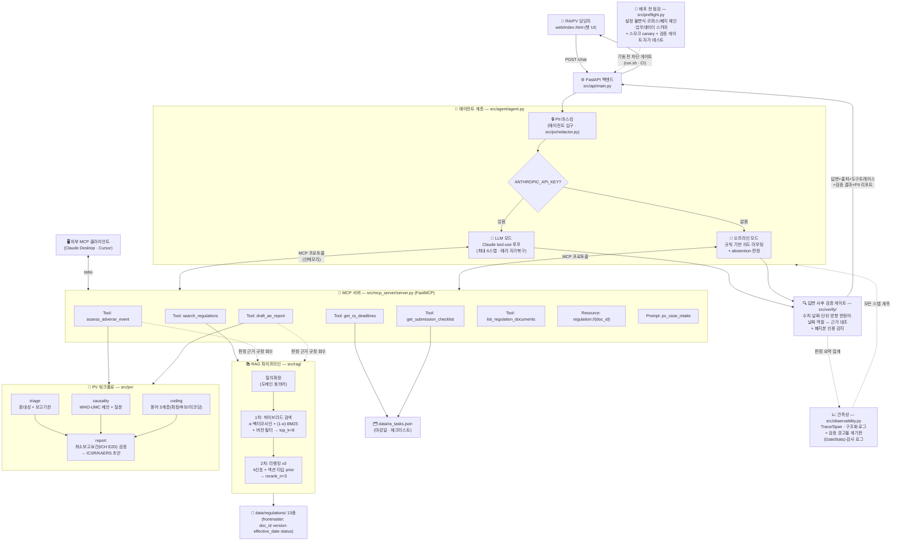
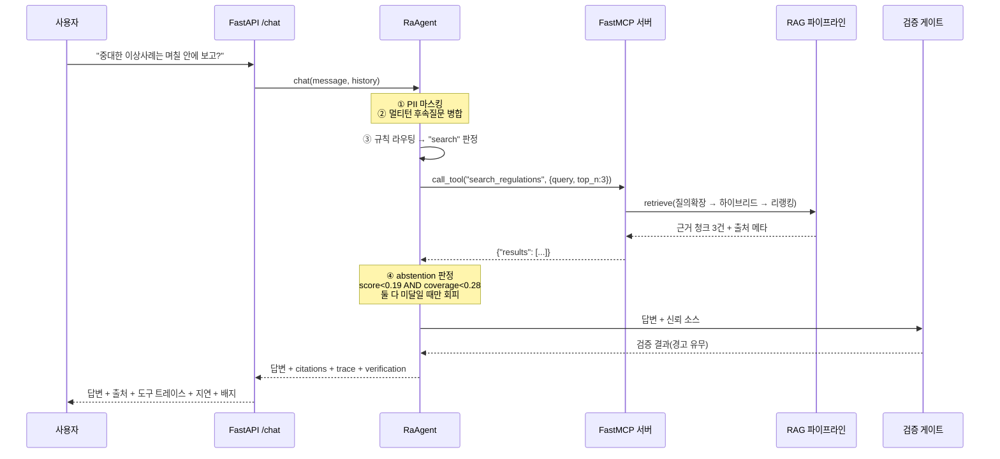
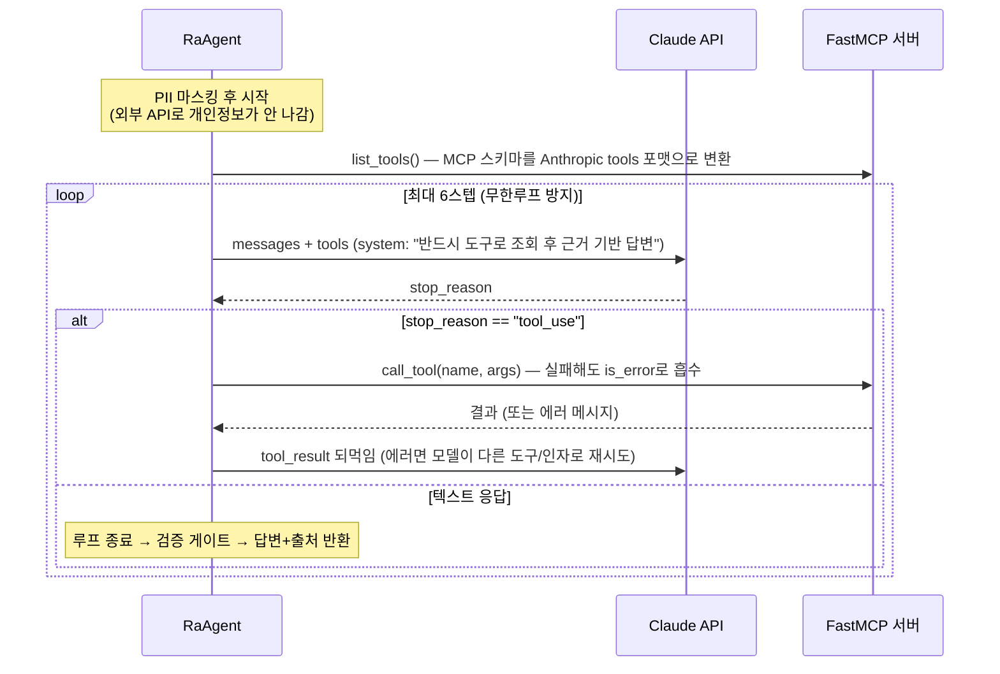
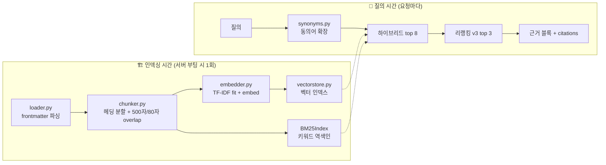

# 아키텍처 — 다이어그램과 상세 해설

> RA-Assistant(제약 RA·PV용 RAG + MCP 에이전트)의 전체 구조를 다이어그램으로 그리고,
> 각 구성요소와 연결선이 **무엇을 의미하고 왜 그렇게 설계됐는지**를 해설한다.

---

## 1. 전체 아키텍처 다이어그램

---

## 2. 다이어그램 상세 해설 — 계층별로

### 2-1. 클라이언트 계층 (그림 최상단)

**`web/index.html` (챗 UI)** 는 사용자가 만나는 유일한 화면이다. 단순한 채팅창이 아니라
답변마다 **출처(문서·섹션·버전), 호출된 MCP 도구 트레이스, 지연(ms), PII 마스킹 배지,
수치 검증 배지**를 함께 보여준다. 규제 도메인에서는 "답이 맞는가"만큼 "왜 이 답인가(추적성)"가
중요하기 때문에, 투명성 정보를 UI의 1급 시민으로 올렸다.

**외부 MCP 클라이언트(Claude Desktop·Cursor)** 가 따로 그려져 있는 것이 이 아키텍처의
핵심 주장이다. MCP 서버는 stdio 트랜스포트(`python -m src.mcp_server.server`)로 단독 실행할 수
있어서, 이 데모의 에이전트가 아니어도 **어떤 MCP 클라이언트든 같은 도구를 재사용**한다.
도구를 에이전트 코드에 함수로 박았다면 불가능했을 확장성이다.

### 2-2. API 계층 — FastAPI (`src/api/main.py`)

요청의 정문. 역할은 세 가지다.
1. **스키마 계약**: `ChatRequest`/`ChatResponse` Pydantic 모델로 입출력을 검증한다.
2. **부팅 시 1회 인덱싱**: `lifespan` 훅에서 RAG 인덱스를 구축한다 — 요청마다 재구축하지 않는다
   (아래 4장 "두 개의 시간축" 참고).
3. **투명성 노출**: 응답에 `citations`·`tool_calls`·`trace`·`latency_ms`·`grounded`·
   `redactions`·`verification` 필드를 실어 UI가 그대로 렌더링한다.

### 2-3. 에이전트 계층 (`src/agent/agent.py`) — 그림의 분기점

다이어그램에서 가장 먼저 눈에 띄는 것은 **PII 마스킹이 에이전트의 '입구'에 있다**는 점이다.
마스킹을 이 한 지점에 두면 이후의 모든 경로(외부 LLM API·검색·로그·트레이스)가 자동으로
안전해진다. 주민번호·연락처·이름은 값이 지워지고 유형·건수만 남는다. 단, 존재 신호
(`[이름]님`, "45세 남성")는 남겨 PV 최소보고요건의 '식별 가능한 환자' 판정과 양립시켰다.

그 다음 분기 `ANTHROPIC_API_KEY?` 가 이 시스템의 **graceful degradation** 설계다:

| | LLM 모드 | 오프라인 모드 |
|---|---|---|
| 도구 선택 주체 | Claude가 tool-use로 스스로(Function Calling) | 규칙 라우터(`_route_intent`) |
| 답변 생성 | Claude가 도구 결과를 종합해 자연어로 | 근거 발췌(grounded 추출) 조립 |
| 안전장치 | 스텝 상한 6회, 도구 에러를 `is_error`로 되먹여 자가복구 | abstention(아래), 멀티턴 병합 |

두 모드는 **동일한 MCP 도구, 동일한 인터페이스**를 쓴다. 차이는 "누가 도구를 고르는가"뿐.
그래서 API 키가 없어도 데모의 전 기능이 동작한다.

**Abstention(환각 회피)** 은 오프라인 검색 경로의 마지막 관문이다. 두 신호 —
최상위 근거의 리랭커 점수(`SCORE_FLOOR=0.19`)와 질의 토큰의 근거 커버리지
(`COVERAGE_FLOOR=0.28`) — 가 **둘 다** 미달일 때만 "근거를 찾지 못했습니다"로 회피한다.
AND 조건인 이유: 구어체 질문은 점수가 낮아도 커버리지가 남는데, OR로 하면 이런 정상 질문까지
과회피한다. 문턱값은 감이 아니라 범위내/범위밖 질문의 점수 분포를 실측해 마진 중앙에 놓았다.

### 2-4. MCP 서버 (`src/mcp_server/server.py`) — 그림의 중심

모델과 도구 사이의 **표준 경계선**이다. 에이전트는 도구의 내부 구현을 모르고,
이름·설명(docstring)·입력 스키마만 보고 호출한다. MCP 3대 primitive를 모두 구현했다:

| Primitive | 구현 | 왜 필요한가 |
|---|---|---|
| **Tools** (6종) | 검색·마감일·체크리스트·PV 트리아지·보고서 초안·문서 목록 | 에이전트가 상황에 맞게 골라 쓰는 실행 단위. 도구는 **의도 단위로 분리**("언제까지 보고?"=assess vs "보고서 만들어줘"=draft) |
| **Resource** | `regulation://{doc_id}` | 검색이 아닌 '원문 전체 열람'은 다른 접근 패턴이라 Resource로 |
| **Prompt** | `pv_case_intake` | 케이스 처리 SOP(assess→search→draft)를 서버가 배포 — 어느 클라이언트가 붙어도 같은 절차로 일하게 함 |

다이어그램에서 T4·T5가 RAG로 가는 **점선**은 "판정 근거 규정 회수"다. PV 도구는 판정만
반환하지 않고 `basis`(그 판정의 근거가 되는 규정 문단)를 RAG로 회수해 부착한다 —
"이 15일 기한의 출처는 REG-005 §2"까지 답할 수 있는 추적성이 여기서 나온다.

### 2-5. RAG 파이프라인 (`src/rag/`) — 왼쪽 갈래

**2단계 검색**이 골격이다. 1차는 넓게(재현율), 2차는 좁게(정밀도):

1. **질의확장**: "부작용"→"이상사례" 같은 도메인 동의어를 원 질의에 덧붙인다(단방향, append).
   어휘 기반 검색(TF-IDF/BM25)이 스스로 못 메우는 **어휘 불일치**를 겨냥한 장치.
2. **1차 하이브리드**: 벡터(TF-IDF 코사인 — 넓은 어휘 유사)와 BM25(정확 키워드 매칭 —
   고유명사·코드에 강함)를 min-max 정규화 후 α=0.5로 결합해 top 8을 회수한다.
   이 단계에 **버전 필터**가 함께 걸린다 — `status=superseded`(폐지 구판)는 기본 제외,
   `as_of=날짜`로 과거 시점 유효 규정 조회 가능.
3. **2차 리랭킹 v3**: 4신호(본문 커버리지 0.55 + 정확 구문 0.20 + 섹션제목 매칭 0.15 +
   문서제목 정합 0.10)에 **섹션 타입 prior**(대조 섹션 페널티 −0.3, 서두 섹션 감쇠 −0.055 —
   단, 질의가 '차이/정의'를 물으면 게이트로 해제)를 더해 재점수하고, 1차 점수를 10% 섞어
   (rerank_weight=0.9) 안정화한다. 실무 Cross-Encoder 리랭커의 오프라인 근사다.

이 구조가 만든 수치가 Hit@1 0.875(벡터만) → **1.000**(전체 파이프라인, 32문항),
하드네거티브 0.786 → **1.000**이다. 특히 어휘가 겹치는 오답 문서(하드네거티브)에서의
개선이 "RAG 최적화"의 핵심 근거다.

### 2-6. PV 워크플로 (`src/pv/`) — 오른쪽 갈래

PV 담당자의 실제 케이스 처리 순서(접수→트리아지→인과성→코딩→보고서 초안)를 그대로
모듈로 옮겼고, **전부 규칙 기반(결정론)**이다. 다이어그램에서 triage·causality·coding이
모두 report로 모이는 구조: 보고서 초안은 세 판정의 종합이되, 그 전에
**최소보고요건(ICH E2D 4요소)**을 검증해 미충족이면 초안 대신 보완 질문을 반환한다.

왜 LLM이 아니라 규칙인가 — **보고기한 계산과 요건 판정은 컴플라이언스 그 자체**라서다.
하루 틀리면 사고인데 LLM의 날짜 연산은 확률적이라 감사(audit)를 통과할 수 없다.
역할 분리: LLM은 도구 선택·설명(orchestration), 규정이 정한 계산은 결정론적 도구.

같은 규칙 기반이라도 업무의 성격에 따라 **출력의 확신 수준**을 다르게 설계했다:
- 중대성 판정(triage) = 닫힌 목록 '대조' → **확정**
- 인과성 평가(causality) = 임상 정보 '종합 판단' → **제안 + follow-up 질문**
- 용어 코딩(coding) = 사전 기반 → **확정/후보/미코딩 감지의 3계층**(자동 확정 금지)

### 2-7. 답변 사후 검증 게이트 (`src/verify/`) — 나가는 방향의 경계

다이어그램에서 두 모드의 출력이 모두 VER 박스를 거쳐 API로 나가는 것에 주목.
LLM 모드의 답변은 매 요청마다 새로 생성되므로, 답변 속 "15일"이 "30일"로 바뀌는
생성 오류를 오프라인 평가셋은 막지 못한다. 그래서 **모든 응답이 통과하는 런타임 게이트**를 뒀다:

- 답변에서 수치+단위(15일·120 근무일 — '근무일'과 '일'은 다른 단위), 고유어 수사(보름=15일),
  날짜, **방향 한정어**("이내"↔"이후")를 추출해
- **신뢰 소스**(검색 근거 ∪ 결정론적 도구 출력 − 질문 에코)에 실제로 존재하는지 대조하고
- **날짜 역할**을 대조한다 — 도구 출력에 날짜가 여러 개면(인지일·마감일) 답변이 두 날짜의
  역할을 맞바꿔도("보고 기한은 \<인지일\>입니다") 각 날짜가 실존하므로 존재 대조는 **정의상
  통과**한다. 그래서 답변에서 역할 키워드(기한/마감·인지일)에 직접 붙은 날짜를 도구의 역할
  라벨(deadline_date·awareness_date)과 따로 대조한다. 라벨이 없으면 판단하지 않는다(보수적).
- 폐지된 규정 인용 여부를 점검한다.
- 실패 시 **차단이 아니라 경고 부착**(본문·API `verification` 필드·UI 배지) — 검증기 자신도
  오탐 가능성이 있고, 원칙은 '사람의 최종 확정을 빠르게'이지 자동 차단이 아니다.
- 모든 판정은 **운영 계기판**(`GateStats`)에 축별로 집계되어 `/health`에 경고율(`warn_rate`)로
  노출되고, 응답 단위 감사 로그(판정 요약 JSON)가 남는다 — 경고율의 추이가 오르면
  답변 품질 회귀 또는 검증기 오탐 증가(alert fatigue 위험)의 조기 신호다.

### 2-8. 관측성 (`src/observability.py`) — 점선으로 전체를 덮는 계층

요청 1건(`Trace`) 안에 도구 호출·LLM 스텝 단위의 `Span`(이름·소요 ms·성패)이 쌓인다.
예외가 나도 ok=False span을 남긴 뒤 재전파하고, 구조화(JSON) 로그를 남긴다.
"무슨 도구를 몇 ms에 성공/실패로 호출했는가"는 엔터프라이즈 에이전트의
디버깅·SLA·비용 관리의 기본이다. OpenTelemetry/LangSmith의 개념을 무의존성으로 구현했다.

여기에 **검증 게이트 운영 계기판**(`GateStats`)이 더해진다: 게이트의 통과/경고를 축별
(미확인 수치·방향·역할·질문 전제·폐지본)로 집계해 `/health`에 경고율로 노출하고, 응답마다
판정 요약을 감사 로그(JSON, PII 없음)로 남긴다. 규제 도메인에서 "그 답변이 그때 검증을
통과했는가"는 사후 감사의 질문이고, 경고율의 추이는 alert fatigue(경고가 무시되기 시작해
검증 계층이 사실상 죽는 순간)의 조기 신호다 — 배치 후 FDE가 매일 확인하는 계기판.

### 2-9. 배포 전 점검 (`src/preflight.py`) — 기동 전의 차단 게이트

다이어그램 맨 아래의 PRE 박스. FDE가 시스템을 고객사에 배치할 때 가장 먼저 깨지는 것은
코드가 아니라 **데이터와 설정**이고, 그런 결함은 부팅이 아니라 **운영 중에 오답으로**
나타난다(예: `status` 필드가 빠진 폐지 구판은 버전 필터를 그대로 통과해 현행 답변에 섞인다).
그래서 서버 기동 전에 결정론적 점검 4그룹을 강제한다:

| 그룹 | 무엇을 잡나 |
|---|---|
| 설정 불변식 | 값 각각은 유효해도 **조합이 모순**인 설정(overlap ≥ chunk_size, rerank_top_n > retrieve_top_k …) |
| 코퍼스 무결성 | frontmatter 필수 필드 누락, doc_id 중복, **폐지 체인 단절**(superseded → 실존하는 현행 문서) |
| 업무 데이터 스키마 | 마감일 필수 필드·날짜 형식 오타, 빈 체크리스트 |
| 스모크(canary) | 대표 질의가 정답 문서를 1위로 회수하는가, 대표 케이스가 인지일+15일로 트리아지되는가, **검증 게이트 자가 테스트**(심은 오류가 실제로 걸리는가) |

운영 중의 검증 게이트가 '경고 부착'(차단하지 않음)인 것과 달리 preflight는 **실패 시
exit 1로 기동을 차단**한다 — 배포 시점에는 아직 사용자가 없으므로 시끄럽게 멈추는 비용이
0이고, 조용히 뜬 결함 서버의 비용은 크다. `run.sh`와 CI가 이 게이트 뒤에 있다.
특히 '검증 게이트 자가 테스트'는 안전장치 자신을 검사한다 — 고장난 안전장치를 단 채
배포되는 것은 안전장치가 없는 것보다 나쁘다(있다고 믿게 만들므로).

---

## 3. 요청이 흐르는 길 — 시퀀스 다이어그램

### 3-1. 오프라인 모드 (API 키 없음, 데모 기본값)

### 3-2. LLM 모드 (ANTHROPIC_API_KEY 있음 — 진짜 Agentic)

**읽는 포인트**: 복합 질문("GMP 변경인데 뭘 준비하고 언제까지?")이면 Claude가 이 루프 안에서
`search_regulations` → `get_submission_checklist` → `get_ra_deadlines`를 **연쇄 호출**해
결과를 종합한다 — 이것이 Agentic Workflow다.

---

## 4. RAG의 두 개의 시간축 — 인덱싱 vs 질의

무거운 작업(파싱·청킹·IDF 학습·임베딩)은 부팅 시 1회, 요청 경로에는 가벼운 검색만 남긴다.
그래서 전체 검색 지연이 ~0.9ms 수준이다. 실무에서 인덱싱은 배치 파이프라인,
질의는 온라인 서빙으로 분리되는 것과 같은 구조다.

---

## 5. 신뢰의 경계선 3개 — 이 아키텍처를 한 문장으로

이 시스템의 모든 설계는 세 개의 경계선으로 요약된다:

1. **들어오는 경계 — PII 마스킹**: 개인정보는 에이전트 입구에서 지워져 외부 API·로그에
   흘러들지 않는다.
2. **가운데 경계 — LLM(확률)과 규칙(결정론)의 분리**: 도구 선택·설명은 LLM이,
   컴플라이언스 계산(기한·중대성·보고요건)은 감사 가능한 결정론적 도구가 맡는다.
   그리고 모델과 도구는 MCP 규격으로 분리되어 어느 클라이언트든 재사용한다.
3. **나가는 경계 — 근거 강제**: 모든 답에 출처가 붙고, 근거가 약하면 회피(abstention)하고,
   나가는 답변의 수치·날짜·방향 한정어·날짜 역할은 사후 검증 게이트가 근거와 대조한다.

이 세 경계선이 규제 산업이 요구하는 **추적성·감사 가능성·개인정보 보호**를
아키텍처 수준에서 보장한다.

경계선은 공간축이고, 여기에 **시간축**이 겹친다 — 배포 전에는 preflight가 데이터·설정·
게이트 자체를 검사해 결함 배포를 차단하고(기동 전 = 차단이 옳은 시점), 운영 중에는
경고율 계기판과 감사 로그가 경계선들이 계속 살아 있는지를 측정한다(운영 중 = 경고가
옳은 시점). 같은 신뢰 장치라도 **언제냐에 따라 실패 방향이 달라진다**는 것이 이 설계의
포인트다.

---

## 6. 확장 지점 (실서비스 전환 시 교체되는 자리)

| 데모 구현 | 실무 교체 대상 | 교체 지점(이미 코드에 존재) |
|---|---|---|
| TF-IDF 희소 벡터 | 상용 밀집 임베딩 | `EmbeddingProvider` 인터페이스 (`VoyageEmbedder`가 실 API 경로 증명) |
| 4신호 리랭커 | 실제 Cross-Encoder / LLM 리랭커 | `HybridRetriever._rerank_score` |
| 인메모리 벡터스토어 | pgvector / Qdrant 등 Vector DB | `InMemoryVectorStore` |
| 정규식 PII 마스킹 | NER 기반 비식별화(Presidio 등) | `src/pv/redactor.py` |
| 검수 소사전 코딩 | MedDRA 본체 라이선스 | `src/pv/coding.py`의 사전 테이블 |
| md + frontmatter 로더 | PDF/HWP 파서 + 문서 관리 시스템 | `src/rag/loader.py` |
| 무인증 | 사내 SSO·권한 체계 | FastAPI 미들웨어 자리 |

확장 지점이 "말"이 아니라 인터페이스와 대체 구현으로 **코드에 존재**한다는 것이
이 데모의 엔지니어링 포인트다.
