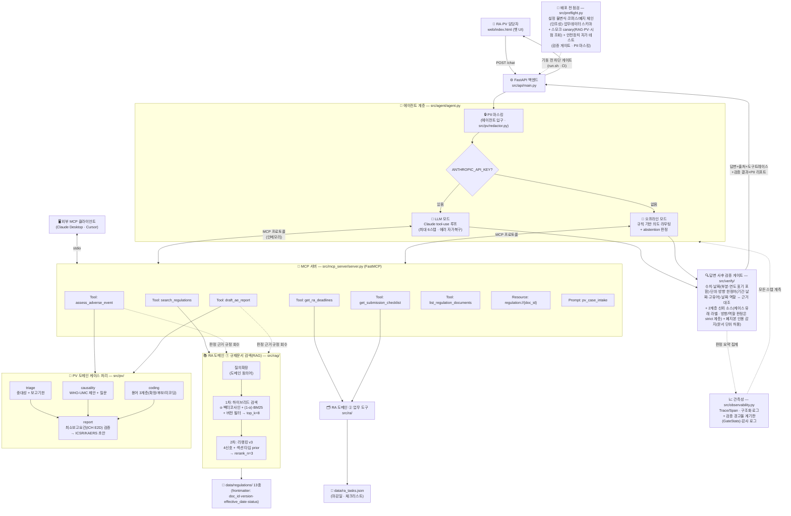
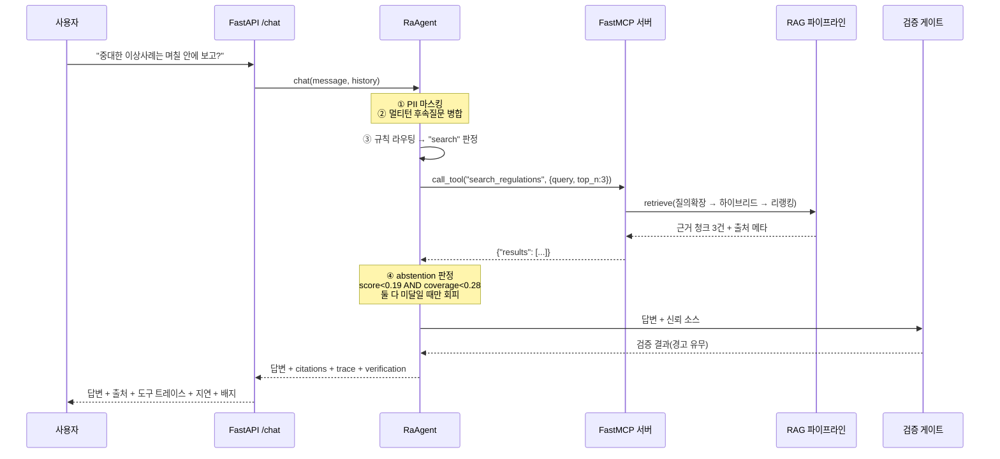
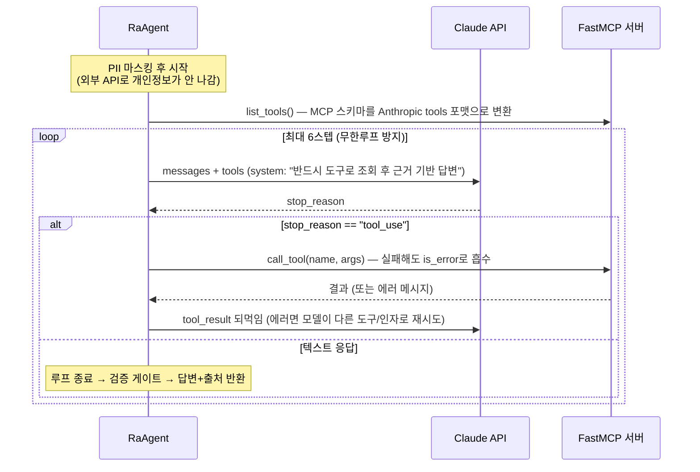
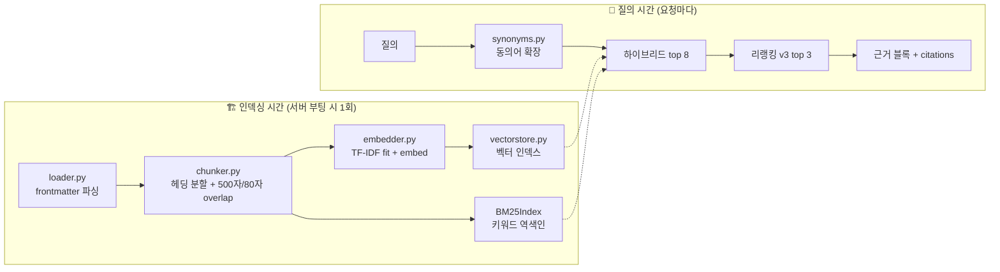

# 아키텍처 — 다이어그램과 상세 해설

> RAPV-Assistant(제약 RA·PV용 RAG + MCP 에이전트)의 전체 구조를 다이어그램으로 그리고,
> 각 구성요소와 연결선이 **무엇을 의미하고 왜 그렇게 설계됐는지**를 해설한다.
> 낯선 용어는 같은 폴더의 `dictionary.md`(용어 사전)를 곁에 두고 볼 것.

---

## 1. 전체 아키텍처 다이어그램

---

## 2. 다이어그램 상세 해설 — 계층별로

### 2-1. 클라이언트 계층 (그림 최상단)

**`web/index.html` (챗 UI)** 는 사용자가 만나는 유일한 화면이다. 단순한 채팅창이 아니라
답변마다 **출처(문서·섹션·버전), 호출된 MCP 도구 트레이스, 지연(ms), PII 마스킹 배지,
수치 검증 배지**를 함께 보여준다. 규제 도메인에서는 "답이 맞는가"만큼 "왜 이 답인가(추적성)"가
중요하기 때문에, 투명성 정보를 UI의 1급 시민으로 올렸다.

**외부 MCP 클라이언트(Claude Desktop·Cursor)** 가 따로 그려져 있는 것이 이 아키텍처의
핵심 주장이다. MCP 서버는 stdio 트랜스포트(`python -m src.mcp_server.server`)로 단독 실행할 수
있어서, 이 데모의 에이전트가 아니어도 **어떤 MCP 클라이언트든 같은 도구를 재사용**한다.
도구를 에이전트 코드에 함수로 박았다면 불가능했을 확장성이다.

### 2-2. API 계층 — FastAPI (`src/api/main.py`)

요청의 정문. 역할은 세 가지다.
1. **스키마 계약**: `ChatRequest`/`ChatResponse` Pydantic 모델로 입출력을 검증한다.
2. **부팅 시 1회 인덱싱**: `lifespan` 훅에서 RAG 인덱스를 구축한다 — 요청마다 재구축하지 않는다
   (아래 4장 "두 개의 시간축" 참고).
3. **투명성 노출**: 응답에 `citations`·`tool_calls`·`trace`·`latency_ms`·`grounded`·
   `redactions`·`verification` 필드를 실어 UI가 그대로 렌더링한다.

### 2-3. 에이전트 계층 (`src/agent/agent.py`) — 그림의 분기점

다이어그램에서 가장 먼저 눈에 띄는 것은 **PII 마스킹이 에이전트의 '입구'에 있다**는 점이다.
마스킹을 이 한 지점에 두면 이후의 모든 경로(외부 LLM API·검색·로그·트레이스)가 자동으로
안전해진다. 주민번호·연락처·이름은 값이 지워지고 유형·건수만 남는다. 단, 존재 신호
(`[이름]님`, "45세 남성")는 남겨 PV 최소보고요건의 '식별 가능한 환자' 판정과 양립시켰다.

다만 "입구에서 막으면 이후 전부 안전"이라는 명제에는 **전제가 하나 숨어 있다** — 모든
입력이 그 입구를 지난다는 전제다. MCP 서버는 stdio로 단독 실행될 수 있고(Claude Desktop·
Cursor 직결), 이때 도구의 자유 텍스트 인자(`case_description` 은 물론 `reporter`·
`patient_info` 같은 부가 필드)는 에이전트 입구를 **거치지 않고** 직접 들어온다. 그래서
마스킹은 2겹이다: 에이전트 입구(메시지·이력) + **MCP 도구 계층(모든 자유 텍스트 인자)**.
경계 주장을 검증할 때는 "그 경계를 우회하는 경로가 있는가"를 함께 물어야 한다 —
부가 인자만 마스킹에서 빠져 있던 것이 실제로 이 프로젝트에서 발견·수정된 사각지대다.
"모든 자유 텍스트 인자"라는 면적 주장 자체도 v7 재감사에서 한 번 더 좁혀 검사됐다 —
실제 마스킹 면적은 PV 도구 2종뿐이었고, `search_regulations` 의 query(voyage 임베더
구성이면 외부 임베딩 API 로 송신), 필터 인자(미매칭 에러 문구에 에코), Prompt
`pv_case_intake` 의 케이스 서술은 면적 밖이었다(범위의 과확장). 지금은 전 도구·Prompt 의
자유 텍스트 인자가 도구 계층에서 마스킹되어 주장과 면적이 일치한다.

경로의 우회만이 아니라 **표기의 우회**도 있다. 마스킹 정규식의 `\b` 경계는 한글이
`\w`로 취급되는 탓에 "연락처는 010-…-5678로", "주민번호는 …입니다"처럼 조사·명사가
직결된(한국어에서 가장 흔한) 표기에서 성립하지 않아, 그 표기로 들어온 개인정보가
통째로 마스킹을 벗어났다 — 검증기의 날짜 추출이 같은 이유로 룩어라운드로 전환된 뒤에도
마스킹 계층에는 그 교훈이 전파되지 않았던 비대칭이다(v6에서 발견·수정, 7-2 참고).
지금은 숫자 룩어라운드 경계를 쓰고, preflight PII 자가 테스트가 한글 직결 표기를
심어 이 표기 변형의 생존을 기동 전에 확인한다. 같은 유형이 v7에서 한 건 더 나왔다 —
대화 이력의 content 는 문자열만이 아니라 anthropic **블록 리스트 표기**
(`content=[{"type":"text",…}]`)로도 들어오는데(이력 텍스트 추출기는 이 표기를 명시
처리한다), 이력 마스킹만 문자열 표기에서 성립해 블록 표기 속 개인정보가 외부 LLM API 로
그대로 나가는 경로였다. 블록 표기 마스킹으로 봉합하고 preflight PII 자가 테스트에
블록 표기를 심어 고정했다.

그 다음 분기 `ANTHROPIC_API_KEY?` 가 이 시스템의 **graceful degradation** 설계다:

| | LLM 모드 | 오프라인 모드 |
|---|---|---|
| 도구 선택 주체 | Claude가 tool-use로 스스로(Function Calling) | 규칙 라우터(`_route_intent`) |
| 답변 생성 | Claude가 도구 결과를 종합해 자연어로 | 근거 발췌(grounded 추출) 조립 |
| 안전장치 | 스텝 상한 6회, 도구 에러를 `is_error`로 되먹여 자가복구 | abstention(아래), 멀티턴 병합, 추측 없는 라우팅(체크리스트 미매칭 → 지원 목록 안내+검색 폴백) |

두 모드는 **동일한 MCP 도구, 동일한 인터페이스**를 쓴다. 차이는 "누가 도구를 고르는가"뿐.
그래서 API 키가 없어도 데모의 전 기능이 동작한다. 기능 대칭도 계약이다 — "이력을
요청하면 구판도 노출"이라는 사용 계약이 한동안 LLM 모드(모델이 `include_superseded` 를
스스로 지정)에서만 참이었다: 오프라인 라우터에는 그 경로 자체가 없었다. 문서가 약속한
동작이 한쪽 모드에만 존재하는 것도 사각지대라서, 오프라인 라우터에 명시적 이력 구문
감지(`_HISTORY_MARKERS`)를 추가해 계약을 양쪽 모드에서 참으로 만들었다. 단, 감지 어휘는
좁게 잡는다 — 이 스위치는 폐지본 인용 '경고를 끄는' 스위치를 겸하므로, 단독 "이력"·"폐지"
같은 현행 질문의 일상 어휘가 끼면 안전장치를 끄는 오탐이 된다.

**Abstention(환각 회피)** 은 오프라인 검색 경로의 마지막 관문이다. 두 신호 —
최상위 근거의 리랭커 점수(`SCORE_FLOOR=0.19`)와 질의 토큰의 근거 커버리지
(`COVERAGE_FLOOR=0.28`) — 가 **둘 다** 미달일 때만 "근거를 찾지 못했습니다"로 회피한다.
AND 조건인 이유: 구어체 질문은 점수가 낮아도 커버리지가 남는데, OR로 하면 이런 정상 질문까지
과회피한다. 문턱값은 감이 아니라 범위내/범위밖 질문의 점수 분포를 실측해 마진 중앙에 놓았다.

### 2-4. MCP 서버 (`src/mcp_server/server.py`) — 그림의 중심

모델과 도구 사이의 **표준 경계선**이다. 에이전트는 도구의 내부 구현을 모르고,
이름·설명(docstring)·입력 스키마만 보고 호출한다. MCP 3대 primitive를 모두 구현했다:

| Primitive | 구현 | 왜 필요한가 |
|---|---|---|
| **Tools** (6종) | 검색·마감일·체크리스트·PV 트리아지·보고서 초안·문서 목록 | 에이전트가 상황에 맞게 골라 쓰는 실행 단위. 도구는 **의도 단위로 분리**("언제까지 보고?"=assess vs "보고서 만들어줘"=draft) |
| **Resource** | `regulation://{doc_id}` | 검색이 아닌 '원문 전체 열람'은 다른 접근 패턴이라 Resource로 |
| **Prompt** | `pv_case_intake` | 케이스 처리 SOP(assess→search→draft)를 서버가 배포 — 어느 클라이언트가 붙어도 같은 절차로 일하게 함 |

도구 함수 자체는 **얇은 래퍼**다 — 검색은 `src/rag/`, 케이스 처리는 `src/pv/`, 마감일·
체크리스트는 `src/ra/tasks.py`(v9 에서 순수 로직으로 분리 — PV 와의 도메인 대칭을 코드
트리로)의 로직을 호출하고, 서버 계층은 인자 마스킹과 스키마·docstring·에러 계약만 맡는다.

다이어그램에서 T4·T5가 RAG로 가는 **점선**은 "판정 근거 규정 회수"다. PV 도구는 판정만
반환하지 않고 `basis`(그 판정의 근거가 되는 규정 문단)를 RAG로 회수해 부착한다 —
"이 15일 기한의 출처는 REG-005 §2"까지 답할 수 있는 추적성이 여기서 나온다.

도구 설계에는 **실패 방향의 규율**이 하나 더 있다: 조용한 빈 결과 금지. 존재하지 않는
체크리스트 카테고리나 오타 난 마감일 유형 필터에 빈 목록을 돌려주면, 에이전트는 그것을
"임박한 마감이 없습니다"라는 **자신 있는 오답**으로 포장한다 — 사용자는 틀렸다는 신호를
받을 길이 없다. 그래서 두 도구 모두 `{"error", "available": [...]}` 를 반환한다.
available 목록은 단순한 친절이 아니라 **에이전트의 자가 정정 재료**다: LLM 모드는 에러를
`is_error` 로 되먹여 받으므로, 가용 값 목록이 있으면 스스로 올바른 인자로 재시도한다.
형식이 틀린 `as_of`(시점 조회 기준일)도 같은 계약(`{"error", "expected"}`)이다 — 조용히
무시하고 현행 기준으로 답하면 사용자는 '그 시점 규정'을 받았다고 믿게 된다(인지일 형식
오류의 caveat 와 같은 원칙을 검색 축에도 대칭 적용한 것). 빈(무신호) 질의도 같은
계약이다(v9) — 리트리버가 무신호 질의에 빈 결과를 반환하므로, 도구는 이를 "결과 없음"
으로 포장하는 대신 명시적 에러(`{"error", "expected"}`)로 답해 에이전트가 질의를 채워
재시도하게 한다.

이 계약에는 후속 규율이 두 개 따라온다. 첫째, **계약은 라우터가 우회하면 무력화된다** —
오프라인 라우터가 체크리스트 카테고리를 확신 없이 '품목허가'로 기본 추측하면, 도구는
항상 유효한 인자를 받아 에러를 낼 기회가 없고 사용자는 엉뚱한 체크리스트를 자신 있게
받는다. 그래서 라우터는 확신 있는 신호가 있을 때만 매칭하고, 미매칭이면 지원 목록 안내와
검색 폴백으로 처리한다(안전장치를 만든 층 '아래'에서 그 장치를 우회하지 않는지까지가
계약의 완성이다). 둘째, **에러 응답은 근거가 아니다** — 에러 문구에는 사용자 입력이
에코되므로("as_of '2024/06/01' 가 … 형식이 아님"), 이를 검증의 신뢰 소스에 넣으면
잘못된 입력 값이 '근거'로 승격된다. 에러 계약 응답은 에이전트 되먹임으로만 쓰고 신뢰
소스에서는 통째로 제외한다(에러 문구에 예시 날짜를 넣지 않는 것도 같은 이유).

### 2-5. RA 도메인 — 규제문서 검색 파이프라인 (`src/rag/`) — 왼쪽 갈래

두 갈래(2-5·2-6)는 **도메인 대칭**이다 — 왼쪽은 RA, 오른쪽은 PV. 제목의 축을
맞춘 이유: 종전 제목("RAG 파이프라인" ↔ "PV 워크플로")은 기술명과 도메인명이
나란히 놓여 "RAG=RA"로 오독되기 쉬웠다 — RAG 는 RA 도메인의 **검색 절반**일
뿐이다. 규제문서 검색은 RA 업무의 중심 도구이고, 마감일·체크리스트 도구
(T2·T3 — 로직은 `src/ra/tasks.py`(v9 분리), 데이터는 `data/ra_tasks.json`, MCP 노출은
2-4장의 래퍼)가 RA 갈래의 나머지 절반이다. `src/ra/` 와 `src/pv/` 가 나란히 서면서
문서가 선언해 온 도메인 대칭이 코드 트리에서도 성립한다.

**2단계 검색**이 골격이다. 1차는 넓게(재현율), 2차는 좁게(정밀도):

1. **질의확장**: "부작용"→"이상사례" 같은 도메인 동의어를 원 질의에 덧붙인다(단방향, append).
   어휘 기반 검색(TF-IDF/BM25)이 스스로 못 메우는 **어휘 불일치**를 겨냥한 장치.
2. **1차 하이브리드**: 벡터(TF-IDF 코사인 — 넓은 어휘 유사)와 BM25(정확 키워드 매칭 —
   고유명사·코드에 강함)를 min-max 정규화 후 α=0.5로 결합해 top 8을 회수한다.
   이 단계에 **버전 필터**가 함께 걸린다 — `status=superseded`(폐지 구판)는 기본 제외,
   `as_of=날짜`는 **그 시점에 시행 중이던 버전**을 반환한다.

   as_of 의 의미론에는 발견·수정된 논리적 비약이 하나 숨어 있었다: '폐지본 기본 제외'를
   as_of 조회에도 그대로 적용하면, 개정된 적 있는 규정은 과거 시점 조회에서 구판(폐지
   필터에 걸림)과 신판(그 시점에 시행 전이라 걸림)이 **모두 걸러져 아무 버전도 나오지
   않는다**. "시점 조회를 지원한다"는 주장이 정작 개정 이력이 있는 — 즉 시점 조회가
   필요한 유일한 — 규정에서만 무너지는 형태다(두 필터의 교집합이 공집합이 되는 조합
   결함이라, 각 필터의 단위 테스트는 통과한다). 그래서 폐지본이라도
   [시행일, 후속본 시행일) 구간에 as_of 가 들어오면 '당시 현행'으로 포함한다.
   시행일을 해석할 수 없는 문서는 시점 조회에서 **fail-closed** 로 제외한다 — 검색
   전체를 죽이지도(예외 전파), 무필터로 오답에 섞지도(조용한 통과) 않으며, 데이터 결함
   자체는 preflight 가 파일명과 함께 보고한다. 이 의미론이 성립하려면 데이터 전제
   (폐지 체인의 시행일 단조성)가 필요한데, 그 전제 역시 preflight 가 기동 전에 검사한다.
   그리고 **기본(무 as_of) 검색은 as_of=오늘과 동치**다(v9) — 종전에는 기본 경로가 이
   의미론 밖에 있어, 시행일이 미래인 active 문서가 '오늘의 현행'처럼 반환되고 그 시행
   중 구판은 폐지 필터에 걸리는 잠복 결함이 있었다. 지금은 미래 시행분을 제외하고 시행
   중인 폐지본을 포함하며, '시행 중 구판 부재' 데이터 결함은 preflight 가 기동 전에 잡는다.
3. **2차 리랭킹 v3**: 4신호(본문 커버리지 0.55 + 정확 구문 0.20 + 섹션제목 매칭 0.15 +
   문서제목 정합 0.10)에 **섹션 타입 prior**(대조 섹션 페널티 −0.3, 서두 섹션 감쇠 −0.055 —
   단, 질의가 '차이/정의'를 물으면 게이트로 해제)를 더해 재점수하고, 1차 점수를 10% 섞어
   (rerank_weight=0.9) 안정화한다. 실무 Cross-Encoder 리랭커의 오프라인 근사다.

이 구조가 만든 수치가 Hit@1 0.875(벡터만) → **1.000**(전체 파이프라인, 32문항),
하드네거티브 0.786 → **1.000**이다. 특히 어휘가 겹치는 오답 문서(하드네거티브)에서의
개선이 "RAG 최적화"의 핵심 근거다.

### 2-6. PV 도메인 — 케이스 처리 워크플로 (`src/pv/`) — 오른쪽 갈래

2-5(RA 도메인)와 대칭인 PV 도메인 갈래다.
PV 담당자의 실제 케이스 처리 순서(접수→트리아지→인과성→코딩→보고서 초안)를 그대로
모듈로 옮겼고, **전부 규칙 기반(결정론)**이다. 다이어그램에서 triage·causality·coding이
모두 report로 모이는 구조: 보고서 초안은 세 판정의 종합이되, 그 전에
**최소보고요건(ICH E2D 4요소)**을 검증해 미충족이면 **"⛔ 정보 보완 필요" 상태 헤더가
문서 최상단에 붙은 초안**과 빠진 항목·보완 질문을 병기해 반환한다(`reportable=False`) —
미완성이 완성으로 포장되지 않도록 상태를 시끄럽게 표시하는 설계다.

왜 LLM이 아니라 규칙인가 — **보고기한 계산과 요건 판정은 컴플라이언스 그 자체**라서다.
하루 틀리면 사고인데 LLM의 날짜 연산은 확률적이라 감사(audit)를 통과할 수 없다.
역할 분리: LLM은 도구 선택·설명(orchestration), 규정이 정한 계산은 결정론적 도구.

같은 규칙 기반이라도 업무의 성격에 따라 **출력의 확신 수준**을 다르게 설계했다:
- 중대성 판정(triage) = 닫힌 목록 '대조' → **확정**
- 인과성 평가(causality) = 임상 정보 '종합 판단' → **제안 + follow-up 질문**
- 용어 코딩(coding) = 사전 기반 → **확정/후보/미코딩 감지의 3계층**(자동 확정 금지)

### 2-7. 답변 사후 검증 게이트 (`src/verify/`) — 나가는 방향의 경계

다이어그램에서 두 모드의 출력이 모두 VER 박스를 거쳐 API로 나가는 것에 주목.
LLM 모드의 답변은 매 요청마다 새로 생성되므로, 답변 속 "15일"이 "30일"로 바뀌는
생성 오류를 오프라인 평가셋은 막지 못한다. 그래서 **모든 응답이 통과하는 런타임 게이트**를 뒀다:

- 답변에서 수치+단위(15일·120 근무일 — '근무일'과 '일'은 다른 단위. '주간/달(개월)/퍼센트'
  같은 한글 단위 표기도 수집한다(v9) — 한 표기가 수집에서 빠지면 그 표기의 왜곡은 미탐,
  옳은 표기는 오탐이 되는 양방향 결함이다), 고유어 수사(보름=15일),
  날짜(ISO·한국어 표기 "2026년 7월 25일"·**연도 없는 부분 표기 "7월 25일"**(--MM-DD 접미로
  대조)·**연도 단독 표기 "2025년"**(근거 날짜의 연도 성분으로 대조)을 **표기 정규화로 동치
  대조** — 정규화가 없으면 올바른 답변이 표기 차이로 '미확인' 오탐을 받고(alert fatigue 도
  검증 계층을 죽이는 실패 방향이다), 날짜의 '25일' 성분이 기간 클레임으로 오추출된다 —
  한국어 표기만이 아니라 "2026-07-25일" 같은 ISO+접미 표기의 오염도 정규식 경계로 차단),
  **방향 한정어**("이내"↔"이후" — 기간·날짜("2026-07-25까지"↔"이후")·**고유어("보름
  이후")** 표기 **모두**: 일부 표기에만 있으면 같은 기한 왜곡이 표기에 따라 한쪽만 잡히는
  축 간 비대칭이 된다)를 추출해
- **신뢰 소스**(검색 근거 ∪ 결정론적 도구 출력 − 입력 에코(query·as_of) − 에러 계약
  응답)에 실제로 존재하는지 대조하고. 미확인 수치가 질문(직전 사용자 턴 포함 — 멀티턴
  전제 이월 창)에 있던 값이면 '환각'이 아니라 '전제 확인 필요'로 경고 종류를 조정한다
  (완화 라벨의 창은 직전 턴까지로 제한 — 대화 전체를 누적하면 오래전 무관한 수치가
  이후 모든 환각을 완화 라벨링한다). 이 from_question 전제 라벨은 v9 부터 **방향·역할
  축에도 대칭 적용**된다 — 질문이 전제한 방향·역할("15일 이후 아니야?")을 답변이 정정할
  때, 존재 축만 완화를 알면 같은 상황의 방향 경고가 오탐 종류 조정 없이 나간다
- 신뢰 소스는 **2계층**이다 — 규정 근거·도구 출력(strict)과 사용자 케이스 서술 에코
  (user facts). 케이스 계층에서만 지지되는 클레임은 `from_case`(case_origin) 라벨로
  노출한다: 케이스 재서술은 정당하므로 경고하면 초안마다 오탐이지만, "케이스는
  사실"이라는 성질이 케이스 수치를 **규정 클레임의 근거**로 승격시키지는 않는다
  (예: 케이스의 "30일간 복용"이 답변의 "보고 기한 30일"을 지지하는 조용한 통과) —
  기계가 구분할 수 없는 두 경우를 차단도 침묵도 아닌 라벨로 사람에게 넘긴다.
  2계층은 **축마다 일관**해야 한다 — 존재 축에만 계층을 만들고 방향 축은 단층(합산 지도)
  으로 두면, 케이스의 "15일 이후 증상 발생"이 규정 "15일 이내"의 방향 뒤집기 경고를
  조용히 무력화한다. 그래서 방향·역할 충돌의 **판정 기준은 strict 계층**이고, 답변의
  방향 표현이 케이스에도 있으면 경고를 끄는 대신 from_case 를 붙여 '재서술 vs 왜곡'의
  모호성을 사람에게 넘긴다(존재 축과 같은 3택 — 차단·침묵·라벨 — 의 라벨 선택).
- **날짜 역할**을 대조한다 — 도구 출력에 날짜가 여러 개면(인지일·마감일) 답변이 두 날짜의
  역할을 맞바꿔도("보고 기한은 \<인지일\>입니다") 각 날짜가 실존하므로 존재 대조는 **정의상
  통과**한다. 그래서 답변에서 역할 키워드(기한/마감·인지일)에 직접 붙은 날짜를 도구의 역할
  라벨(deadline_date·awareness_date)과 따로 대조한다. 라벨이 없으면 판단하지 않는다(보수적).
- 폐지된 규정 인용 여부를 점검한다 — 이력(as_of·include_superseded) 조회에서 폐지본
  인용은 결함이 아니라 목적이지만, 그 면제의 **면적은 문서 단위**다: 이력 검색이
  실제로 반환한 doc_id 집합만 허용한다. 응답 전역 bool 스위치는 같은 턴의 현행 검색에
  상류 결함으로 섞여 든 폐지본 인용까지 경고를 꺼서, 이력 턴 동안 버전 축이 통째로
  무장해제된다(안전장치를 끄는 스위치는 발동 조건과 발동 범위 모두 근거가 성립하는
  만큼만 열려야 한다).
- 실패 시 **차단이 아니라 경고 부착**(본문·API `verification` 필드·UI 배지) — 검증기 자신도
  오탐 가능성이 있고, 원칙은 '사람의 최종 확정을 빠르게'이지 자동 차단이 아니다.
- 모든 판정은 **운영 계기판**(`GateStats`)에 축별로 집계되어 `/health`에 경고율(`warn_rate`)로
  노출되고, 응답 단위 감사 로그(판정 요약 JSON)가 남는다 — 경고율의 추이가 오르면
  답변 품질 회귀 또는 검증기 오탐 증가(alert fatigue 위험)의 조기 신호다.

### 2-8. 관측성 (`src/observability.py`) — 점선으로 전체를 덮는 계층

요청 1건(`Trace`) 안에 도구 호출·LLM 스텝 단위의 `Span`(이름·소요 ms·성패)이 쌓인다.
예외가 나도 ok=False span을 남긴 뒤 재전파하고, 구조화(JSON) 로그를 남긴다.
"무슨 도구를 몇 ms에 성공/실패로 호출했는가"는 엔터프라이즈 에이전트의
디버깅·SLA·비용 관리의 기본이다. OpenTelemetry/LangSmith의 개념을 무의존성으로 구현했다.

계기판 자체의 정확성도 검증 대상이다. 총 지연(`total_ms`)은 최상위 agent span의
**wall-clock**으로 계산한다 — 스텝 span(tool·llm)은 최상위 span '안에서' 실행되므로 전부
합산하면 같은 시간이 두 번 세어져 지연이 실제의 ~2배로 보고된다. 이 왜곡은 답변 품질에는
아무 영향이 없어서 조용히 살아남기 쉽지만, 관측이 틀리면 SLA 판단과 병목 진단이 함께
틀린다 — **틀린 계기판은 계기판이 없는 것보다 나쁘다**(믿게 만들므로). 검증 게이트
자가 테스트와 같은 원리가 관측 계층에도 적용된 것이다.

여기에 **검증 게이트 운영 계기판**(`GateStats`)이 더해진다: 게이트의 통과/경고를 축별
(미확인 수치·방향·역할·질문 전제·폐지본)로 집계해 `/health`에 경고율로 노출하고, 응답마다
판정 요약을 감사 로그(JSON, PII 없음 — 케이스 유래 라벨 case_origin 포함)로 남긴다.
규제 도메인에서 "그 답변이 그때 검증을 통과했는가"는 사후 감사의 질문이고, 경고율의
추이는 alert fatigue(경고가 무시되기 시작해 검증 계층이 사실상 죽는 순간)의 조기 신호다
— 배치 후 FDE가 매일 확인하는 계기판.

계기판에는 **분모의 규율**이 하나 더 있다. "warn_rate 상승 = 품질 회귀 또는 오탐 증가"
라는 해석에는 트래픽 믹스가 일정하다는 숨은 전제가 있다 — 회피·무클레임 응답(checked=0)
은 자명하게 통과하므로, 범위 밖 질문의 비중이 늘면 품질 변화 없이도 warn_rate 가
내려간다(좋아지는 착시). 그래서 '검증할 클레임이 있던 응답'만 분모로 잡은
**warn_rate_checked** 를 병기한다 — 추이 해석이 목적인 지표일수록 분모의 구성이
명시되어야 한다(지연 이중 계산과 같은 계열의 교훈: 계기판 자체도 검증 대상이다).
비경고 라벨의 추이(**case_labeled** — 케이스 유래 지지가 붙은 응답 수)도 함께 센다:
라벨은 ok=True 라 경고율에는 절대 나타나지 않으므로, 답변이 규정 근거 대신 사용자
서술에 기대기 시작하는 이동은 경고율 계기판만 봐서는 보이지 않는다.

### 2-9. 배포 전 점검 (`src/preflight.py`) — 기동 전의 차단 게이트

다이어그램 맨 아래의 PRE 박스. FDE가 시스템을 고객사에 배치할 때 가장 먼저 깨지는 것은
코드가 아니라 **데이터와 설정**이고, 그런 결함은 부팅이 아니라 **운영 중에 오답으로**
나타난다(예: `status` 필드가 빠진 폐지 구판은 버전 필터를 그대로 통과해 현행 답변에 섞인다).
그래서 서버 기동 전에 결정론적 점검 4그룹을 강제한다:

| 그룹 | 무엇을 잡나 |
|---|---|
| 설정 불변식 | 값 각각은 유효해도 **조합이 모순**인 설정(overlap ≥ chunk_size, rerank_top_n > retrieve_top_k …) |
| 코퍼스 무결성 | frontmatter 필수 필드 누락, doc_id 중복, **폐지 체인 단절**(superseded → 실존하는 현행 문서), **체인 시행일 단조성**(후속본 시행일이 구판보다 늦어야 함 — 역전되면 시점(as_of) 조회의 '당시 현행' 구간 판정이 조용히 깨진다), **미래 시행일 active 의 '시행 중 구판 부재'**(v9 — 시행 전 신판만 있으면 기본 검색(as_of=오늘 동치)에서 그 규정이 통째로 사라진다) |
| 업무 데이터 스키마 | 마감일 필수 필드·날짜 형식 오타, 빈 체크리스트, **마감일 전건 과거**(시한부 샘플 데이터의 부패 — 스키마는 유효한 채로 '임박한 마감' 데모 서사만 조용히 죽는 형태. 형식 검사와 값 타당성 검사는 다른 층이라는 E-17 원칙의 데이터 버전) |
| 스모크(canary) | 대표 질의가 정답 문서를 1위로 회수하는가, 대표 케이스가 인지일+15일로 트리아지되는가, **시점 조회 canary**(과거 시점 as_of 에 당시 현행이던 구판이 반환되는가 — 시점 조회 의미론 자체의 생존 확인), **안전장치 자가 테스트** — 검증 게이트(런타임 게이트의 **모든 경고 축** — 존재·방향(기간/날짜/고유어)·역할·버전·전제 라벨 — 에 심은 오류가 '기대한 그 축에' 걸리는가 + **비경고 라벨 축**(case_origin)과 **표기 변형**(고유어 방향·부분 날짜·주간 표기(v9))·**방향 전제 정정 라벨·케이스 간섭 from_case 단언**(v9)까지 + 정상 케이스 오탐 없음)와 PII 마스킹(심은 개인정보가 실제로 지워지는가 — 한글 직결 표기와 **이력 블록 리스트 표기**(content=[{type:text}]), "~님으로부터"·점 구분 주민번호 프로브(v9) 변형 포함) |

운영 중의 검증 게이트가 '경고 부착'(차단하지 않음)인 것과 달리 preflight는 **실패 시
exit 1로 기동을 차단**한다 — 배포 시점에는 아직 사용자가 없으므로 시끄럽게 멈추는 비용이
0이고, 조용히 뜬 결함 서버의 비용은 크다. `run.sh`와 CI가 이 게이트 뒤에 있다.
단, "차단한다"는 명제의 성립 범위는 정확히 그 두 경로까지다 — uvicorn 을 직접 띄우는
수동 실행(가이드의 방법 B, 포트 변경 안내)은 게이트를 지나지 않는다. 이 경계를 숨기면
"preflight 가 있으니 결함 배포는 불가능하다"는 과확장이 되므로, 가이드에 우회 경로와
'수동 실행 전 preflight 별도 실행' 권고를 명시해 둔다(숨은 전제의 문서화 — 7-1 참고).
특히 '안전장치 자가 테스트'는 안전장치 자신을 검사한다 — 고장난 안전장치를 단 채
배포되는 것은 안전장치가 없는 것보다 나쁘다(있다고 믿게 만들므로). 이 원칙은 **대칭적으로**
적용해야 한다: 처음에는 검증 게이트만 자가 테스트했는데, 그러면 또 하나의 안전장치인
PII 마스킹은 고장난 채 배포될 수 있다 — 마스킹이 죽으면 첫 실사용 케이스의 개인정보가
그대로 외부 API·로그로 나간다. 그래서 심은 개인정보(이름·전화·주민번호)가 실제로
지워지는지도 기동 전에 함께 검사한다.

같은 대칭 원칙은 **한 안전장치의 내부 축들 사이에도** 적용된다: 게이트 자가 테스트가
수치 존재 축 1개만 심어 보면, 방향·역할·버전·전제 라벨 축은 고장난 채 배포될 수 있다
— 그래서 자가 테스트를 전 경고 축의 데이터 주도 테이블로 확장하고, 심은 오류가 '기대한
바로 그 축에' 걸리는지까지 확인한다(다른 축에 우연히 걸린 통과는 해당 축의 탐지가
죽었다는 신호일 수 있다). 축 목록과 자가 테스트 커버리지가 어긋나면 pytest 메타
테스트가 실패하므로, 새 축을 추가하면 자가 테스트 추가가 구조적으로 강제된다.

---

## 3. 요청이 흐르는 길 — 시퀀스 다이어그램

### 3-1. 오프라인 모드 (API 키 없음, 데모 기본값)

### 3-2. LLM 모드 (ANTHROPIC_API_KEY 있음 — 진짜 Agentic)

**읽는 포인트**: 복합 질문("GMP 변경인데 뭘 준비하고 언제까지?")이면 Claude가 이 루프 안에서
`search_regulations` → `get_submission_checklist` → `get_ra_deadlines`를 **연쇄 호출**해
결과를 종합한다 — 이것이 Agentic Workflow다.

---

## 4. RAG의 두 개의 시간축 — 인덱싱 vs 질의

무거운 작업(파싱·청킹·IDF 학습·임베딩)은 부팅 시 1회, 요청 경로에는 가벼운 검색만 남긴다.
그래서 전체 검색 지연이 ~0.9ms 수준이다. 실무에서 인덱싱은 배치 파이프라인,
질의는 온라인 서빙으로 분리되는 것과 같은 구조다.

---

## 5. 신뢰의 경계선 3개 — 이 아키텍처를 한 문장으로

이 시스템의 모든 설계는 세 개의 경계선으로 요약된다:

1. **들어오는 경계 — PII 마스킹**: 개인정보는 에이전트 입구에서 지워져 외부 API·로그에
   흘러들지 않는다. 경계는 2겹이다 — 에이전트 입구(메시지·이력, 블록 리스트 표기 포함)와
   MCP 도구 계층(전 도구·Prompt 의 자유 텍스트 인자 — 검색 query·필터 인자 포함).
   입구를 우회하는 경로(stdio 단독 사용)까지 막아야 경계가 완성된다.
2. **가운데 경계 — LLM(확률)과 규칙(결정론)의 분리**: 도구 선택·설명은 LLM이,
   컴플라이언스 계산(기한·중대성·보고요건)은 감사 가능한 결정론적 도구가 맡는다.
   그리고 모델과 도구는 MCP 규격으로 분리되어 어느 클라이언트든 재사용한다.
3. **나가는 경계 — 근거 강제**: 모든 답에 출처가 붙고, 근거가 약하면 회피(abstention)하고,
   나가는 답변의 수치·날짜·방향 한정어·날짜 역할은 사후 검증 게이트가 근거와 대조한다.

이 세 경계선이 규제 산업이 요구하는 **추적성·감사 가능성·개인정보 보호**를
아키텍처 수준에서 보장한다.

경계선은 공간축이고, 여기에 **시간축**이 겹친다 — 배포 전에는 preflight가 데이터·설정·
게이트 자체를 검사해 결함 배포를 차단하고(기동 전 = 차단이 옳은 시점), 운영 중에는
경고율 계기판과 감사 로그가 경계선들이 계속 살아 있는지를 측정한다(운영 중 = 경고가
옳은 시점). 같은 신뢰 장치라도 **언제냐에 따라 실패 방향이 달라진다**는 것이 이 설계의
포인트다.

---

## 6. 확장 지점 (실서비스 전환 시 교체되는 자리)

| 데모 구현 | 실무 교체 대상 | 교체 지점(이미 코드에 존재) |
|---|---|---|
| TF-IDF 희소 벡터 | 상용 밀집 임베딩 | `EmbeddingProvider` 인터페이스 (`VoyageEmbedder`가 실 API 경로 증명) |
| 4신호 리랭커 | 실제 Cross-Encoder / LLM 리랭커 | `HybridRetriever._rerank_score` |
| 인메모리 벡터스토어 | pgvector / Qdrant 등 Vector DB | `InMemoryVectorStore` |
| 정규식 PII 마스킹 | NER 기반 비식별화(Presidio 등) | `src/pv/redactor.py` |
| 검수 소사전 코딩 | MedDRA 본체 라이선스 | `src/pv/coding.py`의 사전 테이블 |
| md + frontmatter 로더 | PDF/HWP 파서 + 문서 관리 시스템 | `src/rag/loader.py` + **`scripts/ingest_pdf.py`(PDF→코퍼스 변환 경로가 실코드로 존재 — v8)** |
| 마크다운 ICSR 초안 | E2B(R3) XML 생성 + KAERS 전송 | `src/pv/report.py`(초안까지 — 제출·전송은 담당자 책임 범위로 명시) |
| 무인증 | 사내 SSO·권한 체계 | FastAPI 미들웨어 자리 |

확장 지점이 "말"이 아니라 인터페이스와 대체 구현으로 **코드에 존재**한다는 것이
이 데모의 엔지니어링 포인트다.

### 6-1. 의도적으로 뺀 것 (범위 관리, MVP 원칙)

- 실제 Vector DB(pgvector 등) → 인메모리 스토어로 대체(개념 동일, 배포 단순).
- 상용 임베딩/리랭커 모델 → 순수 파이썬 근사 + **실제 API 경로(VoyageEmbedder)는 코드로 표시**.
- 인증·영속 DB → MVP 범위 밖(확장 지점만 코드에 표시).
- CI는 **포함**했다(pytest+eval 회귀) — 확장이 아니라 신뢰성의 기본이라 판단.

> 설계 결정별 "왜 이렇게 했나 + 면접 예상질문 대응"은 [`../docs/면접노트.md`](../docs/면접노트.md)에 정리했다.

> 원칙: "완벽함보다 **작동+설명**". GC 방향(Agentic+MCP)과 겹치는 데모를
> **끝까지 작동**시키는 데 집중했다.

---

## 7. 검증 관점의 판정 기준 — 무엇을 '논리적 비약'과 '사각지대'로 보는가

이 프로젝트는 검증 계층을 여러 차례 적대적 루프로 재검토하며 결함을 제거해 왔다.
그때마다 "무엇을 결함으로 셀 것인가"의 기준이 필요했고, 그 기준 자체를 여기 명문화한다
— 기준이 문서화되어 있지 않으면 다음 검토자는 같은 종류의 결함을 다른 이름으로
재발견하거나, 결함이 아닌 것을 결함으로 세게 된다.

### 7-1. '논리적 비약'의 판정 기준

어떤 주장(설계 명제)이 **숨은 전제를 딛고 서 있는데 그 전제가 검사되지 않을 때**
논리적 비약으로 판정한다. 구체적으로 다음 네 형태를 본다:

| 형태 | 판정 질문 | 이 프로젝트의 실제 사례 |
|---|---|---|
| **숨은 전제** | "이 명제가 참이려면 무엇이 함께 참이어야 하는가? 그건 누가 보증하나?" | "입구에서 마스킹하므로 이후 전부 안전" ← '모든 입력이 입구를 지난다'는 전제가 stdio 직결에서 깨짐(→ 도구 계층 마스킹). "warn_rate 상승 = 품질 회귀" ← '트래픽 믹스 일정' 전제(→ warn_rate_checked). "preflight가 결함 배포를 차단한다" ← '모든 기동이 run.sh·CI를 지난다'는 전제 — 수동 uvicorn 실행(가이드 방법 B·포트 변경 안내)은 게이트 밖이다(v6 발견 → 게이트가 걸린 경로와 우회 경로를 가이드에 명시) |
| **성질의 승격** | "A 계층에서 참인 성질이 B 계층의 근거로 슬그머니 쓰이고 있지 않은가?" | "케이스는 사실이다" → "케이스 수치가 규정 클레임의 근거다"로 승격(→ 2계층 신뢰 소스 + from_case 라벨). 에러 문구에 에코된 사용자 입력이 '근거'로 승격(→ 에러 계약 응답 제외) |
| **범위의 과확장** | "이 명제가 성립하는 범위와 코드가 적용하는 범위가 같은가?" | "이력 조회에서 폐지본은 목적" ← 성립 범위는 '이력 검색이 반환한 문서'까지인데 응답 전역 bool 로 적용(→ doc_id 집합 허용). 전제 완화 라벨이 대화 전체 이력으로 무한 확장(→ 직전 턴 창) |
| **측정과 강제의 혼동** | "'측정이 존재한다'가 '측정이 지킨다'로 바뀌어 쓰이고 있지 않은가?" | "탐지율은 회귀를 고정하는 핀" ← CI 는 스크립트를 실행만 하고 exit 0(→ pytest 가드가 CI 실패로 강제 + 표본 수 하한) |

### 7-2. '사각지대'의 판정 기준

**실패했을 때 아무 신호도 나지 않는 경로** — 즉 "이 부분이 고장나면 누가/무엇이 그것을
알아차리는가?"에 답이 없는 경로를 사각지대로 판정한다. 네 가지 탐색 절차를 쓴다:

1. **대칭성 감사(축 × 표기 매트릭스)** — 클레임 타입(수치·날짜·고유어·부분 날짜) ×
   검증 축(존재·방향·역할)의 표를 그려 빈 칸을 찾는다. 같은 등급의 왜곡이 표기에 따라
   한쪽만 잡히면 비대칭이고, 비대칭은 곧 사각지대다. v5 검토에서 나온 것들:
   방향 축이 숫자 표기에만 있고 **고유어("보름 이후")에는 없던 것**, 날짜 존재 축이
   완전한 표기에만 있고 **부분 표기("7월 25일")·연도 표기("2025년")에는 없던 것**,
   2계층 설계가 존재 축에만 있고 **방향 축에는 없던 것**(케이스 에코가 방향 경고를
   무력화), 형식 검사는 있는데 **값 타당성 검사(미래 인지일)는 없던 것**.
   대칭성 감사는 **계층 간에도** 적용된다 — 한 안전장치에서 배운 추출기 교훈이
   다른 안전장치에 전파됐는지를 묻는다(교훈의 전파 감사). v6 검토가 그 사례다:
   검증기의 날짜 추출은 "`\b`는 한글 앞뒤에서 경계가 아니다"를 배워 룩어라운드로
   전환했는데, PII 마스킹의 주민번호·전화 정규식은 여전히 `\b`를 쓰고 있었다 —
   "연락처는 010-…-5678로", "주민번호는 …입니다"처럼 **조사·명사가 직결된
   한국어에서 가장 흔한 표기가 통째로 마스킹을 벗어나** 그대로 외부 API·로그로
   나가는 경로였다(검증기의 비검출은 경고 누락이지만 마스킹의 비검출은 곧 유출 —
   같은 결함이라도 계층에 따라 실패 비용이 다르다). 반대 방향의 경계 결함도 함께
   나왔다: 이메일 정규식의 `[\w.+-]`가 한글을 삼켜 "…com입니다"의 '입니다'까지
   마스킹되는 과잉 매칭(값은 가려지므로 유출은 아니나 감사 리포트가 원문 범위를
   왜곡한다). 둘 다 룩어라운드·ASCII 한정으로 수정하고, preflight PII 자가
   테스트에 한글 직결 표기를 심어 표기 변형 커버리지를 게이트 자가 테스트와
   대칭으로 맞췄다.
2. **조용한 실패 인벤토리** — 경로마다 "여기가 틀리면 사용자가 신호를 받는가"를 묻는다.
   특히 **대칭적 비검출**(답변·근거 양쪽에서 똑같이 추출되지 않아 오탐조차 없는 실패 —
   한국어 날짜, 고유어 수사, `\b` 경계, 부분 날짜가 전부 이 형태였다)은 통과처럼 보이므로
   테스트 실패로도 드러나지 않는다 — 추출기 자체를 의심 목록에 올려야 보인다.
3. **오탐(alert fatigue)도 사각지대로 센다** — 검증 계층은 미탐만이 아니라 **오탐으로도
   죽는다**(경고가 잦으면 무시되기 시작하고, 무시되는 순간 전 축이 무력화된다). 옳은
   답변에 경고가 붙는 경로(연도 표기 "2025년"·부분 날짜 "7월 25일"의 미확인 오탐)는
   미탐 구멍과 같은 등급의 결함으로 취급해 제거한다.
4. **안전장치 자신을 검사 대상에 포함** — 게이트·마스킹·계기판이 고장난 채 배포되는
   경로가 있는가(preflight 자가 테스트), 경고가 아닌 **라벨**이 죽으면 누가 아는가
   (라벨 축 자가 테스트 — 라벨은 죽어도 응답이 계속 ok 라 소리가 없다), 계기판의 분모·
   합산 방식이 착시를 만드는가(warn_rate_checked·wall-clock).

### 7-3. 결함이 '아닌' 것 — 기준의 반대면

기준에는 반대면이 있어야 한다. 다음은 알고도 남겨 둔, 결함이 아니라 **명시된 경계**다:

- **보수적 미판정**: 근거에 한정어가 없으면 방향을 판정하지 않고, 역할 라벨이 없으면
  역할을 판정하지 않는다 — 판단 근거 없는 플래그는 오탐이고, 오탐은 3의 이유로 결함이다.
- **트리아지의 과탐 방향**: "사망하지 않았다" 같은 부정문도 중대 후보로 잡는다 — PV
  트리아지에서 안전한 실패 방향은 과보고이며(놓친 신속보고 > 불필요한 검토 1건),
  최종 확정은 항상 사람 몫이라는 caveat 가 모든 판정에 붙는다.
- **필드 단위 분리의 경계**: draft_markdown 처럼 케이스 서술이 다른 필드 '안에'
  재조립되면 2계층 분리가 잡지 못한다 — 한계를 코드 주석과 문서에 명시해 두는 것까지가
  현재 스코프다(잡는 척하는 것이 못 잡는 것보다 나쁘다).
- **멀티턴 신뢰 소스 미이월**: 이전 턴의 검색 근거는 이번 턴의 신뢰 소스가 아니다 —
  이월하면 오래된 근거가 새 질문의 클레임을 지지하는 시간 오염이 생긴다. 대신 이전 턴
  전제는 from_question 라벨(직전 턴 창)로만 완화한다.
- **인지일(awareness_date) 에코의 신뢰**: 트리아지 도구 출력의 `awareness_date`는
  사용자 입력의 에코지만 신뢰 소스에 남긴다 — query·as_of 에코(검색 파라미터의 단순
  반사)와 달리, 인지일은 도구가 형식 검사(오류 시 caveat)·타당성 검사(미래 날짜
  caveat)를 거쳐 **채택한 계산 기준**이고 마감일이 그 값의 함수다. 기준일을 신뢰
  소스에서 빼면 옳은 답변의 인지일 재서술마다 오탐이 붙는다. 단 이 신뢰는 '도구가
  검사와 caveat 로 감싼 값'이라는 조건부다 — 검사 없는 자유 텍스트 에코(case)가
  from_case 라벨을 받는 것과 등급이 다른 이유를 여기 명시해 둔다(v6에서 문서화).
- **수치 없는 의미 왜곡**: 부정문 왜곡·주어 바꿔치기 등은 결정론 규칙의 범위 밖으로
  명시하고 LLM judge 2차 검증의 자리로 남긴다 — '기계 검증 가능'의 경계는 재심사로
  넓히되(방향 한정어·날짜 역할·부분 날짜가 그렇게 넘어왔다), 경계 자체는 항상 문서에
  남긴다.
- **LLM 모드의 문턱 회피 부재**: 문턱 기반 abstention(SCORE_FLOOR·COVERAGE_FLOOR)은
  오프라인 검색 경로 전용이다 — LLM 모드의 근거 규율은 시스템 프롬프트의 도구 강제 +
  사후 검증 게이트 + `grounded` 신호(성공한 도구 출력이 신뢰 소스로 확보되었는가)가
  나눠 맡는다. 모델이 도구 없이 답하는 것을 차단하지는 않되(차단은 유용한 안내까지
  막는다), grounded=False 로 **라벨링**해 근거 보증이 아님을 노출한다 — v7 전에는
  이 값이 기본값 True 로 방치되어 출처 0건 답변이 근거 배지를 달고 나갔다(범위의
  과확장). "두 모드는 동일하다"의 성립 범위는 '도구 인터페이스·출처 체계·사후
  게이트'까지이며, 회피 판정 방식은 명시적으로 다르다.
- **LLM API 실패의 비폴백**: 키 오류(401)·네트워크 장애·잘못된 모델명으로 LLM 호출이
  실패해도 오프라인 모드로 **자동 강등하지 않는다** — 명시적 실패 안내(예외 타입 포함,
  예외 메시지는 비에코)로 답한다. 조용한 모드 전환은 사용자가 어느 모드의 답을 받았는지
  모르게 만드는 또 하나의 조용한 실패 경로다(인지일 자동 정정 금지와 같은 철학).

이 기준의 요약: **비약은 "전제를 대라", 사각지대는 "고장 나면 누가 아는가"** — 두 질문에
코드(테스트·자가 테스트·계기판)로 답할 수 없으면 결함으로 세고, 답을 만든 뒤에는 그
답 자체(검증기·계기판·라벨)를 다시 같은 질문의 대상에 올린다.

### 7-4. 기준의 재적용 기록 — v6: 20렌즈 정합성 점검

기준(7-1·7-2)은 선언이 아니라 절차다 — 주기적으로 **전체 시스템에 다시 적용**해야
기준 자체가 살아 있는지 확인된다. v6에서는 문서·코드·데이터·수치의 정합성을 20개
렌즈로 나눠 1회씩, 총 20회 점검했다. 렌즈와 결과를 기록해 둔다(다음 검토자가 같은
렌즈를 재사용하거나, 빠진 렌즈를 추가할 수 있도록):

| # | 렌즈 (무엇을 대조했나) | 결과 |
|---|---|---|
| 1 | 문서의 수치 주장 ↔ 실측 재현(pytest 개수, eval 5종 전 지표) | 일치 (Hit@1·하드네거티브·코딩 재현율·탐지 7축 84건·마진 수치 전부 재현) |
| 2 | 파일 구조 지도 ↔ 실제 트리·줄 수 | 일치 |
| 3 | CI 파이프라인의 실재·위치 | **발견 A**: `ci.yml`은 저장소 루트 `.github/`에 있는데 README 구조 트리는 `project/` 아래로 그림 — 지도를 따라간 신규 분석자가 파일을 못 찾는다(→ 위치 명시) |
| 4 | 실행 경로 × 게이트 결합(모든 기동 경로가 preflight 를 지나는가) | **발견 B**: 수동 uvicorn(가이드 방법 B·포트 변경)은 게이트 우회 — "차단한다" 주장의 숨은 전제(→ 경계 명시 + 수동 실행 전 preflight 권장) |
| 5 | 안전장치 간 교훈 전파(검증기 `\b` 교훈 → 마스킹) | **발견 C(핵심)**: 한글 직결 표기의 전화·주민번호 미마스킹(유출 방향) + 이메일 한글 삼킴(과잉 방향) → 룩어라운드/ASCII 수정 + 자가 테스트·회귀 테스트 |
| 6 | 신뢰 소스 에코 인벤토리(query·as_of·case 외 잔여 에코) | **발견 D**: awareness_date 에코의 신뢰가 의도된 설계인데 미문서화 → 7-3에 명문화 |
| 7 | 검증기 표기 공간 잔여 빈 칸(부분 날짜·연도·고유어 구현 확인) | 통과 (v5 봉합 유지) |
| 8 | abstention 문턱 서술의 정밀도(마진의 차원) | **발견 E**: "범위내 최소 0.201"은 점수 축 단독 서술 — 실제 범위내 최소 점수는 0.156으로 문턱 아래이며 AND 조건(커버리지 0.314)이 구제한다. 마진은 2차원(→ 면접질문 F-7 정밀화) |
| 9 | verify_eval 축 개수·표본 합산(7축 84건) 대조 | 일치 (20+23+16+4+8+5+8) |
| 10 | README 평가 표의 최신성(v5 축 반영 여부) | **발견 F**: 6.4 표에 부분 날짜 2행(PartialDatePassRate·PartialDateDetection) 누락 → 추가 |
| 11 | MCP 도구 계약 ↔ docstring(조용한 동작 유무) | **발견 G**: `top_n` 1~5 클램프가 docstring에 없음(조용한 축소) → 명시 |
| 12 | 라우팅 로직 ↔ 가이드 문구(이력 마커·체크리스트 폴백·시점 조회 부재) | 일치 |
| 13 | UI 배지 ↔ 가이드 설명(📝 case_origin 배지 실재) | 일치 |
| 14 | 계기판 산식(warn_rate_checked·case_labeled·wall-clock) ↔ 문서 | 일치 |
| 15 | preflight 자가 테스트 커버리지 ↔ 런타임 축 목록 | 통과 — 단 PII 자가 테스트의 표기 변형 부재는 발견 C에 병합 |
| 16 | 코퍼스 frontmatter·폐지 체인 데이터(REG-013→REG-005, 시행일 단조) | 통과 |
| 17 | 문서 간 상호참조(경로·장 번호·주제 수) | 통과 (발견 A는 렌즈 3에 귀속) |
| 18 | 평가 스크립트 ↔ 운영 경로의 신뢰 소스 동일성(`_split_user_facts` 재사용) | 통과 |
| 19 | 조용한 실패 인벤토리 재감사(신규 후보: 미래 인지일·마감 필터·클램프) | 통과 (클램프는 발견 G에 귀속) |
| 20 | 판정 기준(7장) 자체의 재심사 — 반대면 유지·새 유형 필요 여부 | 7-2에 '교훈의 전파 감사' 유형 추가, 7-4(이 기록) 신설 |

요약: 20렌즈 중 7건 발견(A~G) — 코드 수정 2건(C·G), 문서 수정 5건(A·B·D·E·F).
가장 무거운 발견 C는 이 프로젝트의 자기 기준(대칭성 감사)이 **안전장치 사이의
교훈 전파**까지 물어야 잡히는 형태였다 — 기준을 재적용할 때마다 기준 자체가 한
단계 넓어진다는 것이 이 기록의 존재 이유다.

### 7-5. 기준의 재적용 기록 — v7: 10렌즈 정합성 점검

v7 은 기준(7-1·7-2)을 **문서 4종(파일구조·아키텍처·가이드·면접질문)의 서술 자체**에
재적용하는 데 무게를 뒀다 — 문서·코드·데이터·수치를 10개 렌즈로 나눠 각 1회씩,
렌즈별로 독립 검토를 수행했다(수치 렌즈는 pytest·평가 5종·preflight 실측 재현,
동작 렌즈는 서버 실기동 스모크 포함).

| # | 렌즈 (무엇을 대조했나) | 결과 |
|---|---|---|
| 1 | 문서의 수치 주장 ↔ 실측 재현(pytest·평가 5종·abstention 마진 독립 재계산) | 일치 (불일치 0 — 소수점 단위 재현) |
| 2 | 파일 구조 지도 ↔ 실제 트리·줄 수·심볼·상호참조 | 일치 — 단 "용어 110여 개"는 실측 표제어 108개(→ 보정) |
| 3 | 아키텍처 문서·다이어그램 ↔ 코드 | **발견 H**: mermaid 라벨 "RA/PV" 구표기 + `docs/architecture.svg` 가 구식(도구 3종만·"코퍼스 6종" 오기·PV 도구 부재) → 표기 통일·SVG 갱신·PNG 재렌더 |
| 4 | 가이드 실행·동작 주장 ↔ 실기동(엔드포인트·FAQ 엣지케이스 5종) | 일치 |
| 5 | 면접질문 사실 주장 ↔ 코드·데이터 | **발견 I**: README "대조 섹션 정답 2문항" — 실제는 대조 1+서두 1(게이트 검증 2문항) → 정정 |
| 6 | FDE 수준 적정성(깊이 배분·면접 현실성·공백 축) | **발견 J**: 신뢰성 서사 편중 + 배치 현실 축(비용·망분리·실경력 연결) 공백 → 면접질문에 I 섹션·우선순위 표 신설 |
| 7 | 논리적 비약 신규 탐색(기지 결함 제외) | **발견 K(핵심)**: ① "출처 없는 답은 안 나간다/두 모드 동일 abstention"의 범위 과확장 — LLM 모드에 문턱 회피가 없고 grounded 가 기본값 True 로 방치(→ grounded=도구 근거 유무로 계산 + 7-3 경계 명문화) ② 이력 **블록 리스트 표기**의 마스킹 우회 — v6 발견 C 와 동형의 표기 우회(→ 블록 마스킹 + 자가 테스트) ③ "도구 계층은 모든 자유 텍스트 인자 마스킹"의 면적 과확장 — 실제는 PV 도구 2종(→ query·필터·Prompt 까지 확장) |
| 8 | 문서화 사각지대(코드 실재 ↔ 문서 부재) | **발견 L**: LLM API 실패=500 무안내(→ 명시적 실패 안내 + FAQ), max_tokens 잘림·감사 로그 소재·환경변수 4종·사전 포인터 부재 등(→ 가이드 보강) |
| 9 | RA·PV 표기 규칙(CLAUDE.md) 전수 감사 | **발견 M**: "RA/PV" 위반 7곳(발견 H 의 mermaid 포함) → 전건 치환, 예외(코퍼스·용어 정의)는 유지 |
| 10 | 데이터 계층(코퍼스 frontmatter·업무 데이터·평가셋 라벨·시효성) | **발견 N**: ra_tasks 마감일의 시한부성(전건 과거화 시 데모 서사가 조용히 죽음 → 날짜 갱신 + preflight '전건 과거' 검사) + status 필드 서술 과장(REG-013 에만 실재 → 보정) |

요약: 10렌즈 중 7건 발견(H~N) — 코드 수정 4건(K①②③·L 의 API 실패·N 의 preflight 검사),
문서 수정 다수(H·I·J·M + 가이드 보강). v7 의 패턴은 하나로 수렴한다: **"오프라인
모드/PV 도구에서 참인 성질이 문서에서 시스템 전체로 확장"되는 범위의 과확장** —
모드·도구·표기가 둘 이상인 시스템에서 "X 를 지원한다"는 문장을 쓸 때마다
"모든 모드·모든 표기에서?"를 물어야 한다는 것이 v7 이 기준에 더한 질문이다.
붙은 회귀 장치: 신규 pytest 7건(202케이스), preflight 자가 테스트 2건(블록 표기·
마감일 부패), 7-3 경계 2건 명문화.

### 7-6. 기준의 재적용 기록 — v8: 10렌즈 재점검(외부 관점) 반영

v8 은 같은 기준(7-1·7-2)을 **독립된 10렌즈 점검**(문서 정합 4·수치 재현·데이터
정합·RAG 로직·PV 로직·신뢰성 계층·FDE 적정성)으로 재적용해 나온 발견의 반영이다.
v7 까지의 점검이 놓친 패턴은 두 가지로 수렴한다:

**패턴 1 — "감지가 결과를 안 본다":** 마커가 '맥락의 시작'만 보고 '경과'를 안 보면,
반증이 양성으로 뒤집힌다. negative rechallenge("다시 복용하니 아무 증상 없음")가
Certain 을 지지하고, "중단하니 악화"가 positive dechallenge 가 되고, "병용약물은
없었다" 부정문이 대체원인 '있음'이 됐다 → 경과 창(window) 기반 3상태 감지로 재설계.
같은 패턴의 대조 축 버전: 대체원인 '미언급'을 '없음 충족'으로 치면 정보 없는 요소가
등급을 올린다(docstring 원칙과의 모순) → Certain 은 명시 배제 확인 시에만.

**패턴 2 — "한쪽 표기·한쪽 계층에만 있는 방어":** 이름 마스킹의 호칭+조사
("홍길동님이" — 전화·주민번호는 룩어라운드로 봉합한 바로 그 사각지대가 이름에만
잔존), 부분 날짜의 방향·역할 축(존재 축은 접미 대조로 지지하면서 방향·역할 축은
ISO 만 수집 — '지지된 왜곡'), 하이픈 범위(상·하한 모두 미수집), 주민번호 성별코드
[1-4](외국인등록번호 통과), 동의어 영문 표제어의 substring 발화("finding"→IND),
HashingEmbedder 의 부호 덮어쓰기(순서 의존 벡터), 폐지 체인의 retriever↔preflight
규약 상충(2단 이력에서 어느 쪽으로 써도 한쪽이 깨지는 잠복), 라우터의 인지일
미전달(도구 caveat 계약이 발화할 기회 자체가 없는 조용한 폴백) → 전부 봉합하고
preflight 자가 테스트·verify_eval 변조 축(부분 날짜 역할 스왑·하이픈 범위)·회귀
테스트로 고정. 테스트 202→**237케이스**.

**서사 계층의 발견:** 32문항 위의 1.000 이 '개발셋 포화'임을 명시하지 않던 순환성
→ 홀드아웃 6문항 신설(Hit@1 **0.833** — 갭을 그대로 게재), WHO-UMC 5등급 단정
(실제 6범주), 데모 자작 규정(REG-005)의 기한 체계를 실제 규제 관행처럼 서술하던
답변, "중대성=확정" 서사의 입력 계층 생략(기준 대조 vs 서술→기준 매핑의 2단 구분),
Hey.GC 2.0 "1:1 대응" 단정 → 각각 정정. 아키텍처 문서 3벌의 중복은 이 문서로
통합(고유절 흡수 + 리다이렉트 스텁)해 갱신 미전파형 드리프트(테스트 수 195/136
잔존 등)의 재발 면적 자체를 줄였다.

### 7-7. 기준의 재적용 기록 — v9: 10렌즈 재점검(외부 관점) 반영

v9 는 같은 기준(7-1·7-2)을 다시 **독립된 10렌즈**(문서 정합 4종·수치 재현·데이터
정합·RAG 로직·PV 로직·신뢰성 계층·FDE 적정성/표기 규칙)로 재적용해 나온 발견
약 43건의 반영이다. 발견은 네 패턴으로 수렴한다:

**패턴 1 — "부분 문자열 매칭의 극성·경계 미처리":** v8 '감지가 결과를 안 본다'의
어휘 계층 잔여다. causality 의 부정문("인과관계를 배제할 수 있다")이 Certain 을
지지하고, triage 의 부정형("예상하지 못한")이 expected 로 매칭되고, 보고자 감지가
'의사소통'의 '의사'·'약사법'의 '약사' 합성어에 발화하고, coding 이 '위경련'을
'경련'(Seizure)으로 코딩하고, 이름 마스킹이 조사 집합 밖 표기("~님으로부터")에서
유출되고, 검증기가 '주' 단위를 전면 한글 배제로 아예 수집하지 않았다 — 부정 극성의
**일반 규칙**(맥락 마커의 부정 창 차단 포함)·합성어 경계·최장 일치로 전부 봉합하고
회귀 테스트로 고정했다.

**패턴 2 — "한쪽 경로·한쪽 축에만 있는 방어":** 기본 검색이 as_of 의미론 **밖**에
있어 미래 시행일 active 문서가 잠복하고(→ 기본 검색 = as_of 오늘 동치, 2-5장),
from_question 전제 완화가 존재 축에만 있고 방향·역할 축엔 없고(→ 대칭 적용, 2-7장),
case_origin 이 supported 를 요구해 방향축 케이스 간섭이 라벨 무신호가 되고, 인지일
caveat 만 사용자 입력을 비마스킹으로 에코하고, 주민번호만 점 구분 표기를 미허용이었다
(전화는 허용) — 전부 반대편 경로·축으로 대칭화했다. v7 의 질문("모든 모드·모든
표기에서?")에 "모든 경로·모든 축에서?"가 추가된 형태다.

**패턴 3 — "정본의 앵커 오류":** 자가 테스트 커버리지 메타 검사는 있었지만, 그
검사가 대조하는 축 목록의 정본이 검증기가 아니라 **계기판의 수동 튜플**에 앵커되어
있었다 — 검증기에 새 축이 생겨도 계기판 튜플을 안 고치면 메타 검사가 여전히
초록불이다(강제 사슬이 정본이 아닌 사본을 물고 있는 형태). 축 정본(WARNING_AXES/
LABEL_AXES)을 검증기로 옮기고 계기판·자가 테스트가 파생하게 한 뒤, summary 키
일치 테스트로 사슬을 재구성했다.

**패턴 4 — "실패 서사의 실체 미검증":** 홀드아웃 0.833의 유일 실패를 "REG-003↔
REG-011 유사문서 혼동"으로 서사화해 왔는데, 실체를 파 보니 **복수 정답 문항의 라벨
모호성**이었다(REG-011 §3 이 동등 정답, REG-011 §5 의 라우팅 규칙 자체가 REG-011 을
지목). accept_doc_ids 로 정답 집합만 교정하고 검색기는 건드리지 않았다(홀드아웃 규율
— Hit@1 0.833→1.000 [0.610, 1.000], 교정 이력 병기). '갭을 그대로 게재한다'는 v8 의
정직성 규율 위에, **"갭을 서사화하기 전에 그 실패의 라벨부터 의심한다"** 가 v9 가
기준에 더한 질문이다.

구조 반영: 마감일·체크리스트 로직을 `src/ra/` 로 추출해 문서가 선언한 RA·PV 도메인
대칭을 코드 트리로 만들었고(server.py 는 얇은 래퍼), 테스트 237→**271케이스**.
문서 발견은 갱신 미전파형 드리프트 — 7축→9축 구표기 3곳, 신설 파일(src/ra/·
holdout_dataset.json·ingest 테스트) 미등재, 지원 문서의 "195케이스" 잔존, Claude
Desktop 설정 예시의 cwd 숨은 전제(PYTHONPATH 로 제거), '초안 대신 보완 질문' 서사
4곳(실동작은 ⛔ 상태 헤더가 병기된 초안) — 을 일괄 정정했다.

### 7-8. 기준의 재적용 기록 — v10: v9 의 답 자체를 대상에 올린 10렌즈 재점검

v10 의 1급 원칙은 **직전 라운드가 새로 짠 코드(아직 감사받지 않은 수리)를 대상에
올린다**는 것이었다 — causality 부정 극성 일반 규칙의 과잉 발화, from_question 완화
배선의 순화 과다, src/ra 추출의 계약 보존, 미래 시행일 검사·무신호 계약의 잠복.
검증 기반(271케이스·preflight·평가 5종)을 기준선으로 고정하고 10렌즈를 각 1회 돌렸다.
신규 발견은 셋 다 **하나의 패턴**으로 수렴한다:

**패턴 — "점(點) 수리":** 방어·교정이 **신고된 그 지점에만 닿고, 그 등가류(자매 경로·
소비자·인접 클래스) 전체에 전파됐는지는 검사되지 않는다.** v9 의 패턴 3(정본 앵커
오류)·패턴 2(한쪽 경로 방어)를 이번 라운드의 대상(수리 자신)에 적용한 형태다.

- **grounded 배지의 빈 검색 잔존**(`src/agent/agent.py`): v7 이 '도구 미호출' 답변의
  `grounded=True` 오탐을 막았는데, 같은 오탐이 '도구 호출·**빈 결과**' 경로에 남아
  있었다 — 빈 검색 출력도 신뢰 소스로 직렬화되므로(`{"results": []}`) `bool(trusted_texts)`
  가 참이 되어, 출처 0건·근거 0건 답변이 근거 배지를 달았다. 오프라인 모드는 같은
  무근거 질의를 abstention 으로 `grounded=False` 로 라벨링하는데 LLM 모드만 True 인
  **모드 간 비대칭**. `_captured_evidence`(빈 검색 봉투를 근거에서 제외)로 봉합, 회귀
  테스트(빈 결과=False / 실검색=True 양방향).
- **accept_doc_ids 정본의 스윕 미전파**(`eval/sweep.py`): v9 가 홀드아웃·재심사 문항의
  복수 정답을 `accept_doc_ids` 로 교정하고 판정을 `_gold_ids` 정본에 모았는데, 스윕
  소비자만 raw `relevant_doc_id`(단일 str) 사본을 물고 있었다 — 축을 겹쳐 스윕하면
  정당한 복수 정답(재심사 REG-001)이 1위여도 거짓 Hit@1 미스로 집계된다(정본이 아닌
  사본을 문 v9 패턴 3 의 재발). `_gold_ids` 로 통일. 현재 인쇄 수치는 불변(정본 문항이
  단일축 인쇄 구성에서 1위 유지)이라 잠복이었다.
- **마스킹 스톱리스트의 친족 클래스 누락**(`src/pv/redactor.py`): v9 의 스톱리스트
  반전(허용집합→스톱리스트) 이후 직함(교수님)은 오탐 방어에 넣었으나 **친족·관계
  호칭**("부모님이"·"아드님이")은 빠져 있어 관계 정보가 `[이름]` 으로 오마스킹됐다
  (감사 리포트 왜곡 + 보고자-환자 관계 소실 — 직함과 같은 등급의 오탐). 친족 클래스를
  스톱리스트에 추가하고 preflight 에 **오탐 방향 clean-case**(친족 호칭이 안 지워지는가)를
  검증 게이트의 '정상 케이스 통과'와 대칭으로 심었다.
- **데이터 시효성의 램프 부재**(`data/ra_tasks.json`·preflight): 마감일 부패 감지가
  '전건 과거'라는 **절벽**이라, 최근접 마감이 D+1 까지 얇아져도(하루 만에 임박→연체)
  하드 실패 전까지 데모가 조용히 부패한다. 마감일을 갱신해 여유를 확보하고, 파일
  주석에 '얇아지면 갱신' 규율을 명문화했다(램프의 결정론 검사는 후속 여지로 남김).

**"발견 없음"으로 확인된 축(대조 항목 병기):** 수치·문서 정합(파일구조 줄 수·9축 93건·
홀드아웃·코딩 재현율 전건 실측 일치), abstention 문턱(범위내/밖 마진을 v9 코퍼스로
재실측 — 범위밖 최대 0.167/0.250 < 문턱 0.19/0.28 < 범위내 유효 0.201/0.314, 오회피·
누출 0), from_question 완화(경고를 끄지도 ok 를 뒤집지도 않고 문구만 조정함을 실행으로
확인), RA·PV 표기·다이어그램(신규 위반 0, SVG·PNG 동일 커밋 재렌더 2120×2280), 운영
계기판(run.sh 단일 워커라 프로세스 수명 집계가 정합, 감사 로그는 마스킹 후 클레임만).

**FDE 적정성(4라운드 누적)의 자기 지목:** 7-1~7-3(판정 기준)·면접질문 I 절·README 는
적정하나, **7-4~7-7 의 4연속 렌즈 로그(≈140줄, 이 문서의 18%)는 과하다** — 개별 발견이
이미 2장 설계 산문과 E 절 문답에 정본으로 존재하는데 세 번째로 중복 저장되고, 수렴
패턴("비대칭 방어")도 라운드마다 되풀이된다. 덜어낼 것으로 지목한다: 7-4~7-7 을 라운드별
요약 + '기준에 더한 질문' 한 표로 압축하면 기술 실질을 잃지 않고 30%→~16% 로 준다
(이 7-8 자체를 그 표의 마지막 행으로 흡수하는 것이 정합적이다). 실행은 역사 기록의
대량 편집이라 명시적 합의 후로 남긴다.

검증: pytest 271→**273케이스**(빈 검색 grounded·친족 오탐 clean-case 2건 추가) 통과 ·
preflight 통과(친족 clean-case 포함) · 평가 5종 기준선 재현(Hit@1·홀드아웃·faithfulness·
pv_eval·verify_eval 불변, 스윕 인쇄 수치 불변).

---

## 8. 관통하는 설계 원칙 (아키텍처를 한 번에 요약할 때)

1. **경계 설계가 아키텍처다** — LLM(확률적)과 규칙(결정론)의 경계: 도구 선택·설명은 LLM, 컴플라이언스 계산은 규칙. 확신 수준의 경계: 중대성은 '기준 대조는 결정론 + 서술→기준 매핑은 과탐 보수'의 2단, 인과성은 '제안+질문', 코딩은 '확정/후보/감지 3계층'. 보안 경계: PII는 외부 API로 나가는 입구에서 마스킹.
2. **근거 없는 답은 내보내지 않는다** — 모든 답에 출처, 근거가 약하면 abstention, PV 판정에도 근거 규정(basis) 부착, 나가는 답변의 수치·날짜·방향 한정어(기간·날짜·고유어 표기 모두)·날짜 역할은 사후 검증 게이트가 근거와 대조(케이스 서술 유래 지지는 from_case 라벨, 폐지본 인용 허용은 이력 검색이 반환한 문서 단위). 규제 도메인의 신뢰성 요건을 응답 구조 자체에 박았다.
3. **표준 규격으로 분리해 재사용** — 도구는 MCP로(클라이언트 무관), 임베더는 Protocol 인터페이스로(TF-IDF↔해싱↔Voyage 무수정 교체). 확장 지점이 말이 아니라 코드로 존재한다(PDF 인제스트 경로 포함 — `scripts/ingest_pdf.py`).
4. **모든 주장은 재현 가능한 수치로** — 5개 평가 스크립트 + 스윕/ablation + 273개 테스트 + CI, 소표본 지표엔 95% 신뢰구간 병기, **개발셋(32문항 튜닝용)과 홀드아웃(튜닝 미사용)의 구분 명시**. 하이퍼파라미터 하나까지 "왜 그 값인가"를 스크립트로 재현한다. 홀드아웃은 라벨 교정 후 1.000 — 교정 전 0.833의 유일 실패는 검색기 결함이 아니라 복수 정답 문항의 라벨 모호성이었고(accept_doc_ids 로 정답 집합만 교정, 검색기 튜닝 없음), 교정 이력을 지우지 않고 병기하며 n=6·CI 하한 0.610이라 일반화 보장으로 읽지 않는다. 정직한 갭(ContextRecall 1건, 코딩 재현율 0.792)도 숨기지 않고 '다음 확장 지점의 크기'로 해석한다.
5. **우아한 성능 저하(graceful degradation)** — 키 없으면 오프라인 폴백, 도구 실패는 흡수 후 자가복구 유도, 판정 불가면 보수 적용 + 사람에게 질문. 어떤 실패도 크래시나 조용한 오답이 아니라 '설명되는 축소 동작'이 된다.

---

## 9. 스스로 점검 — 이 질문들에 즉답할 수 있는가

**RAG**
- 왜 벡터 검색만으로 부족한가? → 어휘 불일치(구어↔정식 용어)와 하드네거티브(어휘가 겹치는 오답 문서). 전자는 질의확장, 후자는 리랭킹(title 반증 신호 + 섹션 타입 prior)이 푼다.
- 하이브리드에서 왜 min-max 정규화가 필요한가? → 코사인(0~1)과 BM25(무제한) 점수 스케일이 달라 그대로 더하면 한쪽이 지배한다.
- 질의확장을 왜 1단계엔 전 가중, 2단계엔 절반 가중으로 나눴나? → 회수(recall)와 정밀(precision)의 역할 분리. 확장어가 정밀도 신호를 희석하지 않으면서, 완전 어휘 불일치 질의의 판별력은 유지(ablation 근거: 0.969 vs 0.906).
- 리랭킹 후에도 1차 점수를 왜 섞나(rerank_weight=0.9)? → 순수 재정렬은 쉬운 질의를 오히려 떨어뜨림. first-stage 점수를 prior로 결합하는 실무 관행의 반영.
- 청킹에서 overlap은 왜? → 청크 경계에 걸린 문장의 정보 유실 방지.
- 홀드아웃 0.833은 어떻게 1.000이 됐나? 그건 홀드아웃 오염 아닌가? → 개발셋(튜닝용 32문항)과 홀드아웃(튜닝 미사용 6문항)의 구분 원칙은 그대로다 — 바뀐 것은 검색기가 아니라 **라벨**이다. 유일 실패의 실체를 파 보니 '유사문서 혼동'이 아니라 복수 정답 문항의 라벨 모호성이었고(REG-011 §3 이 동등 정답, REG-011 §5 의 라우팅 규칙 자체가 REG-011 을 지목), accept_doc_ids 로 정답 집합만 교정했다(검색기 튜닝 없음 — 홀드아웃 문항에 맞춰 검색기를 고치는 순간이 오염이다). 교정 후 1.000도 n=6·CI 하한 0.610이라 일반화 보장이 아니며, 교정 전 0.833을 병기해 이력을 남긴다. 배운 것: **갭을 서사화하기 전에 그 실패의 라벨부터 의심한다** — 실패의 실체가 시스템 결함이 아니라 평가 라벨 결함일 수도 있다.

**Agent / MCP**
- Function Calling과 MCP의 관계? → Function Calling은 "모델이 도구를 호출하는 능력"(Anthropic tools 파라미터), MCP는 "도구를 표준 규격으로 제공하는 프로토콜". 이 데모는 MCP 도구 스키마를 Anthropic tools 포맷으로 변환해 둘을 연결한다.
- 도구 6종을 에이전트가 어떻게 구분해 쓰나? → LLM 모드는 docstring(사용 조건 명시)을 보고 스스로, 오프라인 모드는 규칙 라우터가 케이스 어휘(코딩 사전과 공유)·요청 어휘로 분기.
- abstention은 어떻게 동작하나? → 근거 점수와 질의 커버리지 **둘 다** 문턱 미달일 때만 회피(AND). 문턱은 범위내/밖 분포 실측으로 보정, OverAbstain 0.0으로 과회피 없음을 확인.

**PV**
- 왜 트리아지는 '확정'인데 인과성은 '제안'인가? → 중대성은 닫힌 목록과의 '대조'(단, 서술→기준 매핑 입력 단계는 과탐 보수 + 사람 확정), 인과성은 임상 정보 '종합 판단'. 판단 성격이 다르면 자동화의 확신 수준도 달라야 한다.
- 코딩 3계층의 존재 이유? → 정밀도 무관용(오탐=집계 오염) + 재현율 확장 루프(후보→검수→승격) + 보고요건 연쇄 오판 차단(존재 감지).
- PII 마스킹과 '식별 가능한 환자' 요건의 충돌은? → 값은 지우고 존재 신호는 남긴다.
- WHO-UMC 는 몇 범주인가? → 실제 표준은 6범주(Conditional/Unclassified 포함) — 데모는 케이스 단건 서술로 판정 가능한 5범주 근사이고, 그 경계를 먼저 밝힌다.

**전체**
- 이 데모에서 가장 자랑할 설계 하나는? → (내 답을 준비할 것 — 추천: LLM/규칙의 경계 설계, 또는 실패 방향의 설계 — 조용한 실패 금지)
- 실서비스로 가려면 무엇부터 바꾸나? → 임베더(밀집 임베딩), 리랭커(실제 Cross-Encoder), 벡터스토어(Vector DB), PII(NER), 코딩 사전(MedDRA 본체), 문서 인제스트(PDF/HWP 상용 파서 — 경로는 `scripts/ingest_pdf.py`가 증명), 인증·권한 — 전부 이미 교체 지점이 인터페이스로 잡혀 있다.
