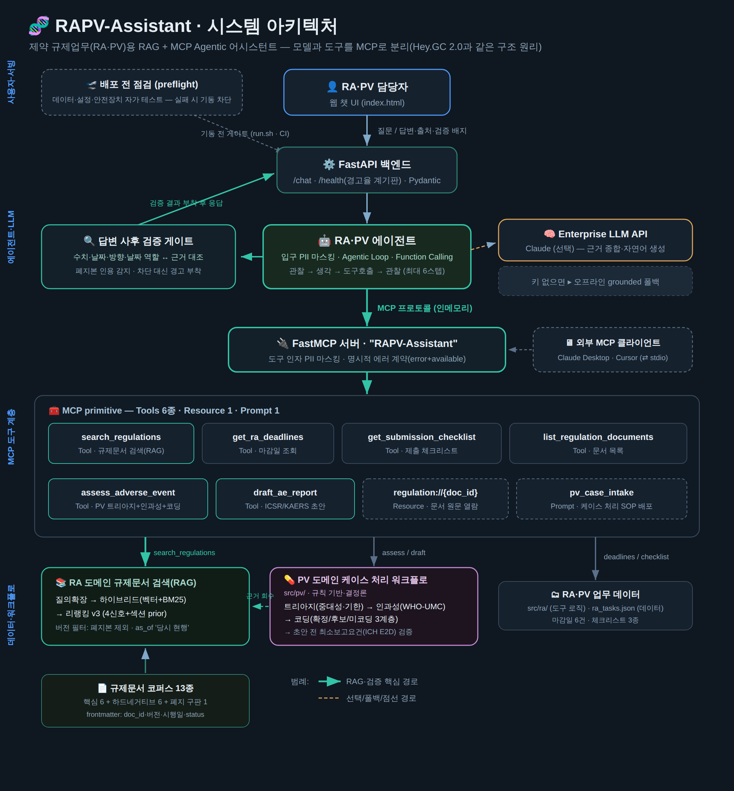
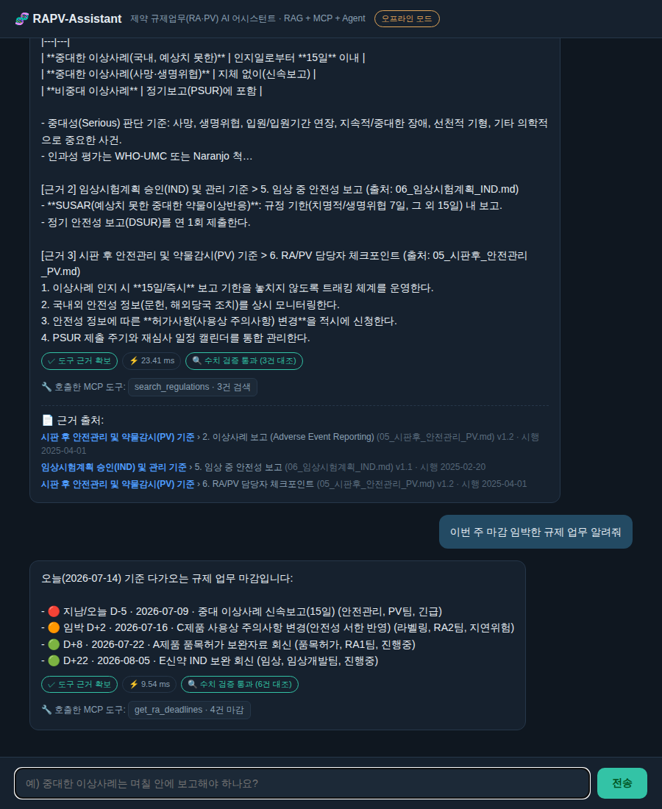

# 🧬 RAPV-Assistant 프로젝트 소개서

> 제약 규제업무(RA)·약물감시(PV) 담당자를 위한 **RAG + MCP Agentic 어시스턴트**
> — 필요성 · 사용자(페르소나) · 사용방법 · 기술 스택 · 구조를 한 문서로 정리한 소개 자료.

---

## 목차
1. [프로젝트 필요성](#1-프로젝트-필요성)
2. [사용자 페르소나](#2-사용자-페르소나)
3. [사용 방법](#3-사용-방법)
4. [기술 스택](#4-기술-스택)
5. [시스템 구조 설명](#5-시스템-구조-설명)
6. [실행 화면](#6-실행-화면)

---

## 1. 프로젝트 필요성

### 1.1 배경 — RA·PV 담당자는 '규제문서의 바다'에서 일한다
제약회사의 **RA(Regulatory Affairs·인허가/규제업무)·PV(Pharmacovigilance·약물감시)** 담당자는
식약처 고시, 허가 가이드라인, 사내 SOP 등 방대한 규제문서를 상시 다룬다.
그런데 현장의 실제 어려움은 이렇다.

| 문제 | 구체적 상황 | 결과 |
|---|---|---|
| **정보 탐색 비용** | "이 변경은 변경허가야 변경신고야?", "품목허가 심사 며칠 걸려?" 답이 문서 어딘가에 흩어져 있음 | 확인에 시간 소모, 담당자별 편차 |
| **정확성 리스크** | 규제 수치(기한·절차)를 잘못 알면 곧 컴플라이언스 사고 | 반려·행정처분 위험 |
| **기한 관리** | 여러 제품의 제출·보고 마감이 파편적으로 관리됨 | 놓치면 규제 위반 |
| **근거 추적** | "그 답의 출처가 어디냐"를 항상 대야 함(감사) | 근거 없는 답변은 무용 |
| **시판 후 안전관리(PV)** | 이상사례 접수 → 중대성 판정 → 보고기한 계산 → 당국 보고를 건별로 수작업 처리 | 판정·기한 오류가 곧 컴플라이언스 사고 |

그리고 허가가 끝이 아니다. 시판 후에는 **이상사례(부작용) 케이스 처리**가 기다린다 —
이 **PV** 업무는 RA와 한 몸처럼 맞물려 도는 규제 컴플라이언스 업무라,
이 데모는 RA의 문서·기한 업무에 더해 **PV 케이스 처리 워크플로까지**를 범위로 잡았다.

### 1.2 해결 아이디어
> **"질문하면, 사내 규제문서를 근거·출처와 함께 즉시 답하고, 마감·체크리스트·이상사례 처리 같은
> 업무 도구까지 에이전트가 자율적으로 처리해 주는 어시스턴트."**

- **① RAG(검색 증강 생성):** 규제문서를 검색해 **근거+출처와 함께** 답 → 환각 억제·추적성 확보.
- **② Agent + MCP:** 마감일·체크리스트·**PV 케이스 처리(트리아지→인과성→코딩→보고서 초안)** 등
  업무 도구를 **MCP 규격**으로 연결, 에이전트가 자율 호출.

### 1.3 왜 이 구조인가 (GC 맥락)
이 아키텍처는 GC녹십자의 **`Hey.GC 2.0`(Agentic AI + MCP로 사내 시스템 통합)** 과 **1:1로 대응**한다.
즉 이 프로젝트는 "GC가 실제로 만드는 것"의 축소 모델이며, 제약 도메인(RA·PV)에 특화해
FDE(Forward Deployed Engineer)가 현업 문제를 코드로 푸는 방식 그 자체를 보여준다.

---

## 2. 사용자 페르소나

### 👩‍💼 주 사용자 — 김규제 (RA 실무 담당자, 5년차)
| 항목 | 내용 |
|---|---|
| **역할** | 품목허가·변경허가 신청, 라벨링 관리, 안전성 보고 실무 |
| **하루** | 규정 확인 → 제출서류 준비 → 기한 체크의 반복 |
| **불편(Pain)** | "이 케이스가 어느 규정에 걸리는지" 매번 문서를 뒤져야 함. 기한을 엑셀로 수기 관리 |
| **바라는 것(Gain)** | 질문 한 줄로 **근거 있는 답** + 놓치면 안 되는 **마감 자동 알림** |
| **이 도구로** | "중대 이상사례 보고 기한?" → 15일, 출처까지 즉시 / "이번 주 마감?" → D-day 순 정리 |

### 💊 주 사용자 — 박안전 (PV 실무 담당자, 3년차)
| 항목 | 내용 |
|---|---|
| **역할** | 이상사례(부작용) 접수 → 중대성 판정 → 인과성 평가 → KAERS 보고 실무 |
| **하루** | 케이스 접수 → 판정·기한 계산 → 보고자 추적조사(follow-up) → 보고서 작성의 반복 |
| **불편(Pain)** | 케이스마다 중대성·기한·최소보고요건을 규정과 대조하며 수작업 판정. 환자 개인정보 취급 부담 |
| **바라는 것(Gain)** | 케이스 서술만 넣으면 **판정+기한+근거 규정**이 나오고, 보고서 초안까지 자동으로 |
| **이 도구로** | "아나필락시스로 입원" → 중대성·기한·인과성 제안+근거 즉시 / "KAERS 초안" → 요건 검증+초안(+PII는 입구에서 마스킹) |

### 🧑‍⚕️ 부 사용자 — 이신입 (RA 신입, 6개월차)
| 항목 | 내용 |
|---|---|
| **역할** | 선배 지시를 받아 제출서류·자료 준비 보조 |
| **불편(Pain)** | 용어·절차가 낯설고, 뭘 준비해야 하는지 몰라 매번 선배에게 질문 |
| **바라는 것(Gain)** | "품목허가 준비 체크리스트" 같은 걸 **스스로 확인**하고 싶음 |
| **이 도구로** | 체크리스트 도구로 준비물 self-check → 선배 질문·병목 감소 |

### 🧑‍💻 확장 사용자 — 관리자/개발자(FDE 관점)
- 새 사내 시스템(전자민원, 문서관리 등)을 **MCP 도구로 추가**만 하면 에이전트가 바로 활용.
- 도구/모델이 MCP로 분리돼 있어 **Claude Desktop·Cursor·사내 챗봇** 어디든 재사용 가능.

> **한 줄 요약:** 이 도구는 *"규정을 찾고, 기한을 챙기고, 준비물을 확인"* 하는 RA의 반복업무와
> *"케이스를 판정하고, 보고기한을 계산하고, 보고서 초안을 만드는"* PV의 케이스 처리를
> 근거 기반으로 자동화한다. 실무자는 시간을, 신입은 자립을, 조직은 추적성을 얻는다.

---

## 3. 사용 방법

### 3.1 설치 & 실행 (원커맨드)
```bash
cd project
./run.sh          # venv 생성 + 의존성 설치 + 서버 실행
# → 브라우저에서 http://127.0.0.1:8000 접속
```
> `run.sh` 없이 수동 실행: `python3 -m venv .venv && .venv/bin/pip install -r requirements.txt && .venv/bin/python -m uvicorn src.api.main:app --port 8000`

### 3.2 두 가지 실행 모드
| 모드 | 조건 | 동작 |
|---|---|---|
| **오프라인 모드** (기본) | API 키 없음 | 검색 근거를 발췌한 **grounded 답변** — 키 없이도 항상 작동 |
| **LLM 모드** | `ANTHROPIC_API_KEY` 설정 | 에이전트가 실제 Claude로 도구를 조합해 **자연어 답변** |

```bash
export ANTHROPIC_API_KEY=sk-ant-...   # 설정 시 자동으로 LLM 모드 전환
```

### 3.3 사용 시나리오 (채팅에 입력)
| 입력 예시 | 호출되는 도구 | 결과 |
|---|---|---|
| `신약 품목허가 심사 며칠 걸려?` | search_regulations (RAG) | 120 근무일 + 출처 |
| `중대한 이상사례는 며칠 안에 보고?` | search_regulations (RAG) | 15일 + 출처 |
| `환자가 복용 후 아나필락시스로 입원했어요. 언제까지 보고?` | assess_adverse_event (PV 트리아지) | 중대성 판정 + 기한 + 인과성 제안 + 근거 규정 |
| `이 케이스 KAERS 보고서 초안 만들어줘` | draft_ae_report (ICSR 초안) | 최소보고요건 검증 + 보고서 초안 + 보완 질문 |
| `이번 주 마감 임박한 규제 업무 알려줘` | get_ra_deadlines | D-day 순 마감 목록 |
| `변경허가 준비 체크리스트 줘` | get_submission_checklist | 준비물 체크리스트 |

### 3.4 부가 명령
```bash
.venv/bin/python -m tests.test_rag          # 스모크 테스트
.venv/bin/python -m eval.evaluate           # RAG 검색 품질 평가
.venv/bin/python -m src.mcp_server.server   # MCP 서버 단독 실행(stdio, Claude Desktop/Cursor 연결)
```

---

## 4. 기술 스택

### 4.1 스택 개요
| 계층 | 기술 | 역할 |
|---|---|---|
| **프론트엔드** | HTML/CSS/JS (단일 페이지) | 챗 UI, 출처·도구 트레이스 표시 |
| **백엔드** | **FastAPI** · Uvicorn · Pydantic | `/chat`·`/health` API 서빙 |
| **에이전트** | 자체 Agentic Loop · **Function Calling** | MCP 도구 자율 호출 |
| **도구 계층** | **FastMCP** (MCP 서버) | RA·PV 도구·리소스를 MCP 규격으로 노출 |
| **RAG** | 순수 파이썬 (TF-IDF · **BM25** · 코사인 · 리랭킹) | 규제문서 검색 최적화 |
| **PV 워크플로** | 규칙 기반 (트리아지·WHO-UMC 인과성·용어 코딩·ICSR 초안·PII 마스킹) | 이상사례 케이스 처리 |
| **LLM** | **Anthropic Claude** (Enterprise LLM API, 선택) | 근거 종합·자연어 생성 |
| **평가** | 자체 스크립트 (Hit@1 · MRR · ContextRecall + PV 22케이스) | 검색·PV 품질 측정 |

### 4.2 설계상 특징
- **무거운 ML 의존성 0** — numpy·torch·sentence-transformers 없이 RAG를 순수 파이썬으로 구현 → 어디서든 실행.
- **Pluggable 구조** — 임베더(`EmbeddingProvider`)·LLM·리랭커를 인터페이스로 분리 → 상용 API로 교체 가능.
- **Graceful degradation** — LLM 키가 없어도 grounded 폴백으로 무중단 동작.
- **모델↔도구 MCP 분리** — 확장성(새 도구 추가만으로 기능 확장)과 재사용성 확보.

### 4.3 채용공고 요구 스택과의 대응
`RAG 최적화 · MCP/FastMCP · Agentic Workflow · Function Calling · FastAPI · Enterprise LLM API`
— 공고 필수 스택 전부를 **작동하는 형태로** 이 프로젝트 하나에 담았다. (상세 매핑은 `../README.md` 4장 참조)

---

## 5. 시스템 구조 설명



### 5.1 계층별 설명 (위 그림 위→아래)
1. **사용자·서빙 계층** — RA·PV 담당자가 웹 챗 UI로 질문하면 **FastAPI** 백엔드(`/chat`)가 받는다.
2. **에이전트·LLM 계층** — **RA·PV 에이전트**가 "관찰→생각→도구호출→관찰"을 반복(Agentic Loop)하며
   필요한 도구를 스스로 고른다(Function Calling). LLM 키가 있으면 Claude가 근거를 종합하고,
   없으면 오프라인 grounded 폴백으로 답한다.
3. **MCP 도구 계층** — 에이전트는 **MCP 프로토콜**로 **FastMCP 서버**에 연결한다. 서버는
   6개 Tool(`search_regulations`·`assess_adverse_event`·`draft_ae_report`·
   `get_ra_deadlines`·`get_submission_checklist`·`list_regulation_documents`),
   1개 Resource(`regulation://{id}`), 1개 Prompt(`pv_case_intake`)를 노출한다.
   → **모델과 도구의 분리(= Hey.GC 2.0 구조)**.
4. **데이터·검색 계층** — 문서검색 도구는 **RAG 파이프라인**(청킹→임베딩→하이브리드 검색→리랭킹)을
   거쳐 규제문서 코퍼스에서 근거를 찾고, PV 도구는 **규칙 기반 워크플로**(`src/pv/`: 트리아지→
   인과성→코딩→보고요건 검증)로 판정하며(판정 근거 규정은 RAG로 부착), 마감일·체크리스트 도구는
   업무 데이터를 조회한다.

### 5.2 RAG 파이프라인 (검색 '최적화'의 핵심)
```
규제문서 ─▶ 청킹(구조+overlap) ─▶ 임베딩(TF-IDF, 교체가능) ─▶ 인덱싱
질문 ─▶ 하이브리드 검색(벡터 코사인 + BM25) ─▶ 리랭킹(정밀 재정렬) ─▶ 근거+출처 ─▶ 답변
```
- **하이브리드 검색:** 의미 유사(벡터)와 정확 용어·코드(키워드 BM25)를 결합 → 재현율↑.
- **리랭킹:** 1차로 넓게 회수한 뒤 질의-청크 관련도로 재정렬 → 정밀도↑.
- **효과 검증:** `eval/`에서 벡터 단독 대비 하이브리드가 **ContextRecall 0.781 → 0.844** 개선 확인
  (리랭킹·질의확장까지 적용한 전체 파이프라인은 **0.969**, Hit@1 0.875 → **1.000** — 32문항 기준).

### 5.3 데이터 흐름 요약
```
사용자 질문 → FastAPI → 에이전트(입구에서 PII 마스킹 → 도구 선택)
   ├─ 규정 질문        → search_regulations  → RAG(검색+리랭킹) → 근거·출처
   ├─ 케이스 서술(PV)  → assess_adverse_event → 트리아지+인과성+코딩(+근거 규정)
   ├─ 보고서 요청(PV)  → draft_ae_report      → 최소보고요건 검증 → ICSR/KAERS 초안
   ├─ 마감 질문        → get_ra_deadlines     → ra_tasks.json
   └─ 준비물 질문      → get_submission_checklist → ra_tasks.json
→ (LLM 있으면 종합 / 없으면 발췌) → 답변 + 출처 + 도구 트레이스 → UI
```

---

## 6. 실행 화면



- **상단:** 규정 질문 → 규제문서에서 근거를 찾아 답하고, **📄 근거 출처**(문서·섹션)를 표시.
- **하단:** "이번 주 마감" 질문 → `get_ra_deadlines` 도구가 **D-day 순**으로 정리(🔴🟠🟢 상태 표시).
- 각 답변 아래 **🔧 호출한 MCP 도구** 트레이스로 에이전트가 어떤 도구를 썼는지 투명하게 보여준다.

---

> ℹ️ 문서 내 규제 수치(처리기한 등)는 **데모용 샘플**로 실제 최신 법령과 다를 수 있다.
> 이 프로젝트의 목적은 규제 자문이 아니라 **아키텍처·엔지니어링 역량 증명**이다.
>
> 📎 관련 문서: [프로젝트 README](../README.md) · [설계 결정 노트](ARCHITECTURE.md) · [자소서3 소재](포트폴리오_자소서3_소재.md)
